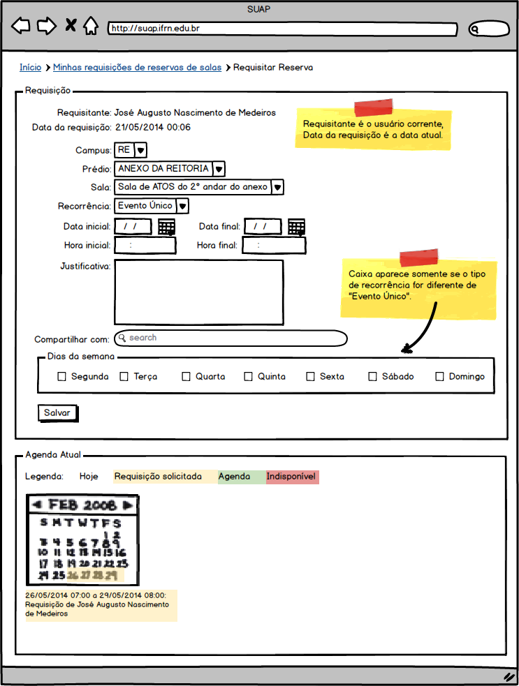
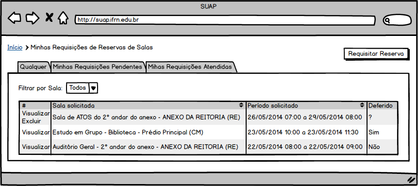
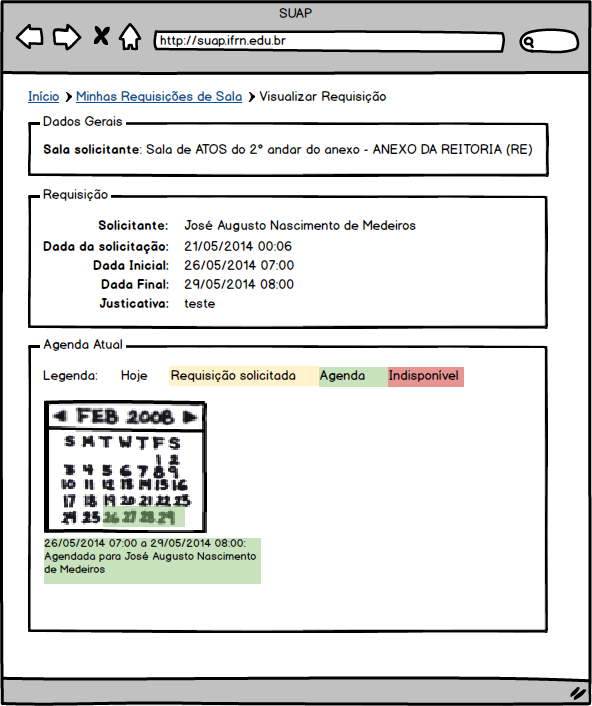

.. |logo| image:: ../../../_static/images/logo_ifrn.png

.. |titulo| replace:: **Comum** 

.. include:: ../../header.rst
   :start-after: uc-start
   :end-before: uc-end

.. _suap-artefatos-adm-agendamento_salas-uc02: 

UC 02 - Requisitar Reserva de  Salas <v0.1>
===========================================

.. contents:: Conteúdo
    :local:
    :depth: 4

Histórico da Revisão
--------------------

.. list-table:: **Histórico da Revisão**
   :widths: 10 5 30 15
   :header-rows: 1
   :stub-columns: 0

   * - Data
     - Versão
     - Descrição
     - Autor
   * - 21/05/2014
     - 0.1
     - Início do Documento
     - Jailton Carlos
   * - 03/07/2014
     - 0.2
     - Alteração no nome dos acessos (menu e botão), alteração dos nomes de solicitação para requisição. 
     - Jailton Carlos
          
.. comentário
   07/05 - início do documento
   08/05 - 

Objetivo
--------

Este caso de uso possibilita que um servidor reserve com antencedência uma sala em qualquer um dos
campi do IFRN para a realização de evento, reunião, aulas e outras necessidades. A reserva estará 
sujeita à aprovação por um avaliador.

Atores
------

Principais
^^^^^^^^^^

Servidor: usuário autenticado pertecente ao grupo "Servidores", tem acesso à consulta e reserva de salas.

Interessado
^^^^^^^^^^^

Não se aplica.

Pré-condições
-------------

Deve existir ao menos uma sala disponível para agendamento (RN4_)

Pós-condições
-------------

- É enviado um e-mail para os avaliadores informando sobre a reserva;
- É incluso no Painel de Notificação do avaliador um aviso de que existem agendamentos pendentes de avaliação.

Fluxo de Eventos
----------------

Fluxo Normal
^^^^^^^^^^^^

.. _FN:

    #. O caso de uso é iniciado acionando a opção  ``ADMINISTRAÇÃO`` > ``Reservas de Salas`` > ``Requisições``
    #. O sistema exibe a lista de reservas de salas do usuário corrente RIN1_
    #. O servidor aciona a opção ``Requisitar Reserva`` 
    #. O servidor informa os dados (RIN2_)
    #. O sistema exibe o calendário atual da sala selecionada (RIN3_)
    #. O servidor finaliza o caso de uso selecionando a opção ``Salvar``
    #. O sistema exibe a mensagem M1_
    #. O sistema apresenta a listagem do passo FN_.2 

Fluxo Alternativo
^^^^^^^^^^^^^^^^^

FA1 – Visualizar requisição (FN_.2 )
""""""""""""""""""""""""""""""""""""

    #. O servidor aciona a opção ``Visualizar`` de uma das linhas da listagem de requisições de reservas
    #. O sistema exibe informações da reserva (RI1_)
  

FA2 – Excluir requisição (FN_.2 )
"""""""""""""""""""""""""""""""""

    #. O servidor aciona a opção ``Excluir`` de uma das linhas da listagem de requisições de reservas
    #. O sistema exibe a mensagem M2_
    #. O servidor confirma exclusão
    #. O sistema apresenta a listagem do passo FN_.2

FA3 – Requisição de reserva já existe (FN_.6 )
""""""""""""""""""""""""""""""""""""""""""""""

    #. O sistema exibe a mensagem especifica na regra de negócio RN3_

    	
Fluxo de Exceção
^^^^^^^^^^^^^^^^

FE1 – Exclusão fere Regra RN2_ (FN_.6)
""""""""""""""""""""""""""""""""""""""

    #. O sistema exibe a mensagem especifica na regra de negócio RN2_

Especificação suplementares
---------------------------

Requisitos Não-Funcionais
^^^^^^^^^^^^^^^^^^^^^^^^^

Não há.

Requisitos de Interface
^^^^^^^^^^^^^^^^^^^^^^^

.. _RI1:

RI1 – Exibição de requisição de reserva de sala
"""""""""""""""""""""""""""""""""""""""""""""""

É exibida informações da requisição da reserva dentro dos seguintes caixas: 

* ``Dados Gerais``: exbe informações da sala;
* ``Requisição``: Exibe a data da solicitaçaõ, data inicial e final da reserva, justificativa e nome do solicitante;
* ``Agenda atual``: exibe o calendário com a agenda atual da sala.

A `Figura 3`_ esboça como os dados da reserva de sala deverão ser exibidos

.. note::
   Se uma requisição foi avalida, além das caixas acima citadas, é exibida a caixa ``Avaliação`` com os dados 
   da avaliação: nome do avaliador, data da avaliação, parecer e observação do avaliador conforme pode ser
   visto na `Figura 4`_.

Requisitos de Informação
^^^^^^^^^^^^^^^^^^^^^^^^

.. _RIN1:
     
RIN1 – Campos para listagem
"""""""""""""""""""""""""""

A listagem é exibida dividida em abas conforme especificadas abaixo:

- Aba ``Qualquer``: lista todas as solicitações de reservas independente se foram avaliadas ou não.
- Aba ``Minhas Requisições Pendentes``: lista todas as requisições de reservas que não foram avaliadas
- Aba ``Minhas Requisições Atendidas``: lista todas as requisições de reservas avaliadas (deferidas/indeferidas)

.. list-table:: 
   :header-rows: 1
   :stub-columns: 1

   * - 
     - Ações
     - Sala solicitada
     - Período solicitado
     - Deferido
   * - Ordenação
     - Não
     - Sim
     - Sim
     - Não
   * - Filtro
     - Não
     - Não
     - Não
     - Não
   * - Busca
     - Não
     - Sim
     - Não   
     - Não
   * - Observações
     - Ver RN9_
     
       .. csv-table::
          :header: "Rótulo"
          :widths: 100

          Ver
          Excluir
     - 
     -
     -  Sim, Não, ?
          
A `Figura 2`_ exibe um esboço da tela de listagem de requisições.

.. _RIN2:

RIN2 – Campos para Cadastros
""""""""""""""""""""""""""""

.. list-table:: 
   :widths: 10 20 5 5 5 5
   :header-rows: 1
   :stub-columns: 0

   * - Informação
     - Tipo
     - Tamanho
     - Valor Inicial
     - Domínio/Máscara
     - Observação
   * - Câmpus*
     - Seleção
     - 
     - 
     - RN5_
     - 
   * - Prédio*
     - Seleção
     - 
     - 
     - RN6_
     - 
   * - Sala*
     - Texto autocomplentar simples
     - 
     - 
     - RN7_
     - 
   * - Recorrência*
     - Seleção
     - 
     - "Evento único"
     - "Evento único", "Semanalmente", "Quinzenalmente" e "Mensalmente"
     - RN8_
   * - Data/Hora inicial*
     - Calendário
     - 
     - 
     - | Data: dd/mm/yyyy
       | Hora: HH:MM
     - Dois campos, uma para a data e outro para a hora.
   * - Data/Hora final*
     - Calendário
     - 
     - 
     - | Data: dd/mm/yyyy
       | Hora: HH:MM
     - Dois campos, uma para a data e outro para a hora.
   * - Justificativa*
     - Texto longo
     - 
     - 
     - 
     - 
   * - Dias da semana
     - Caixa de checagem
     - 
     - 
     - Segunda, Terça, Quarta, Quinta, Sexta, Sábado, Domingo
     - RN1_
   * - Compartilhar com 
     - Texto autocompletar multiplo
     - 
     - 
     - 
     - RN11_    
     
A `Figura 1`_ exibe um esboço do formulário de cadastro.

RIN3 – Agenda atual da sala
"""""""""""""""""""""""""""
     
A agenda atual da sala é exibida na forma de um calendário com as seguintes cores:

- Amarelo: representa as requisições de reservas de salas que ainda não foram avaliadas;
- Verde: representa as requisições de reservas deferida, isto é, reserva confirmada;
- Vermelho: sala indisponível, ou seja, não acessível para reservas.

Abaixo do calendário são listadas as reservas no padrão: Dia <Data inicial no formato dd> 
(<hora inicial no formato HH:MM>) até dia <data final no formato dd> (<hora final no formato 
HH:MM>) de <nome usuário solicitante (matricula usuário solicitante)>. Ver caixa ``Agenda tual da sala`` na `Figura 1`_ .
     
Regras de Negócio
^^^^^^^^^^^^^^^^^

.. list-table:: 
   :widths: 10 90
   :header-rows: 1
   :stub-columns: 0

   * - Regra
     - Descrição / Mensagem
   * - RN1
     - | Critério para exibição da caixa ``Dias da semana``: a caixa só deverá aparecer quando o servidor selecionar a opção de recorrência difetente de "Evento Único".
       | mensagem: Não há. 
   * - RN2
     - | Não deve existir duas solicitações de salas avaliadas na mesma data/hora.
       | mensagem: Sala já esta agendada para a data e hora especificada.
   * - RN3
     - | Solicitações de reserva de sala na mesa data/hora será incluída em uma fila.
       | mensagem: Já existe uma requisição de reserva para a data/hora informada. Você é o <numero_fila> da fila.
                   Caso ocorra alguma desistência (exclusão de solicitação de reserva) você será notificado por email.          
   * - RN4
     - | Sala disponível para agendamento, é uma sala com o status ativo e agendável verdadeiro e ter pelo menos um avaliador responsável pela sala.
       | mensagem: não há.
   * - RN5
     - | Listar somente os campi que possuem salas disponíveis para agendamento (ver RN4_)
       | mensagem: Não há. 
   * - RN6
     - | Listar somente os prédios que possuem salas disponíveis para agendamento (ver RN4_) e 
         do campus informado previamente
       | mensagem: Não há. 
   * - RN7
     - | Listar somente as salas disponíveis para agendamento (ver RN4_) pertecente ao prédio
         informado anteriormente
       | mensagem: Não há.       
   * - RN8
     - | A reserva de sala ocorrerá de acordo com o tipo de envento selecionado no campo ``Recorrência``:
     
         - "Evento único": reserva e período continuos;
         - "Semanalmente": os dias marcados são repetidos de semana a semana até a data informada no campo ``Data/Hora final``
         - "Quinzenalmente": os dias marcados são repetidos de quinze em quinze dias até a data informada no campo ``Data/Hora final``
         - "Mensalmente": os dias marcados são repetidos a cada mês até a data informada no campo ``Data/Hora final``
     
       | mensagem: Não há.     
   * - RN9
     - | Critério para exibição da opção excluir: essa opção só estará disponível se a solicitação de reserva ainda não foi avaliada.
       | mensagem: não há.    
   * - RN10
     - | A caixa ``Agenda atual da sala`` é exibida assim que for informado a sala no campo ``Sala``.
       | mensagem: não há.    
   * - RN11
     - | Os servidores informados em ``Compartilhar com`` receberão email sobre a solicitação de reservas, bem como sobre o resultado da avaliação da reserva.
       | mensagem: não há.  

         
.. _RN1: `Regras de Negócio`_  
.. _RN2: `Regras de Negócio`_  
.. _RN3: `Regras de Negócio`_  
.. _RN4: `Regras de Negócio`_  
.. _RN5: `Regras de Negócio`_  
.. _RN6: `Regras de Negócio`_  
.. _RN7: `Regras de Negócio`_  
.. _RN8: `Regras de Negócio`_  
.. _RN9: `Regras de Negócio`_ 
.. _RN10: `Regras de Negócio`_ 
.. _RN11: `Regras de Negócio`_ 
   
Mensagens
^^^^^^^^^

.. _M:

.. list-table:: 
   :widths: 10 90
   :header-rows: 1
   :stub-columns: 0

   * - Código
     - Descrição
   * - M1    
     - Cadastro realizado com sucesso.
   * - M2   
     - Você tem certeza que quer excluir a reserva de sala <Sala solicitada> <período solicitado>”?
     
          
.. _M1: `Mensagens`_     
.. _M2: `Mensagens`_  

Ponto de Extensão
-----------------

Não há.

Questões em Aberto
------------------

Não há.

Esboço de Protótipo
-------------------

.. _`Figura 1`:

   
   Figura 1: Protótipo de tela para cadastro de requisição de reserva de salas.	   

.. _`Figura 2`:

   
   Figura 2: Protótipo de tela para listagem de reservas.   
   
.. _`Figura 3`:

   
   Figura 3: Protótipo de tela para exibição de reservas.   
  
  
.. _`Figura 4`:
      
.. figure:: media/UC04_visualizar_reserva_avaliada.png
   :align: center
   :scale: 70 %
   :alt: protótipo de tela.
   :figclass: align-center
   
   Figura 4: Protótip de tela para exbição de requisição com parecer do avaliador.    
   
Diagrama de domínio do caso de uso
----------------------------------

Não há.

Diagrama de Fluxo de Operação
-----------------------------

Não há.

Cenário de Testes
-----------------

Não há.