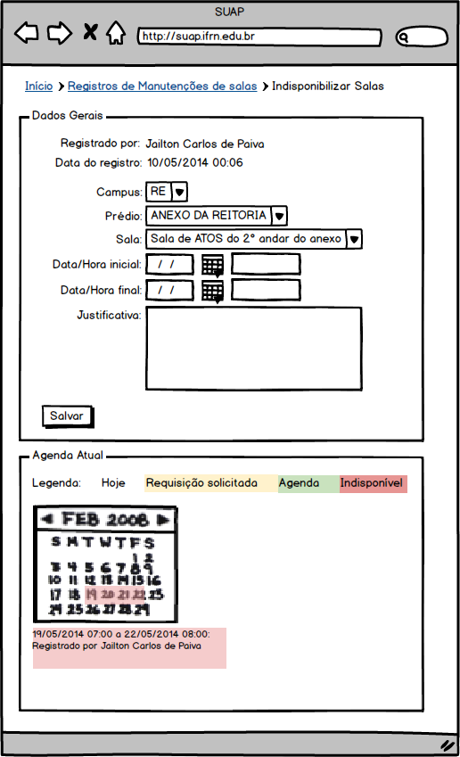
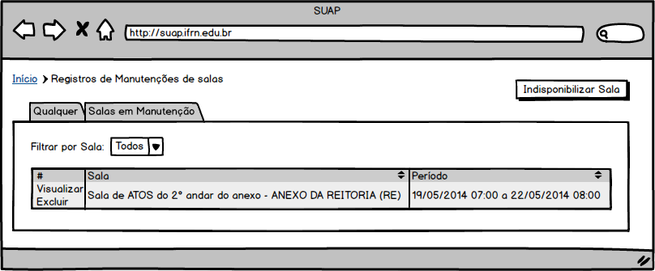
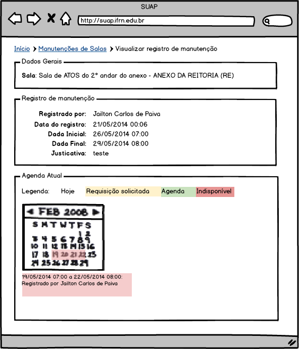

.. |logo| image:: ../../../_static/images/logo_ifrn.png

.. |titulo| replace:: **Comum** 

.. include:: ../../header.rst
   :start-after: uc-start
   :end-before: uc-end

.. _suap-artefatos-adm-agendamento_salas-uc03: 

UC 03 - Indisponibilizar Salas <v0.1>
=====================================

.. contents:: Conteúdo
    :local:
    :depth: 4

Histórico da Revisão
--------------------

.. list-table:: **Histórico da Revisão**
   :widths: 10 5 30 15
   :header-rows: 1
   :stub-columns: 0

   * - Data
     - Versão
     - Descrição
     - Autor
   * - 03/05/2014
     - 0.1
     - Início do Documento
     - Jailton Carlos

          
.. comentário
   07/05 - início do documento
   08/05 - 

Objetivo
--------

Este caso de uso possibilita que um avaliador indisponibilize  com antencedência uma sala para manutenção.

Atores
------

Principais
^^^^^^^^^^

Avaliador: usuário autenticado pertecente ao grupo "Servidores" e que seja avaliador em ao menos uma sala.

Interessado
^^^^^^^^^^^

Não se aplica.

Pré-condições
-------------

Deve existir ao menos uma sala disponível para agendamento (RN3_)

Pós-condições
-------------

- A sala estará indisponível para reservas no período informado.

Fluxo de Eventos
----------------

Fluxo Normal
^^^^^^^^^^^^

.. _FN:

    #. O caso de uso é iniciado acionando a opção  ``ADMINISTRAÇÃO`` > ``Reservas de Salas`` > ``Indisponibilizações``
    #. O sistema exibe a lista de registros de manutenção de salas (RIN1_)
    #. O avaliador aciona a opção ``Indisponibilizar Sala`` 
    #. O avaliador informa os dados (RIN2_)
    #. O sistema exibe o calendário atual da sala selecionada (RIN3_)
    #. O avaliador finaliza o caso de uso selecionando a opção ``Salvar``
    #. O sistema exibe a mensagem M1_
    #. O sistema apresenta a listagem do passo FN_.2 

Fluxo Alternativo
^^^^^^^^^^^^^^^^^

FA1 – Visualizar registro de manutenção de sala (FN_.2 )
""""""""""""""""""""""""""""""""""""""""""""""""""""""""

    #. O avaliador aciona a opção ``Visualizar`` de uma das linhas da listagem de registros de manutenção de salas
    #. O sistema exibe informações da indisponibilização da sala (RI1_)
  

FA2 – Excluir registro de manutenção de sala (FN_.2 )
"""""""""""""""""""""""""""""""""""""""""""""""""""""

    #. O avaliador aciona a opção ``Excluir`` de uma das linhas da listagem de registros de manutenção de salas
    #. O sistema exibe a mensagem M2_
    #. O avaliador confirma exclusão
    #. O sistema apresenta a listagem do passo FN_.2

      
Fluxo de Exceção
^^^^^^^^^^^^^^^^

FE1 – Exclusão fere Regra RN1_ (FN_.6)
""""""""""""""""""""""""""""""""""""""

    #. O sistema exibe a mensagem especifica na regra de negócio RN1_

FE2 – Exclusão fere Regra RN2_ (FN_.6)
""""""""""""""""""""""""""""""""""""""

    #. O sistema exibe a mensagem especifica na regra de negócio RN2_
    
Especificação suplementares
---------------------------

Requisitos Não-Funcionais
^^^^^^^^^^^^^^^^^^^^^^^^^ 

Não há.

Requisitos de Interface
^^^^^^^^^^^^^^^^^^^^^^^

.. _RI1:

RI1 – Exibição de registro de manutenção de sala
""""""""""""""""""""""""""""""""""""""""""""""""

É exibida informações do registro de manutenção da sala dentro dos seguintes caixas: 

* ``Dados Gerais``: exbe informações da sala;
* ``Registro de manutenção``: Exibe a data do registro, data inicial e final da indisponibilização da sala, justificativa e nome do autor do registro;
* ``Agenda atual``: exibe o calendário com a agenda atual da sala.

A `Figura 3`_ esboça como os dados do registro de manutenção de sala deverão ser exibidos

Requisitos de Informação
^^^^^^^^^^^^^^^^^^^^^^^^

.. _RIN1:
     
RIN1 – Campos para listagem
"""""""""""""""""""""""""""

A listagem é exibida dividida em abas conforme especificadas abaixo:

- Aba ``Qualquer``: lista todas as solicitações de reservas independente se foram avaliadas ou não.
- Aba ``Salas em Manutenção``: lista todos os registros de manutenção de salas na qual data inicio maior\igual que data atual e data fim menor/igual que data atual.

.. list-table:: 
   :header-rows: 1
   :stub-columns: 1

   * - 
     - Ações
     - Sala 
     - Período 
   * - Ordenação
     - Não
     - Sim
     - Sim
   * - Filtro
     - Não
     - Não
     - Não
   * - Busca
     - Não
     - Sim
     - Não   
   * - Observações
     - Ver RN7_
     
       .. csv-table::
          :header: "Rótulo"
          :widths: 100

          Ver
          Excluir
     - 
     -
          
A `Figura 1`_ exibe um esboço da tela de listagem de registros de manutenção de salas.

.. _RIN2:

RIN2 – Campos para Cadastros
""""""""""""""""""""""""""""

.. list-table:: 
   :widths: 10 20 5 5 5 5
   :header-rows: 1
   :stub-columns: 0

   * - Informação
     - Tipo
     - Tamanho
     - Valor Inicial
     - Domínio/Máscara
     - Observação
   * - Câmpus*
     - Seleção
     - 
     - 
     - RN4_
     - 
   * - Prédio*
     - Seleção
     - 
     - 
     - RN5_
     - 
   * - Sala*
     - Seleção
     - 
     - 
     - RN6_
     - 
   * - Data/Hora inicial*
     - Calendário
     - 
     - 
     - | Data: dd/mm/yyyy
       | Hora: HH:MM
     - Dois campos, uma para a data e outro para a hora.
   * - Data/Hora final*
     - Calendário
     - 
     - 
     - | Data: dd/mm/yyyy
       | Hora: HH:MM
     - Dois campos, uma para a data e outro para a hora.
   * - Justificativa*
     - Texto longo
     - 
     - 
     - 
     - 
  
     
A `Figura 2`_ exibe um esboço do formulário de cadastro.

RIN3 – Agenda atual da sala
"""""""""""""""""""""""""""
     
A agenda atual da sala é exibida na forma de um calendário com as seguintes cores:

- Amarelo: representa as requisições de reservas de salas que ainda não foram avaliadas;
- Verde: representa as requisições de reservas deferida, isto é, reserva confirmada;
- Vermelho: sala indisponível, ou seja, não acessível para reservas.

Abaixo do calendário são listadas as reservas no padrão: Dia <Data inicial no formato dd> 
(<hora inicial no formato HH:MM>) até dia <data final no formato dd> (<hora final no formato 
HH:MM>) de <nome usuário solicitante (matricula usuário solicitante)>. Ver caixa ``Agenda tual da sala`` na `Figura 1`_ .
     
Regras de Negócio
^^^^^^^^^^^^^^^^^

.. list-table:: 
   :widths: 10 90
   :header-rows: 1
   :stub-columns: 0

   * - Regra
     - Descrição / Mensagem
   * - RN1
     - | Não deve existir duas agendas de salas na mesma data/hora.
       | mensagem: Há agendamento para está sala no período solicitado, exclua antes a agenda.
   * - RN2
     - | Requisições de reserva de sala na mesa data/hora será indeferida.
       | mensagem: Há requisições de reserva para esta sala no período solicitado, indefira antes as requisições.
   * - RN3
     - | Sala disponível para agendamento, é uma sala com o status ativo, agendável verdadeiro e ter pelo menos um avaliador responsável pela sala.
       | mensagem: não há.
   * - RN4
     - | Listar somente os campi que possuem salas disponíveis para agendamento (ver RN3_)
       | mensagem: Não há. 
   * - RN5
     - | Listar somente os prédios que possuem salas disponíveis para agendamento (ver RN3_) e 
         do campus informado previamente
       | mensagem: Não há. 
   * - RN6
     - | Listar somente as salas disponíveis para agendamento (ver RN3_) pertecente ao prédio
         informado anteriormente
       | mensagem: Não há.         
   * - RN7
     - | Critério para exibição da opção excluir: essa opção só estará disponível se a data final do registro de manutenção for menor que a data atual.
       | mensagem: não há.    
   * - RN8
     - | A caixa ``Agenda atual da sala`` é exibida assim que for informado a sala no campo ``Sala``.
       | mensagem: não há.    

         
.. _RN1: `Regras de Negócio`_  
.. _RN2: `Regras de Negócio`_  
.. _RN3: `Regras de Negócio`_  
.. _RN4: `Regras de Negócio`_  
.. _RN5: `Regras de Negócio`_  
.. _RN6: `Regras de Negócio`_  
.. _RN7: `Regras de Negócio`_  
.. _RN8: `Regras de Negócio`_  
.. _RN9: `Regras de Negócio`_ 
   
Mensagens
^^^^^^^^^

.. _M:

.. list-table:: 
   :widths: 10 90
   :header-rows: 1
   :stub-columns: 0

   * - Código
     - Descrição
   * - M1    
     - Cadastro realizado com sucesso.
   * - M2   
     - Você tem certeza que quer excluir o registro de manutenção da sala <Sala solicitada> <período solicitado>”?
     
          
.. _M1: `Mensagens`_     
.. _M2: `Mensagens`_  

Ponto de Extensão
-----------------

Não há.

Questões em Aberto
------------------

Não há.

Esboço de Protótipo
-------------------

.. _`Figura 1`:

   
   Figura 1: Protótipo de tela para cadastro de registro de manutenção.      

.. _`Figura 2`:

   
   Figura 2: Protótipo de tela para listagem de manutenções de salas.   
   
.. _`Figura 3`:

   
   Figura 3: Protótipo de tela para exibição do registro de manutenção.   
   
   
Diagrama de domínio do caso de uso
----------------------------------

Não há.

Diagrama de Fluxo de Operação
-----------------------------

Não há.

Cenário de Testes
-----------------

Não há.