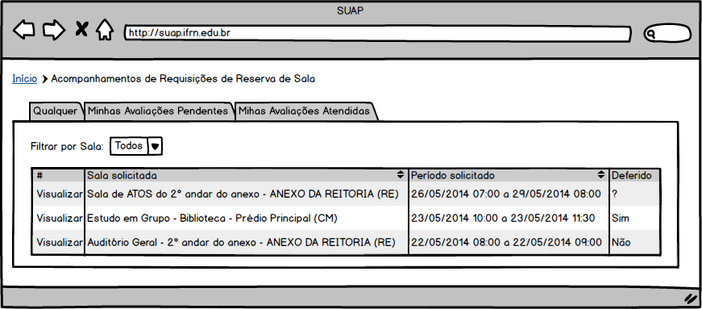
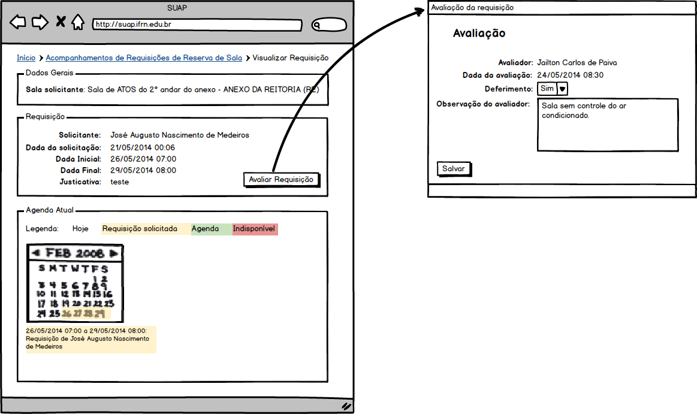
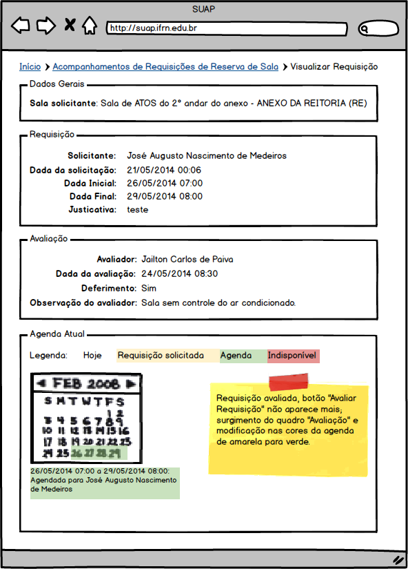

.. |logo| image:: ../../../_static/images/logo_ifrn.png

.. |titulo| replace:: **Comum** 

.. include:: ../../header.rst
   :start-after: uc-start
   :end-before: uc-end

.. _suap-artefatos-adm-agendamento_salas-uc04: 

UC 04 - Avaliar requisição de reservas de salas <v0.1>
======================================================

.. contents:: Conteúdo
    :local:
    :depth: 4

Histórico da Revisão
--------------------

.. list-table:: **Histórico da Revisão**
   :widths: 10 5 30 15
   :header-rows: 1
   :stub-columns: 0

   * - Data
     - Versão
     - Descrição
     - Autor
   * - 07/05/2014
     - 0.1
     - Início do Documento
     - Jailton Carlos
   * - 03/07/2014
     - 0.2
     - Ajustes finais na documentação, inclusão de protótipos de telas.
     - Jailton Carlos
         
.. comentário
   07/05 - início do documento
   08/05
   01/07

Objetivo
--------

Permitir que um avaliador possa deferir ou indefir uma solicitação de reserva de salas.

Atores
------

Principais
^^^^^^^^^^

Avaliador: usuário autenticado pertecente ao grupo "Servidores" e que seja avaliador em ao menos uma sala.

Interessado
^^^^^^^^^^^

Não se aplica.

Pré-condições
-------------

- Deve existir ao menos uma solicitação de reserva de sala.
- Usuário corrente dever ser avaliador de pelo menos uma sala.

Pós-condições
-------------

- É enviado um e-mail para os solicitantes de reserva informando que a reserva foi avaliada;
- É excluído no Painel de Notificação do avaliador o aviso de que existem agendamentos pendentes de avaliação.
  
  .. note::
     Ver RN2_
     

Fluxo de Eventos
----------------

Fluxo Normal
^^^^^^^^^^^^

.. _FN:

    #. O caso de uso é iniciado acionando a opção  ``ADMINISTRAÇÃO`` > ``Reservas de Salas`` > ``Acompanhamentos``
    #. O sistema lista todas as requisições de reservas de salas na qual o usuário corrente é avaliador (RIN1_)
    #. O avaliador aciona a opção ``Ver`` de uma das linhas da listagem de solicitações de reservas
    #. O sistema exibe informações da requisição da reserva de sala (RI1_)
    #. O avaliador aciona a opção ``Avaliar Requisição``  
    #. O avaliador informa os dados (RIN2_)
    #. O avaliador finaliza o caso de uso selecionando a opção ``Salvar``
    #. O sistema exibe a mensagem M1_
    #. O sistema apresenta a listagem do passo FN_.2

    

Fluxo Alternativo
^^^^^^^^^^^^^^^^^

Não há.
    	
    	
Fluxo de Exceção
^^^^^^^^^^^^^^^^

Não há.
    

Especificação suplementares
---------------------------

Requisitos Não-Funcionais
^^^^^^^^^^^^^^^^^^^^^^^^^ 

Não há.

Requisitos de Interface
^^^^^^^^^^^^^^^^^^^^^^^

.. _RI1:

RI1 – Exibição de requisição de reserva de sala
"""""""""""""""""""""""""""""""""""""""""""""""

É exibida informações da requisição da reserva dentro dos seguintes caixas: 

* ``Dados Gerais``: exbe informações da sala;
* ``Requisição``: Exibe a data da requisição, data inicial e final da reserva, justificativa e nome do solicitante;
* ``Agenda atual``: exibe o calendário com a agenda atual da sala.

A `Figura 2`_ a esquerda esboça como essas informações estariam dispostas.

.. note::
   Se uma requisição foi avalida, além das caixas acima citadas, é exibida a caixa ``Avaliação`` com os dados 
   da avaliação: nome do avaliador, data da avaliação, parecer e observação do avaliador conforme pode ser
   visto na `Figura 3`_.
   

Requisitos de Informação
^^^^^^^^^^^^^^^^^^^^^^^^

.. _RIN1:
  
RIN1 – Campos para listagem de requisições de reservas
""""""""""""""""""""""""""""""""""""""""""""""""""""""
 
A listagem é exibida dividida em abas conforme especificadas abaixo:

- Aba ``Qualquer``: lista todas as solicitações de reservas independente se foram avaliadas ou não.
- Aba ``Minhas avaliações pendentes``: lista todas as requisições de reservas de salas na qual o usuário corrente
  é avaliador e que ainda não foram avaliadas
- Aba ``Minhas avaliações atendidas``: lista todas as requisições de reservas de salas na qual o usuário corrente
  é avaliador e que já foram avaliadas.

     
.. list-table:: 
   :header-rows: 1
   :stub-columns: 1

   * - 
     - Ações
     - Sala solicitada
     - Período solicitado
     - Deferido
   * - Ordenação
     - Não
     - Sim
     - Sim
     - Não
   * - Filtro
     - Não
     - Sim
     - Sim
     - Não
   * - Busca
     - Não
     - Não
     - Não   
     - Não
   * - Observações
     -      
       .. csv-table::
          :header: "Rótulo"
          :widths: 100

          Ver
     - 
     -
     -  Sim, Não, ?
          
          
          
A `Figura 1`_ exibe um esboço de como esses dados serão exibidos.

.. _RIN2:   

RIN2 – Campos para Cadastros
""""""""""""""""""""""""""""

.. list-table:: 
   :widths: 10 20 5 5 5 5
   :header-rows: 1
   :stub-columns: 0

   * - Informação
     - Tipo
     - Tamanho
     - Valor Inicial
     - Domínio/Máscara
     - Observação
   * - Deferimento*
     - Caixa de seleção
     - 
     - 
     - Sim, Não
     - 
   * - Observação do avaliador*
     - Texto longo
     - 
     - 
     - 
     - 
        
     
A `Figura 2`_ a direita exibe um esboço do formulário de cadastro.

     
Regras de Negócio
^^^^^^^^^^^^^^^^^
   
.. list-table:: 
   :widths: 10 90
   :header-rows: 1
   :stub-columns: 0

   * - Regra
     - Descrição / Mensagem
   * - RN1
     - | Critério para exibição da opção ``Avaliar Requisição``:  essa opção só estará disponível para avaliador e se a data final da 
       | requisição for menor ou igual a data atual e a requisição não tenha sido avaliada.
       | mensagem: não há.  
   * - RN2
     - | O aviso de que existem agendamentos pendentes de avaliação disponível no Painel de Notificação só será excluído se não existir mais solicitações
       | de reservas a serem avaliadas.
       | mensagem: não há.   
  
 
.. _RN1: `Regras de Negócio`_  
.. _RN2: `Regras de Negócio`_  

Mensagens
^^^^^^^^^

.. _M:

.. list-table:: 
   :widths: 10 90
   :header-rows: 1
   :stub-columns: 0

   * - Código
     - Descrição
   * - M1    
     - Cadastro realizado com sucesso.
     

.. _M1: `Mensagens`_     

    
.. _PE:

Ponto de Extensão
-----------------

Não há.

Questões em Aberto
------------------

Não há.

Esboço de Protótipo
-------------------

.. _`Figura 1`:

   
   Figura 1: Protótipo de tela para listagem de requisições.
	   
	   
.. _`Figura 2`:
	   

   
   Figura 2: Protótip de tela a esquerda para exibir requisição e a direita para cadastro de avaliação de requisição.	   

.. _`Figura 3`:
      

   
   Figura 3: Protótip de tela para exbição de requisição com parecer do avaliador.   

Diagrama de domínio do caso de uso
----------------------------------

Não há.

Diagrama de Fluxo de Operação
-----------------------------

Não há.

Cenário de Testes
-----------------

Não há.