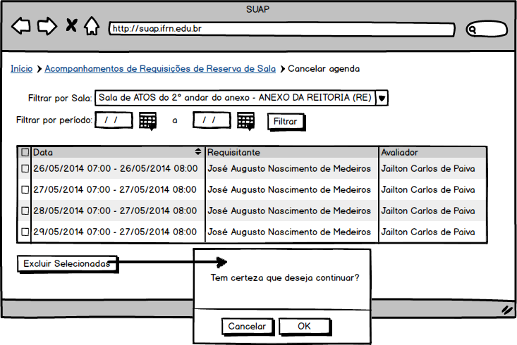

.. |logo| image:: ../../../_static/images/logo_ifrn.png

.. |titulo| replace:: **Comum** 

.. include:: ../../header.rst
   :start-after: uc-start
   :end-before: uc-end

.. _suap-artefatos-adm-agendamento_salas-uc08: 

UC 05 - Cancelar Agenda <v0.1>
==============================

.. contents:: Conteúdo
    :local:
    :depth: 4

Histórico da Revisão
--------------------

.. list-table:: **Histórico da Revisão**
   :widths: 10 5 30 15
   :header-rows: 1
   :stub-columns: 0

   * - Data
     - Versão
     - Descrição
     - Autor
   * - 03/07/2014
     - 0.1
     - Início do Documento
     - Jailton Carlos
     

Objetivo
--------

Um avaliador poderá cancelar uma agenda de sala.

Atores
------

Principais
^^^^^^^^^^

Avaliador: usuário autenticado pertecente ao grupo "Servidores" e que seja avaliador em ao menos uma sala.

Interessado
^^^^^^^^^^^

Não se aplica.

Pré-condições
-------------

Não há.

Pós-condições
-------------

- É enviado um e-mail para o solicitante da reserva que originou a agenda.
     

Fluxo de Eventos
----------------

Fluxo Normal
^^^^^^^^^^^^

.. _FN:

    #. O caso de uso é iniciado acionando a opção  ``ADMINISTRAÇÃO`` > ``Reservas de Salas`` > ``Cancelamentos``
    #. O avaliador informa a sala e o período da agenda (RIN1_)
    #. O sistema exibe a lista de datas conforme agenda da sala e no período especificados (RIN2)
    #. O avaliador seleciona uma ou mais agendas da listagem e aciona a opção ``Excluir Selecionadas``
    #. O sistema exibe a mensagem M1_
    #. O avaliador confirma a exclusão
    #. O sistema apresenta a listagem do passo FN_.3

Fluxo Alternativo
^^^^^^^^^^^^^^^^^

Não há.    	
    	
Fluxo de Exceção
^^^^^^^^^^^^^^^^

FE1 – Exclusão fere Regra RN1_ (FN_.4)
""""""""""""""""""""""""""""""""""""""

    #. O sistema exibe a mensagem especifica na regra de negócio RN1_

Especificação suplementares
---------------------------

Requisitos Não-Funcionais
^^^^^^^^^^^^^^^^^^^^^^^^^

Não há.

Requisitos de Interface
^^^^^^^^^^^^^^^^^^^^^^^

Não há.

Requisitos de Informação
^^^^^^^^^^^^^^^^^^^^^^^^

RIN2 – Campos para Filtros
""""""""""""""""""""""""""

.. list-table:: 
   :widths: 10 20 5 5 5 5
   :header-rows: 1
   :stub-columns: 0

   * - Informação
     - Tipo
     - Tamanho
     - Valor Inicial
     - Domínio/Máscara
     - Observação
   * - Filtrar por Sala*
     - Seleção
     - 
     - 
     - RN1_
     - 
   * - *
     - Calendário
     - 
     - 
     - Data: dd/mm/yyyy
       
     - 
   * - *
     - Calendário
     - 
     - 
     - Data: dd/mm/yyyy
       
     -      
     
     
A `Figura 1`_ exibe um esboço das opções de filtros.

.. _RIN2:
     
RIN2 – Campos para listagem de datas da agenda
""""""""""""""""""""""""""""""""""""""""""""""
 
     
.. list-table:: 
   :header-rows: 1
   :stub-columns: 1

   * - 
     - [  ] 
     - Data
     - Requisitante
     - Avaliador
   * - Ordenação
     - Não
     - Sim
     - Não
     - Não
   * - Filtro
     - Não
     - Não
     - Não
     - Não
   * - Busca
     - Não
     - Não
     - Não
     - Não
   * - Observações
     - Caixa de checagem
     -
     -
     -
             

A `Figura 1`_ exibe um esboço de como a listagem será apresentada.

     
Regras de Negócio
^^^^^^^^^^^^^^^^^
   
.. list-table:: 
   :widths: 10 90
   :header-rows: 1
   :stub-columns: 0

   * - Regra
     - Descrição / Mensagem
   * - RN1
     - | Listar somente as salas que possuem agenda na qual o usuário corrente é avaliador.
       | mensagem: não há.
   * - RN2
     - | Não permitir excluir uma genda com data final menor que data atual 
       | mensagem: Impossível realizar está ação, agenda já transcorrida. Há seleção de data menor que hoje.
 
.. _RN1: `Regras de Negócio`_  
.. _RN2: `Regras de Negócio`_  

Mensagens
^^^^^^^^^

.. _M:

.. list-table:: 
   :widths: 10 90
   :header-rows: 1
   :stub-columns: 0

   * - Código
     - Descrição 
   * - M1
     - Tem certeza que deseja continuar?       

.. _M1: `Mensagens`_     

    
.. _PE:

Ponto de Extensão
-----------------

Não há.

Questões em Aberto
------------------

Não há.

Esboço de Protótipo
-------------------

.. _`Figura 1`:

   
   Figura 1: Protótipo de tela para cancelamento/listagem de agenda de salas.

Diagrama de domínio do caso de uso
----------------------------------

Não há.

Diagrama de Fluxo de Operação
-----------------------------

Não há.

Cenário de Testes
-----------------

Não há.