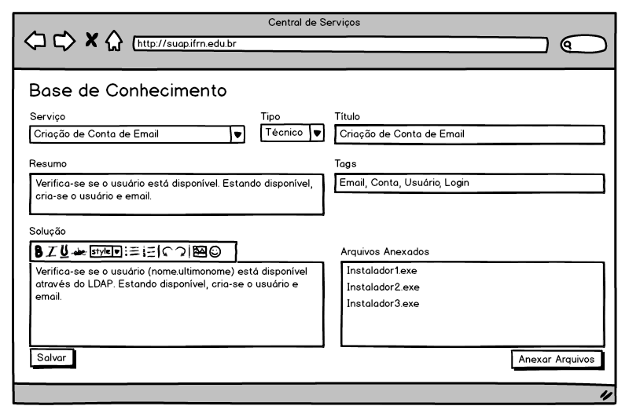

.. include:: header.rst

.. _suap-artefatos-adm-centralservicos-uc102:

UC102 - Manter Base de Conhecimento <v0.1>
==========================================

.. contents:: Conteúdo
    :local:
    :depth: 4

Histórico da Revisão
--------------------

.. list-table:: **Histórico da Revisão**
   :widths: 10 5 30 15
   :header-rows: 1
   :stub-columns: 0

   * - Data
     - Versão
     - Descrição
     - Autor
   * - 03/07/2014
     - 0.1
     - Início do Documento
     - Rafael Pinto

Objetivo
--------

.. _suap-artefatos-adm-centralservicos-uc102-objetivo:

Cadastrar e manter atualizadas a base de conhecimento da central de serviços.

Atores
------

Principais
^^^^^^^^^^
Chefe da Equipe de Suporte

Interessado
^^^^^^^^^^^
Chefe da Equipe de Suporte / Técnico de Suporte

Pré-condições
-------------
Cadastro de Serviços.

Pós-condições
-------------

Fluxo de Eventos
----------------

Fluxo Normal
^^^^^^^^^^^^
.. _FN:

    #. O caso de uso é iniciado selecionando a opção ``Central de Serviços`` > ``Base de Conhecimento``
    #. O sistema apresenta uma listagem das soluções (base de conhecimento) já cadastrados (RIN01_):
    #. O ator seleciona a opção ``Adicionar Base de Conhecimento``
    #. Na tela ``Adicionar Base de Conhecimento`` o ator preenche os campos (RIN02_)
    #. O ator finaliza o caso de uso selecionando a opção ``Salvar``
    #. O sistema apresenta a listagem do passo FN-2

Fluxos Alternativos
^^^^^^^^^^^^^^^^^^^

FA1 – Editar (FN_-2, FA5.2)
"""""""""""""""""""""""""""

#. O ator seleciona a opção ``Editar`` de uma das linhas da listagem de base de conhecimento já cadastradas
#. Na tela ``Editar <nome da base de conhecimento>`` o ator altera os campos (RIN02_), os dados da base de conhecimento já virão preenchidos
#. O ator finaliza o caso de uso selecionando a opção ``Salvar``
#. O sistema apresenta a listagem do passo FN-2

FA2 – Salva e adicionar novo (FN_-4, FA1.2)
"""""""""""""""""""""""""""""""""""""""""""

#. O ator seleciona a opção ``Salvar e adicionar outro(a)`` ao invés da opção ``Salvar``
#. Após salvar a base de conhecimento o caso de uso reinicia no passo FN-3

FA3 – Salvar e continuar editando (FN_-4, FA1.2)
""""""""""""""""""""""""""""""""""""""""""""""""

#. O ator seleciona a opção ``Salvar e continuar editando`` ao invés da opção ``Salvar``
#. Após salvar a base de conhecimento o caso de uso reinicia no FA1.2

FA4 – Remover (FN_-2, FA1.2)
""""""""""""""""""""""""""""

#. O ator seleciona a opção ``Remover`` de uma das linhas da listagem da base de conhecimento já cadastrada
#. Na tela ``Remover base de conhecimento`` o sistema apresenta uma lista todos os registros filhos relacionados a base de conhecimento
#. O ator seleciona a opção ``Sim, tenho certeza`` para confirma que deseja remover esta base de conhecimento
#. O sistema apresenta a listagem do passo FN-2

FA5 – Visualizar (FN_-2)
""""""""""""""""""""""""

#. O ator seleciona a opção ``Visualizar`` de uma das linhas da listagem de base de conhecimento já cadastrados
#. Na tela ``Visualizar base de conhecimento`` o sistema:

   #) Apresenta os campos (RIN02)

Fluxos de Exceção
^^^^^^^^^^^^^^^^^

FE1 – Cancelar remoção de base de conhecimento (FA4.2)
""""""""""""""""""""""""""""""""""""""""""""""""""""""

#. O ator seleciona a opção ``Cancelar`` na tela ``Remover base de conhecimento`` 
#. O sistema apresenta a listagem do passo FN-2

Especificação suplementares
---------------------------

Requisitos Não-Funcionais
^^^^^^^^^^^^^^^^^^^^^^^^^

Não há.

Requisitos de Interface
^^^^^^^^^^^^^^^^^^^^^^^

Não há.

Requisitos de Informação
^^^^^^^^^^^^^^^^^^^^^^^^

.. _RIN01:

RIN01 – Campos para listagem de base de conhecimento
""""""""""""""""""""""""""""""""""""""""""""""""""""

.. list-table:: 
   :header-rows: 1
   :stub-columns: 1

   * - 
     - Opções
     - Serviço
     - Tipo
     - Título
   * - Ordenação
     - Não
     - Sim
     - Não
     - Sim
   * - Filtro
     - Não
     - Sim
     - Sim
     - Sim
   * - Busca
     - Não
     - Não
     - Não
     - Não
   * - Observações
     - 
       .. csv-table::
          :header: "Rótulo"
          :widths: 100

          Visualizar
          Editar

     - 
     - 
     - 

.. _RIN02:

RIN02 – Campos para cadastros de base de conhecimento (incluir, editar e visualizar)
""""""""""""""""""""""""""""""""""""""""""""""""""""""""""""""""""""""""""""""""""""

.. list-table:: 
   :header-rows: 1
   :stub-columns: 0

   * - Informação
     - Tipo
     - Tamanho
     - Valor Inicial
     - Domínio
     - Máscara
   * - Serviço
     - Seleção (Combobox)
     - 
     - 
     - Serviço 
     - 
   * - Tipo*
     - Seleção (Combobox)
     - 
     - 
     - 
       .. csv-table::
          :header: "Rótulo"
          :widths: 100

          Técnico
          FAQ     
     -     
   * - Título*
     - Texto
     - 60
     - 
     - 
     -      
   * - Resumo*
     - Texto Longo
     - 
     - 
     -  
     - 
   * - Tags*
     - Texto
     - 60
     - 
     - 
     -
   * - Solução*
     - Texto longo (Editor rico)
     - 
     - 
     - 
     -
   * - Anexos*
     - Arquivos para upload
     - 
     - 
     - 
     -

Regras de Negócio
^^^^^^^^^^^^^^^^^

Não há.
   

Mensagens
^^^^^^^^^

Não há.
  

.. _pde:

Ponto de Extensão
-----------------

Não há.

Questões em Aberto
------------------

Não há.

Esboço de Protótipo 
-------------------

Tela de cadastro de serviços
^^^^^^^^^^^^^^^^^^^^^^^^^^^^

Diagrama de domínio do caso de uso
----------------------------------

Não há.

Diagrama de Fluxo de Operação
-----------------------------

Não há.

Cenário de Testes
-----------------

.. note:: Falta construir os cenários de teste.

.. comment

  Objetivos
  ^^^^^^^^^

  O objetivo desde Caso de Testes é identificar o maior número possível de cenários e variações dos requisitos 
  de software desde Caso de Uso. É dado um conjunto de dados de entradas, condições de execução, resultados 
  esperados que visam validar esse caso de uso.

  Casos e Registros de Teste
  ^^^^^^^^^^^^^^^^^^^^^^^^^^

  Fluxo de Exceção FE1
  """"""""""""""""""""

  .. list-table:: 
     :widths: 10 50
     :stub-columns: 1

     * - Objetivo
       - 
     * - Dados de Entrada
       - 
     * - Resultado Esperado
       - 
     
