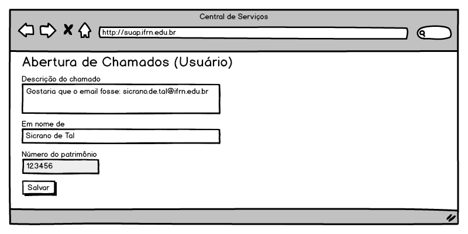
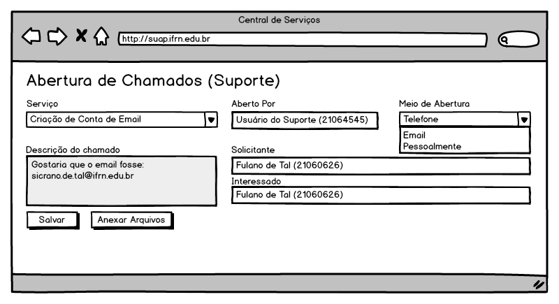

.. include:: header.rst

.. _suap-artefatos-adm-centralservicos-uc200:

UC200 - Abrir Chamado <v0.1>
============================

.. contents:: Conteúdo
    :local:
    :depth: 4

Histórico da Revisão
--------------------

.. list-table:: **Histórico da Revisão**
   :widths: 10 5 30 15
   :header-rows: 1
   :stub-columns: 0

   * - Data
     - Versão
     - Descrição
     - Autor
   * - 03/07/2014
     - 0.1
     - Início do Documento
     - Rafael Pinto

Objetivo
--------

.. _suap-artefatos-adm-centralservicos-uc200-objetivo:

Possibilitar abertura dos chamados pelo usuário da central de serviços.

Atores
------

Principais
^^^^^^^^^^
Requisitante, Atendente do Suporte

Interessado
^^^^^^^^^^^

Pré-condições
-------------
Cadastro de Serviços.

Pós-condições
-------------

Fluxo de Eventos
----------------

Fluxo Normal
^^^^^^^^^^^^
.. _FN:

    #. O caso de uso é iniciado selecionando a opção ``Central de Serviços`` > ``Abrir Chamado``
    #. O sistema apresenta uma listagem serviços disponíveis, agrupados por ``Categoria de Serviço`` e ``Grupo de Serviço``
    #. O ator clica em algum dos serviços disponíveis
    #. Na tela seguinte, o ator deve completar/preencher o campo descrição, interessado e ``número do patrimônio`` (este último) quando disponível
    #. O ator finaliza o caso de uso selecionando a opção ``Salvar``
    #. O sistema apresenta a tela de visualização do chamado, :ref:`suap-artefatos-adm-centralservicos-uc201`, onde é possível (dentre outras coisas) anexar arquivos ao chamado

Fluxos de Exceção
^^^^^^^^^^^^^^^^^

Especificação suplementares
---------------------------

Requisitos Não-Funcionais
^^^^^^^^^^^^^^^^^^^^^^^^^

Não há.

Requisitos de Interface
^^^^^^^^^^^^^^^^^^^^^^^

Deverá haver uma tela de abertura de chamado amigável, com os Serviços agrupados por Categoria e Grupo.

Requisitos de Informação
^^^^^^^^^^^^^^^^^^^^^^^^

.. _RIN01:

RIN01 – Campos para abertura do chamado
"""""""""""""""""""""""""""""""""""""""

.. list-table::
   :header-rows: 1
   :stub-columns: 0

   * - Informação
     - Tipo
     - Tamanho
     - Valor Inicial
     - Domínio
     - Máscara
   * - Serviço
     - Lista
     -
     -
     -
     -
   * - Descrição
     - Texto Longo
     -
     - ``Texto modelo de preenchimento`` do cadastro de Serviço
     -
     -
   * - Aberto por
     - Texto (Oculto)
     -
     - Usuário Logado
     -
     -
   * - Requisitante
     - Texto (Oculto)
     -
     - Usuário Logado
     -
     -
   * - Interessado
     - Autocomplete
     -
     - Usuário Logado
     -
     -
   * - Texto Informativo
     - Texto (Desabilitado)
     -
     - ``Texto exibido para ajuda`` do cadastro de Serviço
     -
     -
   * - Status
     - Texto (Oculto)
     -
     - Aberto
     -
     -
   * - Meio de Abertura
     - Texto (Oculto)
     -
     - Interface Web
     -
     -

Regras de Negócio
^^^^^^^^^^^^^^^^^

.. list-table::
   :widths: 10 90
   :header-rows: 1
   :stub-columns: 0

   * - Regra
     - Descrição / Mensagem
   * - RN01
     - | Se o serviço selecionado tiver o ``Requer número de patrimônio?`` igual a verdadeiro, o campo ``Número do patrimônio`` deverá aparecer e será obrigatório.
     	 Caso contrário, o campo não deve aparecer.
   * - RN02
     - | Se o serviço selecionado tiver o ``Permite abertura de Terceiros?`` igual a falso, o campo ``Requisitante`` não deverá aparecer. O valor padrão para este campo é o usuário logado ou o interessado (caso seja aberto por um Atendente).
   * - RN03
     - | Se o chamado estiver sendo aberto por um Atendente do Suporte, os campos ``Requisitante`` e ``Interessado`` deverão aparecer habilitados para escolha (autocomplete), além do campo ``Meio de Abertura``
   * - RN04
     - | Ao abrir um chamado, deverá ser enviado um email ao usuário Interessado. Informando o número do chamado.

.. _RN1: `Regras de Negócio`_

Mensagens
^^^^^^^^^

Não há.

.. _pde:

Ponto de Extensão
-----------------

Não há.

Questões em Aberto
------------------

Não há.

Esboço de Protótipo
-------------------

Tela de abertura de chamados pelo Usuário
^^^^^^^^^^^^^^^^^^^^^^^^^^^^^^^^^^^^^^^^^

Tela de abertura de chamados pelo Suporte
^^^^^^^^^^^^^^^^^^^^^^^^^^^^^^^^^^^^^^^^^

Diagrama de domínio do caso de uso
----------------------------------

Não há.

Diagrama de Fluxo de Operação
-----------------------------

Não há.

Cenário de Testes
-----------------

.. note:: Falta construir os cenários de teste.

.. comment

  Objetivos
  ^^^^^^^^^

  O objetivo desde Caso de Testes é identificar o maior número possível de cenários e variações dos requisitos
  de software desde Caso de Uso. É dado um conjunto de dados de entradas, condições de execução, resultados
  esperados que visam validar esse caso de uso.

  Casos e Registros de Teste
  ^^^^^^^^^^^^^^^^^^^^^^^^^^

  Fluxo de Exceção FE1
  """"""""""""""""""""

  .. list-table::
     :widths: 10 50
     :stub-columns: 1

     * - Objetivo
       -
     * - Dados de Entrada
       -
     * - Resultado Esperado
       -

