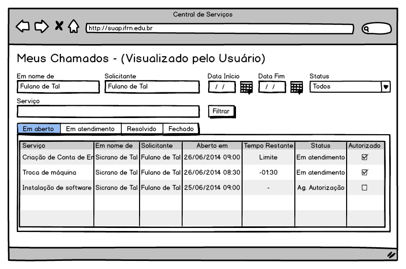
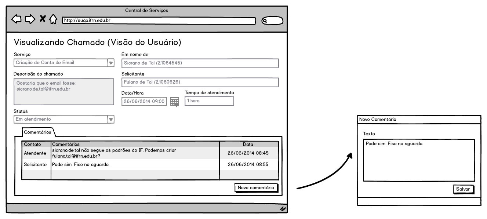

.. include:: header.rst

.. _suap-artefatos-adm-centralservicos-uc201:

UC201 - Listar e Visualizar Meus Chamados <v0.1>
================================================

.. contents:: Conteúdo
    :local:
    :depth: 4

Histórico da Revisão
--------------------

.. list-table:: **Histórico da Revisão**
   :widths: 10 5 30 15
   :header-rows: 1
   :stub-columns: 0

   * - Data
     - Versão
     - Descrição
     - Autor
   * - 03/07/2014
     - 0.1
     - Início do Documento
     - Rafael Pinto

Objetivo
--------

.. _suap-artefatos-adm-centralservicos-uc201-objetivo:

Listar e possibilitar a visualização dos chamados abertos pelo usuário da central de serviços.

Atores
------

Principais
^^^^^^^^^^
Requisitante

Interessado
^^^^^^^^^^^

Pré-condições
-------------
Cadastro de Serviços.

Pós-condições
-------------

Fluxo de Eventos
----------------

Fluxo Normal
^^^^^^^^^^^^
.. _FN:

    #. O caso de uso é iniciado selecionando a opção ``Central de Serviços`` > ``Meus Chamados``
    #. O sistema apresenta uma listagem dos chamados abertos pelo usuário ou que ele seja o interessado (RIN01_):
    #. O ator seleciona a opção ``Visualizar Chamado``
    #. Na aba ``Comentários`` o ator preenche o campo texto (RIN02_)
    #. O ator finaliza o caso de uso selecionando a opção ``Salvar``
    #. O sistema apresenta a listagem do passo FN-2

Fluxos de Exceção
^^^^^^^^^^^^^^^^^

Especificação suplementares
---------------------------

Requisitos Não-Funcionais
^^^^^^^^^^^^^^^^^^^^^^^^^

Não há.

Requisitos de Interface
^^^^^^^^^^^^^^^^^^^^^^^

Não há.

Requisitos de Informação
^^^^^^^^^^^^^^^^^^^^^^^^

.. _RIN01:

RIN01 – Campos para listagem de chamados
""""""""""""""""""""""""""""""""""""""""

.. list-table:: 
   :header-rows: 1
   :stub-columns: 1

   * - 
     - Opções
     - Serviço
     - Em nome de
     - Requisitante
     - Aberto em
     - Tempo restante
     - Status
     - Autorizado
   * - Ordenação
     - Não
     - Sim
     - Sim
     - Sim
     - Sim
     - Não
     - Não
     - Não
   * - Filtro
     - Não
     - Não
     - Não
     - Não
     - Não
     - Não
     - Não
     - Não
   * - Busca
     - Não
     - Não
     - Não
     - Não
     - Não
     - Não
     - Não
     - Não
   * - Observações
     - 
       .. csv-table::
          :header: "Rótulo"
          :widths: 100

          Visualizar

     - 
     - 
     - 
     -
     -
     -     
     -
	 
.. _RIN02:

RIN02 – Campos para visualização do chamado (inclusão apenas de comentários)
""""""""""""""""""""""""""""""""""""""""""""""""""""""""""""""""""""""""""""

.. list-table:: 
   :header-rows: 1
   :stub-columns: 0

   * - Informação
     - Tipo
     - Tamanho
     - Valor Inicial
     - Domínio
     - Máscara
   * - Serviço
     - Seleção (desabilitado)
     - 
     - 
     -  
     - 
   * - Em nome de
     - Texto (Desabilitado)
     - 
     - 
     - 
     -     
   * - Requisitante
     - Texto (Desabilitado)
     - 
     - 
     - 
     -      
   * - Descrição do chamado
     - Texto Longo (Desabilitado)
     - 
     - 
     -  
     - 
   * - Data/Hora de Abertura
     - Data/Hora (Desabilitado)
     - 
     - 
     - 
     -
   * - Tempo de atendimento
     - Texto (Desabilitado)
     - 
     - 
     - 
     -
   * - Status
     - Seleção (Desabilitado)
     - 
     - 
     - 
     -
   * - Listagem de Comentários
     - Tabela
     - 
     - 
     - 
     -

Regras de Negócio
^^^^^^^^^^^^^^^^^

Não há.
   

Mensagens
^^^^^^^^^

Não há.
  

.. _pde:

Ponto de Extensão
-----------------

Não há.

Questões em Aberto
------------------

Não há.

Esboço de Protótipo 
-------------------

Tela de Listagem de Chamados
^^^^^^^^^^^^^^^^^^^^^^^^^^^^

Tela de Visualização do Chamado
^^^^^^^^^^^^^^^^^^^^^^^^^^^^^^^

Diagrama de domínio do caso de uso
----------------------------------

Não há.

Diagrama de Fluxo de Operação
-----------------------------

Não há.

Cenário de Testes
-----------------

.. note:: Falta construir os cenários de teste.

.. comment

  Objetivos
  ^^^^^^^^^

  O objetivo desde Caso de Testes é identificar o maior número possível de cenários e variações dos requisitos 
  de software desde Caso de Uso. É dado um conjunto de dados de entradas, condições de execução, resultados 
  esperados que visam validar esse caso de uso.

  Casos e Registros de Teste
  ^^^^^^^^^^^^^^^^^^^^^^^^^^

  Fluxo de Exceção FE1
  """"""""""""""""""""

  .. list-table:: 
     :widths: 10 50
     :stub-columns: 1

     * - Objetivo
       - 
     * - Dados de Entrada
       - 
     * - Resultado Esperado
       - 
     
