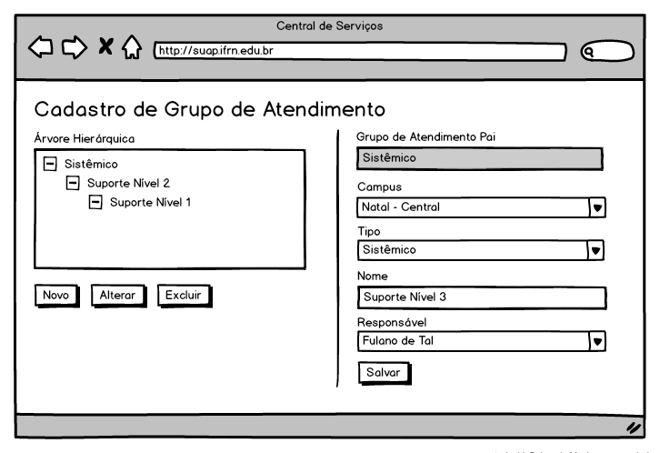
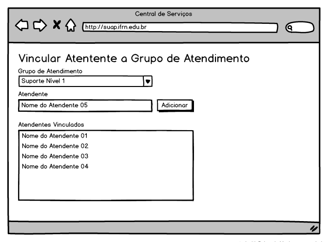
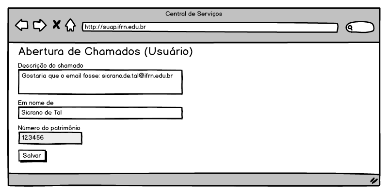

.. |logo| image:: ../../../_static/images/logo_ifrn.png

.. |titulo| replace:: **Central de Serviços**

.. include:: ../../header.rst
   :start-after: docvisao-start
   :end-before: docvisao-end

.. _suap-artefatos-adm-centralservicos-visao:

Documento de Visão do Subsistema Central de Serviços <v0.1>
===========================================================

.. contents:: Conteúdo
    :local:
    :depth: 4

Histórico da revisão
--------------------

.. list-table:: **Histórico da Revisão**
   :widths: 10 5 30 15
   :header-rows: 1
   :stub-columns: 0

   * - Data
     - Versão
     - Descrição
     - Autor
   * - 25/06/2014
     - 0.1
     - Início do Documento
     - Rafael Pinto

Introdução
----------

Finalidade do documento
^^^^^^^^^^^^^^^^^^^^^^^

A finalidade deste documento é especificar os requisitos relevantes do usuários, assim como os limites e restrições evidentes que dão uma
visão geral. Essa visão viabiliza a identificação e a produção de documentos e requisitos mais técnicos, assim como do próprio sistema.
A visão serve como forma de permitir a compreensão, pelos participantes do projeto, do “o quê e por quê” o projeto existe e provê uma
estratégia a partir da qual todas as futuras decisões podem ser validadas.

Finalidade do sistema
^^^^^^^^^^^^^^^^^^^^^

.. finalidade_start

A finalidade do sistema é prover um meio centralizado para que o usuário final possa realizar requisições ou reportar incidentes relacionados aos
serviços de TI. Desta forma, será possível mapear as principais requisições/incidentes, melhorar a 'base de conhecimento' das soluções e dar
transparência na resolução do problema ao usuário solicitante.

.. finalidade_end

Motivações, necessidades e problemas
------------------------------------

A motivação para o desenvolvimento deste módulo foi a dificuldade para controlar manualmente, em planilhas eletrônicas,
a demanda de serviços de atendimento realizados pela DIGTI, bem como a documentação da base de conhecimento das soluções.

Projeto da solução
------------------

Desenvolvimento de uma aplicação Web integrada ao Suap.

Descrição dos papeis
--------------------

Papel das partes interessadas
^^^^^^^^^^^^^^^^^^^^^^^^^^^^^

.. list-table::
   :widths: 30 70
   :header-rows: 1
   :stub-columns: 0

   * - Representante
     - Responsabilidades
   * - Alex Furtunato
     - Fornecer requisitos e validar o sistema
   * - Calos Eduardo Egito
     - Fornecer requisitos e validar o sistema

Papel dos atores
^^^^^^^^^^^^^^^^

.. list-table::
   :widths: 15, 15, 70
   :header-rows: 1
   :stub-columns: 0

   * - Ator
     - Sinônimos
     - Descrição
   * - Requisitante
     - Usuário Requisitante
     - Responsável por abrir os chamados reportando requisições ou incidentes relacionados aos serviços de TI.
   * - Interessado
     - Usuário Interessado
     - Usuário afetado diretamente pelo chamado. A quem o chamado se refere.
   * - Autorizador
     - Usuário Autorizador
     - Responsável autorizar chamados abertos para realização de determinados serviços que requerem autorização.
   * - Atendente do Suporte
     - Suporte/Atendimento/Atendente do Suporte/Técnico de Atendimento
     - Responsável realizar os chamados abertos pelos requisitantes, após autorizados.
   * - Chefe da Equipe de Suporte
     - Chefe da Equipe de Suporte/Responsável Técnico da Equipe de Suporte
     - Responsável analisar determinadas solicitações de serviços e encaminhar um 'pedido de autorização' a determinado usuário (autorizador) do sistema. Também é responsável por atribuir um chamado a determinado Atendente do Suporte.

Visão geral do produto
----------------------

Modelagem de processos de negócio
^^^^^^^^^^^^^^^^^^^^^^^^^^^^^^^^^

.. image:: imagens/diagrama-de-atividades.png
   :scale: 80 %

.. csv-table:: Detalhamento das atividades do processo da central de serviços
   :header: "#", "Atividade", "Ator responsável", "Descrição"
   :widths: 1 9 10 70

   1, "Cadastrar chamado", "Requisitante", "O requisitante preenche o formulário, reportando uma nova requisição ou incidente."
   2, "Designar autorizador", "Suporte", "Caso o chamado necessite de uma autorização e esta autorização seja do tipo 'designada pelo suporte', o chefe da equipe de suporte deverá encaminhar a autorização especificamente para um usuário (autorizador)."
   3, "Autorizar chamado", "Autorizador", "O autorizador, consulta os chamados pendentes de sua autorização, deferindo ou não o pedido de autorização"
   4, "Analisar chamado", "Suporte", "O atendente do suporte consulta os chamados abertos e autorizados (ou que não necessitam de autorização), verificando se estes chamados estão com todas as informações completas. Caso esteja faltando alguma informação, envia uma notificação ao requisitante, pedindo complementação."
   5, "Acrescentar informações", "Requisitante", "O requisitante, após receber notificação ou consultar seus chamados, acrescenta informações referente ao chamado aberto."
   6, "Atender chamado", "Suporte", "O atendente do suporte, após constatar que todas as informações do chamado estão completas, realiza o atendimento do mesmo."

Requisitos
^^^^^^^^^^
.. note::
   Descreva os requisitos funcionais e não funcionais do produto.
   Foi decidido que não haverá divisão entre requisitos funcionais e não funcionais.

   :ref:`suap-models-recnaofuncionais-categoria`

.. list-table::
   :widths: 10 60 30
   :header-rows: 1
   :stub-columns: 0

   * - Cód
     - Descrição
     - Categoria
   * - R01
     - O sistema deverá permitir que a equipe de Suporte cadastre os serviços prestados pela TI, na forma de Requisição ou Incidente,
       agrupando-os em dois níveis (Categorias e Grupos), sendo que um Grupo de Serviço pode pertencer a mais de uma
       Categoria de Serviço.
     - Especificação
   * - R02
     - Alguns serviços necessitam de Autorização. Estas autorizações devem ser realizadas de acordo com os seguintes "perfis":
       Chefe imediato do interessado, Diretor Admin. do Campus do interessado, Diretor Geral do Campus do interessado,
       Coordenador de TI do Campus, DIGTI, EAD ou por algum usuário específico Designado pelo Suporte. Nestes casos,
       somente após autorizados os serviços serão realizados.
     - Especificação
   * - R03
     - O sistema deverá permitir que o Chefe da Equipe de Suporte vincule seus Funcionários aos Níveis de Suporte correspondentes,
       de forma que um chamado que esteja atribuído a determinado nível possa ser filtrado ou limitado a determinados Atendentes.
     - Especificação
   * - R04
     - Os chamados poderão ser abertos pelo próprio usuário interessado, por terceiros (quando o serviço permitir) ou diretamente
       pelo Atendente do Suporte.
     - Especificação
   * - R05
     - Sempre que um chamado for aberto, deverá ser Atribuído à Equipe de Primeiro Nível do Campus do Interessado. Deverá haver uma e
       apenas uma Equipe de Primeiro Nível por Campus do Interessado. Caso não haja nenhuma equipe cadastrada no
       Primeiro Nível do Campus, o sistema deverá informar o ocorrido ao usuário e o chamado não poderá ser Aberto.
     - Especificação
   * - R06
     - Os chamados abertos podem ser atribuídos pelo Responsável Técnico da Equipe de Suporte a algum Atendente do Suporte,
       que ficará encarregado de atender ou entrar em contato com usuário (quando necessário) para requisitar maiores informações.
       O Responsável Técnico da Equipe de Suporte também poderá cancelar determinada atribuição para em seguida atribuir a outro
       Atendente do Suporte. Além disso, os atendentes podem consultar os chamados abertos e fazer uma 'auto-atribuição'
       de determinado chamado, estando o mesmo já atribuido ou não. No entanto um Atendente não pode se desvincular de um chamado.
     - Especificação
   * - R07
     - O Atendente poderá Escalonar um chamado a um nível superior ou Retornar um chamado a um nível inferior,
       quando entender que determinado chamado não faz parte do contexto de seu nível. Neste caso, o chamado fica atribuido
       ao grupo escalonado ou retornado, mas sem um atendente específico. Ao Escalonar ou Retornar um chamado, o Atendente
       deverá escrever uma Nota Interna dando detalhes de sua decisão.
     - Especificação
   * - R08
     - Os Atendentes do Suporte devem ser capazes de entrar em contato com o usuário requisitante através de mensagens do sistema,
       afim de que possam solicitar maiores informações sobre algum chamado. Estas mensagems serão registradas nos chamados
       sob a denominação de "Comentários" do Chamado.
     - Especificação
   * - R09
     - Os Atendentes do Suporte devem ser capazes de enviar "Notas Internas" entre si, afim de trocar informações técnicas sobre
       o chamado. Estas informações não devem ser visíveis aos usuários externos (Requisitante ou Interessado).
     - Especificação
   * - R10
     - Os Atendentes do Suporte devem ser capazes de Atualizar os Status dos seus chamados com as seguintes opções:
       Aberto, Em Atendimento, Resolvido. Ao atualizar para "Em Atendimento", o atendente deverá informar qual solução foi
       aplicada (registrada na Base de Conhecimento). Chefes da Equipe de Suporte e o Usuário Interessado podem atualizar o
       Status de um Chamado para Fechado ou Reaberto.
     - Especificação
   * - R11
     - O sistema deverá permitir que a equipe de Suporte cadastre uma Base de Conhecimento, afim de que essas soluções
       sejam aplicadas nos Chamados resolvidos bem como sirvam de FAQ para o Portal da instituição.
     - Especificação
   * - R12
     - A tela de Abertura de Chamado deverá exibir uma interface amigável ao usuário Requisitante, agrupando inicialmente as
       Categorias e Grupos de Serviço e posteriormente os Serviços do grupo selecionado.
     - Interface

Casos de uso
^^^^^^^^^^^^

Lista de casos de uso
"""""""""""""""""""""

.. list-table::
   :widths: 40 40 10 10
   :header-rows: 1
   :stub-columns: 0

   * - Cód - Nome - Versão
     - Descrição
     - Complexidade
     - Requisitos relacionados
   * - :ref:`suap-artefatos-adm-centralservicos-uc100`
     -
       .. include:: centralservicos_uc100.rst
          :start-after: Objetivo
          :end-before: Atores
     - Normal
     -
   * - :ref:`suap-artefatos-adm-centralservicos-uc101`
     -
       .. include:: centralservicos_uc101.rst
          :start-after: Objetivo
          :end-before: Atores
     - Normal
     -
   * - :ref:`suap-artefatos-adm-centralservicos-uc102`
     -
       .. include:: centralservicos_uc102.rst
          :start-after: Objetivo
          :end-before: Atores
     - Normal
     -
   * - :ref:`suap-artefatos-adm-centralservicos-uc200`
     -
       .. include:: centralservicos_uc200.rst
          :start-after: Objetivo
          :end-before: Atores
     - Normal
     -
   * - :ref:`suap-artefatos-adm-centralservicos-uc201`
     -
       .. include:: centralservicos_uc201.rst
          :start-after: Objetivo
          :end-before: Atores
     - Normal
     -
   * - :ref:`suap-artefatos-adm-centralservicos-uc202`
     -
       .. include:: centralservicos_uc202.rst
          :start-after: Objetivo
          :end-before: Atores
     - Normal
     -
   * - :ref:`suap-artefatos-adm-centralservicos-uc300`
     -
       .. include:: centralservicos_uc300.rst
          :start-after: Objetivo
          :end-before: Atores
     - Alta
     -

Lista de casos de uso do tipo simples
"""""""""""""""""""""""""""""""""""""

.. csv-table::
   :header: "Cód", "Nome", "Descrição", "Complexidade", "Requisitos relacionados"
   :widths: 10 30 40 10 10

   "UC001", "Categoria de serviço", "", "", ""
   "UC002", "Grupo de serviço", "", "", ""

.. casos-de-uso-end

Modelagem de domínio
^^^^^^^^^^^^^^^^^^^^

Diagrama de modelagem de domínio
""""""""""""""""""""""""""""""""

Protótipos de telas
-------------------

Tela de cadastro de grupo de serviços
^^^^^^^^^^^^^^^^^^^^^^^^^^^^^^^^^^^^^

Tela de cadastro de grupo de serviços
^^^^^^^^^^^^^^^^^^^^^^^^^^^^^^^^^^^^^

Tela de cadastro de serviços
^^^^^^^^^^^^^^^^^^^^^^^^^^^^

Tela de cadastro de grupo de atendimento
^^^^^^^^^^^^^^^^^^^^^^^^^^^^^^^^^^^^^^^^

Tela de vinculação de Atendente ao Grupo de Atendimento
^^^^^^^^^^^^^^^^^^^^^^^^^^^^^^^^^^^^^^^^^^^^^^^^^^^^^^^

Tela de cadastro de base de conhecimento
^^^^^^^^^^^^^^^^^^^^^^^^^^^^^^^^^^^^^^^^
.. image:: imagens/tela-cadastro-base-conhecimento.png

Tela de abertura de chamados pelo Usuário
^^^^^^^^^^^^^^^^^^^^^^^^^^^^^^^^^^^^^^^^^

Tela de abertura de chamados pelo Suporte
^^^^^^^^^^^^^^^^^^^^^^^^^^^^^^^^^^^^^^^^^
.. image:: imagens/tela-abertura-de-chamados-suporte.png

Tela de listagem de chamados (visualizado pelo usuário)
^^^^^^^^^^^^^^^^^^^^^^^^^^^^^^^^^^^^^^^^^^^^^^^^^^^^^^^
.. image:: imagens/tela-listagem-chamados-usuario.png

Tela de visualização de chamados (visualizado pelo usuário)
^^^^^^^^^^^^^^^^^^^^^^^^^^^^^^^^^^^^^^^^^^^^^^^^^^^^^^^^^^^
.. image:: imagens/tela-visualizacao-chamado-usuario.png

Tela de listagem e autorização de chamado de usuário
^^^^^^^^^^^^^^^^^^^^^^^^^^^^^^^^^^^^^^^^^^^^^^^^^^^^

Tela de autorização de chamado de usuário
^^^^^^^^^^^^^^^^^^^^^^^^^^^^^^^^^^^^^^^^^
.. image:: imagens/tela-autorizacao-chamado-usuario.png

Tela de listagem de chamados (visualizado pelo suporte)
^^^^^^^^^^^^^^^^^^^^^^^^^^^^^^^^^^^^^^^^^^^^^^^^^^^^^^^

Tela de atendimento de chamados
^^^^^^^^^^^^^^^^^^^^^^^^^^^^^^^
.. image:: imagens/tela-atendimento-de-chamados.png

Questões em aberto
------------------

- Não há.
