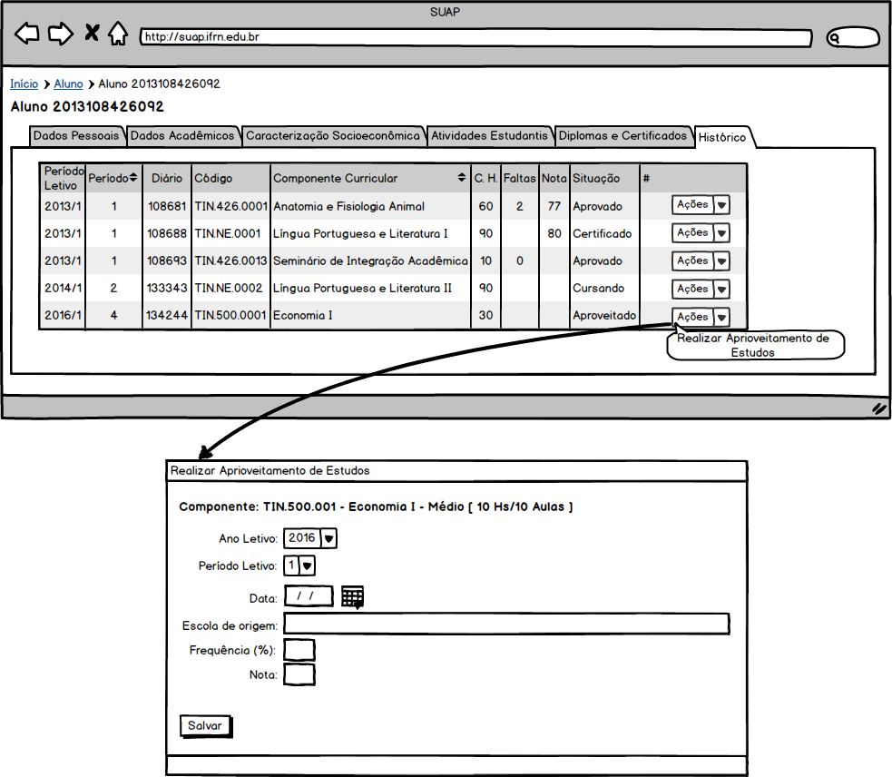

.. |logo| image:: ../../../../_static/images/logo_ifrn.png

.. |titulo| replace:: **Ensino** 

.. include:: ../../../header.rst
   :start-after: uc-start
   :end-before: uc-end

.. _suap-artefatos-edu-ensino-alunos_professores-uc203: 

UC 203 - Manter Aproveitamento de Estudos <v0.1>
================================================

.. contents:: Conteúdo
    :local:
    :depth: 4

Histórico da Revisão
--------------------

.. list-table:: **Histórico da Revisão**
   :widths: 10 5 30 15
   :header-rows: 1
   :stub-columns: 0

   * - Data
     - Versão
     - Descrição
     - Autor
   * - 16/05/2014
     - 0.1
     - Início do Documento
     - Jailton Carlos
   * - 11/05/2014
     - 0.2
     - 
       - Exclusão da RN: exclusão de um aproveitamento de estudos muda a situação do componente para aquela anterior a situação de "Aproveitado"
       - Inclusão do FA3_, M2_, M3_, RN3_
       - Mudança do rótulo "Aproveitado" para "Aproveit. Disciplina"
     - Jailton Carlos
     
Objetivo
--------

Permite registrar ou excluir um aproveitamento de estudo de um componente do histórico escolar do aluno.

Atores
------

Principais
^^^^^^^^^^

Secretário, diretores acadêmicos ou administradores do sistema.

Interessado
^^^^^^^^^^^

Não se aplica.

Pré-condições
-------------

Aluno com matricula ativa

Pós-condições
-------------

Aluno com componente aproveitado

Casos de Uso Impactados
-----------------------

    #. :ref:`suap-artefatos-edu-ensino-proc_apoio-uc502` : influência no cálculo no IRA
    #. :ref:`suap-artefatos-edu-ensino-diarios-uc403`: aluno desabilitado no diário para lançamento de fatlas
    #. :ref:`suap-artefatos-edu-ensino-diarios-uc404`: aluno desabilitado no diário para lançamento de notas

Fluxo de Eventos
----------------

Fluxo Normal
^^^^^^^^^^^^

.. _FN:

    #. O caso de uso é iniciado a partir do passo FN.3 do caso de uso :ref:`suap-artefatos-edu-ensino-alunos_professores-uc200`, ao 
       acionar a  opção ``ENSINO`` > ``Alunos e Professores`` > ``Alunos``,  em seguida, selecionando a opção ``Ver`` 
       do aluno dentre um dos alunos disponíveis na listagem, depois acionar a opção ``Histórico``
    #. O sistema exibe o histórico (RIN1 do caso de uso :ref:`suap-artefatos-edu-ensino-alunos_professores-uc200`)
    #. O secretário aciona a opção ``Ações`` > ``Realizar Aproveitamento de Estudos`` de um dos componente listados no histórico escolar
    #. O secretário informa os dados (RIN1_)
    #. O secretário finaliza o caso de uso selecionando a opção ``Salvar``
    #. O sistema exibe o histórico escolar (passo FN_.2 ) com a situação do componente "Aproveit. Disciplina" 

Fluxo Alternativo
^^^^^^^^^^^^^^^^^

.. _FA1:

FA1 - Editar (FN_.3)
""""""""""""""""""""

    #. O sistema exibe o aproveitamento de estudos com os dados (RIN1_) preenchidos
    #. O secretário informa novos valores para os dados (RIN1_) 
    #. O secretário finaliza o caso de uso selecionando a opção ``Salvar``    
    #. O sistema exibe o histórico escolar (passo FN_.2 ) com a situação do componente em aberto

FA2 - Exclusão de Aproveitamento de Estudos (FA1_.1)
""""""""""""""""""""""""""""""""""""""""""""""""""""

    #. O secretário aciona a opção ``Apagar``
    #. O sistema exibe a mensagem M1_
    #. o secretário confirma a exclusão
    #. O sistema exibe o histórico escolar (passo FN_.2 )
       	

.. _FA3:

FA3 - Componente com Diário (FN_.5)
""""""""""""""""""""""""""""""""""""

    #. O sistema exibe a mensagem M2_
    #. O secretário aciona a opção "Sim, tenho certeza"
    #. O sistema exibe a mensagem M3_
    #. O secretário confirma a inclusão.
    #. Continua no passo FN_.6 
    
    

Fluxo de Exceção
^^^^^^^^^^^^^^^^

FE1 – Inserção fere Regra RN3_ (FN_-3)
"""""""""""""""""""""""""""""""""""""""

Especificação suplementares
---------------------------

Requisitos Não-Funcionais
^^^^^^^^^^^^^^^^^^^^^^^^^ 

Não há.

Requisitos de Interface
^^^^^^^^^^^^^^^^^^^^^^^

Não há.

Requisitos de Informação
^^^^^^^^^^^^^^^^^^^^^^^^

.. _RIN1:
     

RIN1 – Campos para Cadastros
""""""""""""""""""""""""""""

.. list-table:: 
   :widths: 10 20 5 5 5 5
   :header-rows: 1
   :stub-columns: 0

   * - Informação
     - Tipo
     - Tamanho
     - Valor Inicial
     - Domínio/Máscara
     - Observação
   * - Ano letivo*
     - Caixa de seleção
     - 
     - 
     - 
     - 
   * - Periodo Letivo*
     - Caixa de seleção
     - 
     - 
     - 
     - 
   * - Data*
     - Calendário
     - 
     - Data atual
     - DD/MM/AAAA
     -      
   * - Escola de origem
     - Texto
     - 
     - 
     - 
     - 
   * - Frequência
     - Texto
     - 
     - 
     - Número inteiro na faixa de 0 - 100
     -  
   * - Nota*
     - Texto
     - 
     - 
     - Número inteiro na faixa de 0 - 100
     -       
            
A `Figura 1`_ exibe um esboço do formulário de cadastro.

     
Regras de Negócio
^^^^^^^^^^^^^^^^^

.. list-table:: 
   :widths: 10 90
   :header-rows: 1
   :stub-columns: 0

   * - Regra
     - Descrição / Mensagem
   * - RN1
     - | Critério para exibição da opção ``Ações`` > ``Realizar Aproveitamento de Estudos``: essa opção deverá está desabilitada caso: 
     
         - O aluno não tenha cumprido todos os pré-requisitos do componente curricular;
         - O aluno tenha sido reprovado no componente curricular;
         - O componente não tenha sido concluído (situação aprovada, reprovada). 

       | mensagem: não há.    
   * - RN2
     - | Edição ou exclusão de aproveitamento de estudos só será possível se ano/período letivo do aproveitamento for maior ou igual
         ao ano/período letivo corrente.
       | mensagem: não há.   
   * - RN3
     - | O Aluno só poderá solicitar o aproveitamento de disciplina, em conjunto, de até o valor informado no campo "Percentual de dispensa
         para certificação/aproveitamento de disciplina" do caso de uso :ref:`suap-artefatos-edu-ensino-cursos_matr_comp-uc300` da carga horária de
         disciplinas do curso, para cursos técnicos de nível médio, de graduação e de pós-graduação lato sensu.
       | Art. 266, parágrafo único da Organização Didática do IFRN.
       | mensagem: O discente não poderá mais obter dispensa por aproveitamento de estudos, pois irá ultrapassar o percentual máximo
         permitido da carga horária de disciplinas do curso. 
   
  
.. _RN1: `Regras de Negócio`_  
.. _RN2: `Regras de Negócio`_
.. _RN3: `Regras de Negócio`_
 
Mensagens
^^^^^^^^^

.. _M:

.. list-table:: 
   :widths: 10 90
   :header-rows: 1
   :stub-columns: 0

   * - Código
     - Descrição
   * - M1
     - Você tem certeza que quer excluir o aproveitamento de estudos do componente <nome componente>"? 
   * - M2
     - Está ação irá excluir o diário e seus respectivos registros de notas e faltas. Deseja continuar? 
   * - M3
     - Tem certeza que deseja continuar?   

.. _M1: `Mensagens`_     
.. _M2: `Mensagens`_
.. _M3: `Mensagens`_    

Ponto de Extensão
-----------------

Não há.

Questões em Aberto
------------------

Não há.

.. comentário
   Na reunião do dia 15/05/2014 perguntei ao Alessandro se o sistema irá validar o ano/período letivo, 
   ele falou que pode deixar em aberto, mas segundo o inciso X do Art. 15 da Organização Didática do IFRN, 
   o período para aproveitamento de estudos deverá está no calendário acadêmico de referência do IFRN.

Esboço de Protótipo
-------------------

.. _`Figura 1`:

   
   Figura 1: Protótipo de tela.

Diagrama de domínio do caso de uso
----------------------------------

Não há.

Diagrama de Fluxo de Operação
-----------------------------

Não há.

Cenário de Testes
-----------------

Não há.