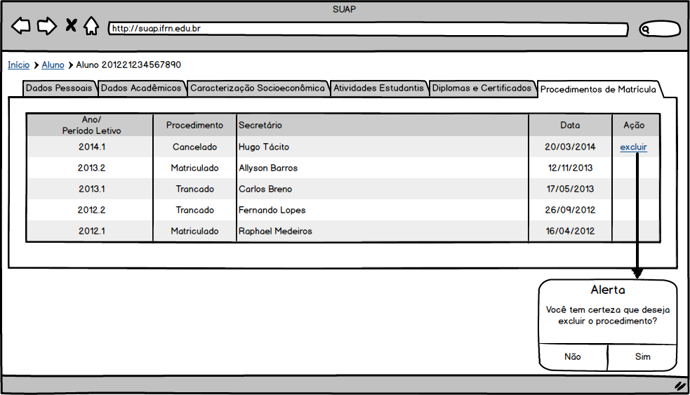

.. |logo| image:: ../../../../_static/images/logo_ifrn.png

.. |titulo| replace:: **Ensino** 

.. include:: ../../../header.rst
   :start-after: uc-start
   :end-before: uc-end

.. _suap-artefatos-edu-ensino-alunos_professores-uc204: 

UC 204 - Visualizar Procedimentos de Matricula <v0.1>
======================================================

.. contents:: Conteúdo
    :local:
    :depth: 4

Histórico da Revisão
--------------------

.. list-table:: **Histórico da Revisão**
   :widths: 10 5 30 15
   :header-rows: 1
   :stub-columns: 0

   * - Data
     - Versão
     - Descrição
     - Autor
   * - 16/05/2014
     - 0.1
     - Início do Documento
     - Hugo Tácito Azevedo de Sena

Objetivo
--------

O usuário poderá cancelar um procedimento de trancamento ou cancelamento de matrícula.

Atores
------

Principais
^^^^^^^^^^

Administrador do sistema, Diretor Acadêmico e Secretário: podem cancelar um procedimento sobre a matrícula do aluno.

Interessado
^^^^^^^^^^^

Aluno.

Pré-condições
-------------

	#. O aluno está com a matrícula cancelada (por evasão, cancelamento voluntário/compulsório, jubilamento e transferências
	   externa/interna) ou trancada (trancamento voluntário, compulsório e intercâmbio).

Pós-condições
-------------

	#. Aluno fica com a situação da matrícula e período restaurados para o estado anterior.

Casos de Uso Impactados
-----------------------

	#. :ref:`suap-artefatos-edu-ensino-alunos_professores-uc202` - Adiciona a aba de procedimentos de apoio e altera a situação do 
	   aluno e do período corrente do aluno para um estado anterior.
	#. :ref:`suap-artefatos-edu-ensino-diarios-uc402` - Altera a situação do aluno no diário para um estado anterior.
	#. :ref:`suap-artefatos-edu-ensino-diarios-uc400` - Altera a situação do aluno no diário para um estado anterior.

Fluxo de Eventos
----------------

Fluxo Normal
^^^^^^^^^^^^

.. _FN:

    #. O caso de uso é iniciado acionando a opção  ``ENSINO`` > ``Alunos e Professores`` > ``Aluno``
    #. O sistema exibe a lista de alunos (:ref:`suap-artefatos-edu-ensino-alunos_professores-uc202-RIN1`)
    #. O Secretário visualiza o aluno ativo.
    #. O sistema exibe as informações sobre o aluno (:ref:`suap-artefatos-edu-ensino-alunos_professores-uc202-RI1`).
    #. O Secretário seleciona a opção ``Procedimentos de Matrícula``
    #. O sistema exibe a lista de procedimentos realizados sobre a matrícula do aluno (RI1_).

Fluxo Alternativo
^^^^^^^^^^^^^^^^^

.. _FA1:
.. _suap-artefatos-edu-ensino-alunos_professores-uc204-FA1:

FA1 - Cancelar Procedimento (FN_.6 )
""""""""""""""""""""""""""""""""""""

    #. O Secretário seleciona o estado atual da matrícula e seleciona a opção ``Excluir``.
    #. O sistema exibe a mensagem de alerta M1_
    #. O Secretário confirma.
    #. O sistema exibe a mensagem M2_ e apresenta uma nova listagem do passo FN_.6 
    	
Fluxo de Exceção
^^^^^^^^^^^^^^^^

FE1 – Exclusão fere Regra RN2_ (FA1_)
""""""""""""""""""""""""""""""""""""""

    #. O sistema exibe a mensagem M3_.

Especificação suplementares
---------------------------

Requisitos Não-Funcionais
^^^^^^^^^^^^^^^^^^^^^^^^^ 

Não há.

Requisitos de Interface
^^^^^^^^^^^^^^^^^^^^^^^

.. _RI1:

RI1 – Exibição dos procedimentos de matrícula 
"""""""""""""""""""""""""""""""""""""""""""""

Os dados da matrícula são exibidos dentro de uma caixa de nome "Procedimentos realizados", são eles:

- ``Ano/Periodo Letivo``: <campo ano>.<campo periodo_letivo> 
- ``Procedimento``: <campo situacao_matricula>
- ``Secretário``: <campo servidor>
- ``Data``: <campo data>
- ``Ação``: <botão lixeira>

A `Figura 1`_ exibe um esboço de como esses dados serão exibidos.

Requisitos de Informação
^^^^^^^^^^^^^^^^^^^^^^^^

Não há.

     
Regras de Negócio
^^^^^^^^^^^^^^^^^

.. list-table:: 
   :widths: 10 90
   :header-rows: 1
   :stub-columns: 0

   * - Regra
     - Descrição / Mensagem
   * - RN1
     - O procedimento de cancelamento deve restaurar o estado da situação (matrícula, período, disciplinas e diários) do aluno 
       para o estado no qual ele se encontrava anteriormente ao procedimento de cancelamento/trancamento.
   * - RN2
     - Apenas o último procedimento de cancelamento/trancamento pode ser desfeito.
   * - RN3
     - O botão de exclusão só aparece para o último procedimento caso sua situação seja de cancelamento/trancamento.
     
.. _RN1: `Regras de Negócio`_  
.. _RN2: `Regras de Negócio`_
   
Mensagens
^^^^^^^^^

.. _M:

.. list-table:: 
   :widths: 10 90
   :header-rows: 1
   :stub-columns: 0

   * - Código
     - Descrição
   * - M1    
     - Você tem certeza que deseja excluir o procedimento?
   * - M2
     - Procedimento cancelado com sucesso.
   * - M3
     - Erro ao cancelar procedimento.       

.. _M1: `Mensagens`_     
.. _M2: `Mensagens`_
.. _M3: `Mensagens`_    
.. _M4: `Mensagens`_    
.. _M5: `Mensagens`_
.. _M6: `Mensagens`_

    
.. _PE:

Ponto de Extensão
-----------------

Não há.

Questões em Aberto
------------------

Não há.

Esboço de Protótipo 
-------------------

.. _`Figura 1`:

.. comentário para usar o exemplo abaixo, basta recuar a margem.

   
   Figura 1: Protótipo de tela para exibição de procedimentos de matrícula.	   

Diagrama de domínio do caso de uso
----------------------------------

Não há.

Diagrama de Fluxo de Operação
-----------------------------

Não há.

Cenário de Testes
-----------------

Não há.