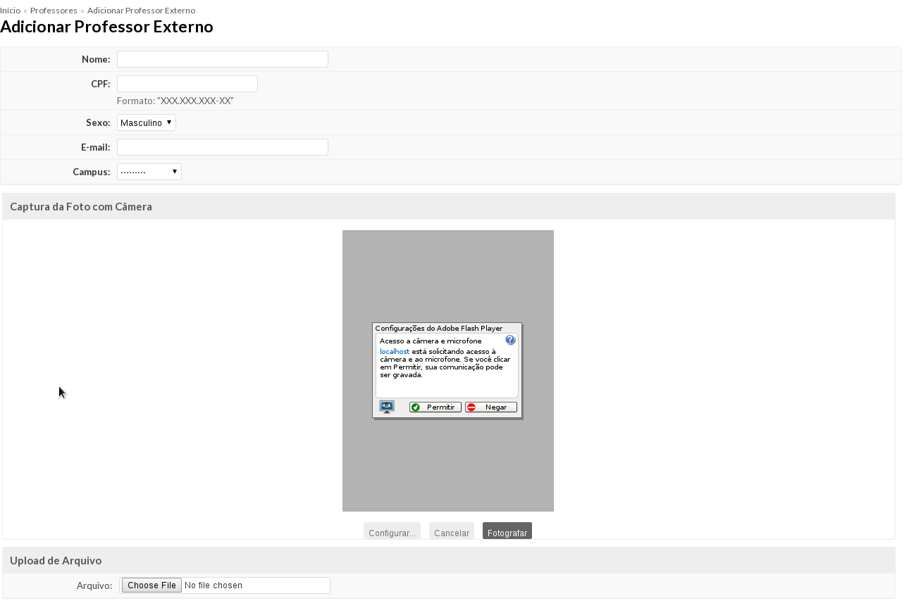

.. |logo| image:: ../../../../_static/images/logo_ifrn.png

.. |titulo| replace:: **Ensino** 

.. include:: ../../../header.rst
   :start-after: uc-start
   :end-before: uc-end

.. _suap-artefatos-edu-ensino-alunos_professores-uc210: 

UC 210 - Cadastrar Professor Convidado <v0.1>
=============================================

.. contents:: Conteúdo
    :local:
    :depth: 4

Histórico da Revisão
--------------------

.. list-table:: **Histórico da Revisão**
   :widths: 10 5 30 15
   :header-rows: 1
   :stub-columns: 0

   * - Data
     - Versão
     - Descrição
     - Autor
   * - 22/05/2014
     - 0.1
     - Início do Documento
     - Hugo Sena

Objetivo
--------

Cadastra um professor convidado.

Atores
------

Principais
^^^^^^^^^^

Secretário, Administrador, Coordenador, Diretor Geral e Acadêmico: podem adicionar um professor convidado.

Interessado
^^^^^^^^^^^

Professor.

Pré-condições
-------------

	#. Não pode haver mais de um professor com o mesmo CPF.

Pós-condições
-------------

	#. O professor como prestador de serviços é cadastrado no sistema.
	#. O professor é cadastrado no sistema.
	#. O professor é cadastrado na rede LDAP.

Casos de Uso Impactados
-----------------------

	#. :ref:`suap-artefatos-edu-ensino-alunos_professores-uc208` - Adiciona o cadastro de professores convidados.

Fluxo de Eventos
----------------

Fluxo Normal
^^^^^^^^^^^^

.. _FN:

    #. O caso de uso é iniciado acionando a opção  ``ENSINO`` > ``Alunos e Professores`` > ``Professores``
    #. O sistema exibe a lista de professores (:ref:`suap-artefatos-edu-ensino-alunos_professores-uc208-RIN1`)
    #. O Secretário seleciona a aba "Convidados"
    #. O sistema exibe uma lista de professores convidados 
    #. O Secretário seleciona a opção ``Adicionar Professor Convidado`` 
    #. O sistema exibe o formulário de cadastro
    #. O Secretário informa os dados (RIN1_)
    #. O Secretário finaliza o caso de uso selecionando a opção ``Salvar``
    #. O sistema exibe a mensagem M1_
    #. O sistema apresenta a listagem do passo FN_.2 

Fluxo Alternativo
^^^^^^^^^^^^^^^^^

.. _FA1:

FA1 - Editar (FN_.4)
""""""""""""""""""""

	#. O Secretário aciona a opção ``Editar`` de um dos professores convidados disponíveis na listagem
	#. O sistema exibe o professor convidado com os dados (RIN1_) preenchidos
	#. O Secretário informa novos valores para os dados (RIN1_) 
	#. O Secretário finaliza o caso de uso selecionando a opção ``Salvar``
	#. O sistema exibe a mensagem M2_.
	#. O sistema apresenta a listagem do passo FN_.2 

.. _FA6:
	
FA2 - Remover (FA1_.4)
""""""""""""""""""""""

    #. O Secretário aciona a opção ``Apagar`` 
    #. O sistema exibe a mensagem M4_
    #. O Secretário aciona a opção "Sim, tenho certeza"
    #. O sistema exibe a mensagem M5_
    #. O Secretário confirma a exclusão.
    #. O sistema apresenta a listagem do passo FN_.2 
    	
    	
Fluxo de Exceção
^^^^^^^^^^^^^^^^

FE1 – Cadastro fere Regra RN2 (FN_.1)
"""""""""""""""""""""""""""""""""""""

Exibe a mensagem M2_

Especificação suplementares
---------------------------

Requisitos Não-Funcionais
^^^^^^^^^^^^^^^^^^^^^^^^^ 

Não há.

Requisitos de Interface
^^^^^^^^^^^^^^^^^^^^^^^

Não há.

Requisitos de Informação
^^^^^^^^^^^^^^^^^^^^^^^^

.. _RIN1:

RIN1 – Campos para Cadastros
""""""""""""""""""""""""""""

.. list-table:: 
   :widths: 10 20 5 5 5 5
   :header-rows: 1
   :stub-columns: 0

   * - Informação
     - Tipo
     - Tamanho
     - Valor Inicial
     - Domínio/Máscara
     - Observação
   * - Nome*
     - Texto
     - 
     - 
     - 
     - 
   * - CPF*
     - Texto
     - 
     - 
     - CPF
     - 
   * - Sexo*
     - Combobox
     - 
     - 
     - Sexo
     - 
   * - Email*
     - Texto
     - 
     - 
     - Email
     - 
   * - Câmpus*
     - Combobox
     - 
     - 
     - UnidadeOrganizacional
     - 
   * - Foto
     - Arquivo ou Captura
     - 
     - 
     - Foto
     - 
     
A `Figura 2`_ exibe um esboço do formulário de cadastro.

     
Regras de Negócio
^^^^^^^^^^^^^^^^^

.. list-table:: 
   :widths: 10 90
   :header-rows: 1
   :stub-columns: 0

   * - Regra
     - Descrição / Mensagem
   * - RN1
     - Somente professores convidados podem ser editados ou excluídos.
   * - RN2
     - Os CPF são únicos, não podem haver mais de um professor convidado com o mesmo CPF.
   * - RN3
     - Professores convidados com diários ou férias não podem ser excluídos.
  
.. _RN1: `Regras de Negócio`_  
.. _RN2: `Regras de Negócio`_
.. _RN3: `Regras de Negócio`_ 
  
Mensagens
^^^^^^^^^

.. _M:

.. list-table:: 
   :widths: 10 90
   :header-rows: 1
   :stub-columns: 0

   * - Código
     - Descrição
   * - M1    
     - Professor cadastrado com sucesso.
   * - M2
     - Já existe um professor com esse CPF.
   * - M3
     - Professor <campo nome> alterado com sucesso. 
   * - M4
     - Você tem certeza que quer remover Professor "<campo nome>"?    
   * - M5
     - Professor excluído com sucesso.       

.. _M1: `Mensagens`_     
.. _M2: `Mensagens`_
.. _M3: `Mensagens`_    
.. _M4: `Mensagens`_    
.. _M5: `Mensagens`_

    
.. _PE:

Ponto de Extensão
-----------------

Não há.

Questões em Aberto
------------------

Não há.

Esboço de Protótipo
-------------------

.. _`Figura 1`:

.. comentário para usar o exemplo abaixo, basta recuar a margem.

   
   Figura 1: Protótipo de tela para cadastro de professores convidados.
	   
	   
.. _`Figura 2`:

.. comentário para usar o exemplo abaixo, basta recuar a margem.
	   
	.. figure:: media/tela_uc210.png
	   :align: center
	   :scale: 70 %
	   :alt: protótipo de tela.
	   :figclass: align-center
	   
	   Figura 2: Protótipo de tela para cadastro de professores convidados.	   

Diagrama de domínio do caso de uso
----------------------------------

Não há.

Diagrama de Fluxo de Operação
-----------------------------

Não há.

Cenário de Testes
-----------------

Não há.