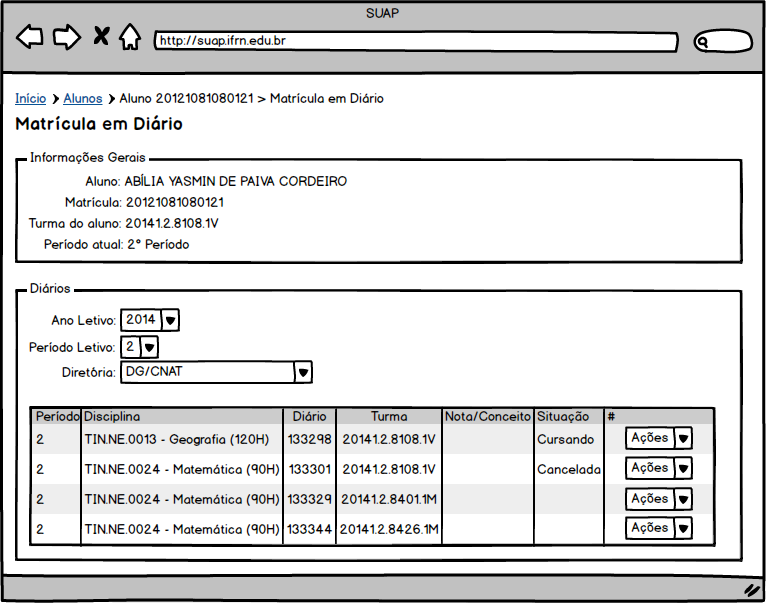

.. |logo| image:: ../../../../_static/images/logo_ifrn.png

.. |titulo| replace:: **Ensino** 

.. include:: ../../../header.rst
   :start-after: uc-start
   :end-before: uc-end

.. _suap-artefatos-edu-ensino-alunos_professores-uc212:

UC 212 - Matricular aluno em diário <v0.1>
==========================================

.. contents:: Conteúdo
    :local:
    :depth: 4

Histórico da Revisão
--------------------

.. list-table:: **Histórico da Revisão**
   :widths: 10 5 30 15
   :header-rows: 1
   :stub-columns: 0

   * - Data
     - Versão
     - Descrição
     - Autor
   * - 27/05/2014
     - 0.1
     - Início do Documento
     - Jailton Carlos

Objetivo
--------

Matricular o aluno, que por ventura não participou do período de matricula regular, em diário.

Atores
------

Principais
^^^^^^^^^^

Secretário, diretores acadêmicos ou administradores do sistema.

Interessado
^^^^^^^^^^^

Não se aplica.

Pré-condições
-------------

- Turmas e diários disponíveis;
- Aluno com matrícula institucional ativa, ou seja, matriculado ou concludente.

Pós-condições
-------------

Aluno matriculado no diário.

Casos de Uso Impactados
-----------------------

    #. :ref:`suap-artefatos-edu-ensino-proc_apoio-uc502` : influência no cálculo do IRA
    #. :ref:`suap-artefatos-edu-ensino-diarios-uc403`: aluno desabilitado no diário para lançamento de fatlas
    #. :ref:`suap-artefatos-edu-ensino-diarios-uc404`: aluno desabilitado no diário para lançamento de notas

Fluxo de Eventos
----------------

Fluxo Normal
^^^^^^^^^^^^

.. _FN:

    #. O caso de uso é iniciado a partir do passo FA5.2 do caso de uso :ref:`suap-artefatos-edu-ensino-alunos_professores-uc202`, ao 
       acionar a  opção ``ENSINO`` > ``Alunos e Professores`` > ``Alunos``,  em seguida, selecionando a opção ``Ver`` 
       do aluno dentre um dos alunos disponíveis na listagem
    #. O secretário aciona a opção ``Ações`` > ``Matricular em Diário``
    #. O sistema exibe os diários disponíveis do período atual do aluno (RIN1_)	
    #. O secretário aciona a opção ``Ações`` > ``Matricular`` de um dos diários da lista
    #. O sistema exibe os diários disponívels (passo FN_.3) com a situação do diário "Cursando" 

Fluxo Alternativo
^^^^^^^^^^^^^^^^^

.. _FA1:

FA1 - Diário sem horário definido (FN_.4)
"""""""""""""""""""""""""""""""""""""""""

    #. O sistema exibe a mensagem M1_
    #. O secretário confirma a matricula do aluno no diário
    #. O sistema apresenta a listagem do passo FN_.3

.. _FA2:

FA2 - Número máximo de disciplinas permitidas (FN_.4)
"""""""""""""""""""""""""""""""""""""""""""""""""""""

    #. O sistema exibe a mensagem M2_
    #. O secretário confirma a matricula do aluno no diário
    #. O sistema apresenta a listagem do passo FN_.3

.. _FA3:

FA3 - Cancelar diário (FN_.3)
"""""""""""""""""""""""""""""

	#. O secretário aciona a opção ``Ações`` > ``Desfazer Cancelamento`` de um dos diários da lista
	#. O sistema exibe os diários disponívels (passo FN_.3) com a situação do diário "Cancelado" 

FA4 - Desfazer cancelamento de diário (FN_.3)
"""""""""""""""""""""""""""""""""""""""""""""

	#. O secretário aciona a opção ``Ações`` > ``Desfazer Cancelamento`` de um dos diários da lista
   #. O sistema exibe os diários disponívels (passo FN_.3) com a situação do diário "Cancelado" 
		
	
FA5 - Remover diário (FN_.3)
""""""""""""""""""""""""""""

   #. É iniciado o caso de uso :ref:`suap-artefatos-edu-ensino-diarios-uc400` e o secretário segue o fluxo alternativo FA1 a partir do passo FA1.1 desse caso de uso
   #. Secretário sai do caso de uso :ref:`suap-artefatos-edu-ensino-diarios-uc400`
   #. O sistema exibe os diários disponívels (passo FN_.3) com a situação do diário "Removido" 

FA6 - Matricular aluno em turma (FN_.2)
"""""""""""""""""""""""""""""""""""""""

   #. É iniciado o caso de uso :ref:`suap-artefatos-edu-ensino-diarios-uc400` e o secretário segue o fluxo normal a partir do passo FN.7 desse caso de uso
   #. Secretário sai do caso de uso :ref:`suap-artefatos-edu-ensino-diarios-uc400`
   #. O sistema exibe os diários disponívels (passo FN_.3) com a situação do diário "Cursando" 
	
    	
Fluxo de Exceção
^^^^^^^^^^^^^^^^

FE1 – Exclusão fere Regra RN4_ (FN_.4)
""""""""""""""""""""""""""""""""""""""

Especificação suplementares
---------------------------

Requisitos Não-Funcionais
^^^^^^^^^^^^^^^^^^^^^^^^^ 

Não há.

Requisitos de Interface
^^^^^^^^^^^^^^^^^^^^^^^

Não há.

Requisitos de Informação
^^^^^^^^^^^^^^^^^^^^^^^^

.. _RIN1:
     
RIN1 – Campos para listagem de Diários
""""""""""""""""""""""""""""""""""""""
 
.. list-table:: 
   :widths: 10 10 10 10 10 10 10 20 
   :header-rows: 1
   :stub-columns: 1

   * - 
     - Período
     - Disciplina
     - Diário
     - Turma
     - Nota/Conceito
     - Situação
     - Ações
   * - Ordenação   
     - Não
     - Não
     - Não
     - Não
     - Não
     - Não
     - Não   
   * - Filtro
     - Não
     - Não
     - Não
     - Não
     - Não
     - Não
     - Não   
   * - Busca
     - Não
     - Não
     - Não
     - Não
     - Não
     - Não
     - Não   
   * - Observações
     - Não
     - Não
     - Não
     - Não
     - Não
     - Não
     - 
       .. csv-table::
          :header: "Ações"
          :widths: 100

          `Matricular` (ver RN6_)
          `Cancelar` (ver RN7_)
          `Desfazer Cancelamento` (ver RN8_)          
		  

A `Figura 1`_ exibe um esboço do formulário.

.. _RIN2:

RIN2 – Campos para Filtro
"""""""""""""""""""""""""

.. list-table:: 
   :widths: 5 5 5 10 5 5
   :header-rows: 1
   :stub-columns: 0

   * - Informação
     - Tipo
     - Tamanho
     - Valor Inicial
     - Domínio/Máscara
     - Observação
   * - Ano Letivo
     - Label
     - 
     - Ano do período atual 
     - 
     - 
   * - Período Letivo
     - Label
     - 
     - Período atual 
     - 
     - 
   * - Diretória
     - Caixa de Seleção
     - 
     - Diretória do curso do aluno
     - 
     - 
        
     
Regras de Negócio
^^^^^^^^^^^^^^^^^

.. list-table:: 
   :widths: 10 90
   :header-rows: 1
   :stub-columns: 0

   * - Regra
     - Descrição / Mensagem
   * - RN1
     - | Critério para cancelamento de diários:
     
         - Somente para os estudantes dos cursos com regime de crédito (:download:`Art. 222 da Organização Didática do IFRN <../media/OrganizacaoDidatica_2012_versaoFINAL_20mai2012.pdf>`),
           isto é, para disciplinas de cursos com regime seriado, não será permitido;
         - Cada disciplina poderá ser cancelada apenas o número informado no campo "Número máximo de cancelamento de diário"
           do caso de uso :ref:`suap-artefatos-edu-ensino-cursos_matr_comp-uc300`;
         - O cancelamento de disciplinas não será concedido para disciplinas constantes do primeiro período na matriz curricular do curso.
            
       | mensagem: Não há. 
   * - RN2
     - | Emitir um alerta quando a matricula em diário exceder o valor informado no campo "Número máximo de disciplinas além do 
          período letivo" do caso de uso :ref:`suap-artefatos-edu-ensino-cursos_matr_comp-uc300`.
       | mensagem: M2_
   * - RN3
     - | Critério para exibição dos diários: 
         - Listar todos os diários cujos componentes não foram integralizados pelo aluno
           de todas as turmas relativos aos componentes da matriz curricular do curso e campus informados
           nas opções de filtro;
         - Não listar os componentes(diários) cujos pré-requisitos o aluno ainda não cursou.
       | mensagem: Não há.        
   * - RN4
     - | O sistema não deve permitir matrículas em diário que tenham choques de horários.
       | mensagem: "Impossível realizar está ação, o horário do diário <identificação do diário [horário]> está com conflito
         com o diário <identificação do diário [horário]"                     
   * - RN5
     - | O sistema deve registrar em log toda as operações.
       | mensagem: Não há.
   * - RN6
     - | Critério para exibição da ação `Matricular`: essa apção só ficará disponível para os diários ainda não matriculado.
       | mensagem: Não há.
   * - RN7
     - | Critério para exibição da ação `Cancelar`: essa opção só ficará disponível para os diários com situação "Cursando" e conforme
         regras definidas em RN1_.
       | mensagem: Não há.
   * - RN8
     - | Critério para exibição da ação `Desfazer Cancelamento`: essa opção só ficará disponível para os diários com situação "Cancelada".
       | mensagem: Não há.
   * - RN9
     - | Emitir um aviso quando a matricula em diário for menor que o valor informado no campo "Número mínimo de disciplinas por 
          período letivo" do caso de uso :ref:`suap-artefatos-edu-ensino-cursos_matr_comp-uc300`.
       | mensagem: M3_

.. _RN1: `Regras de Negócio`_
.. _RN2: `Regras de Negócio`_  
.. _RN3: `Regras de Negócio`_  
.. _RN4: `Regras de Negócio`_  
.. _RN5: `Regras de Negócio`_  
.. _RN6: `Regras de Negócio`_  
.. _RN7: `Regras de Negócio`_  
.. _RN8: `Regras de Negócio`_
.. _RN9: `Regras de Negócio`_
    
   
   
Mensagens
^^^^^^^^^

.. _M:

.. list-table:: 
   :widths: 10 90
   :header-rows: 1
   :stub-columns: 0

   * - Código
     - Descrição
   * - M1    
     - Diário sem horário definido. Tem certeza que deseja continuar?    
   * - M2
     - A matricula do aluno no diário <nome do diário>, excede o número máximo de disciplinas permitidas para o período de referência. 
       Tem certeza que deseja continuar? 
   * - M3
     - O aluno deve está matriculado em no mínimo o "Número mínimo de disciplinas por 
       período letivo" do caso de uso :ref:`suap-artefatos-edu-ensino-cursos_matr_comp-uc300`

.. _M1: `Mensagens`_     
.. _M2: `Mensagens`_   
.. _M3: `Mensagens`_ 

    
.. _PE:

Ponto de Extensão
-----------------

Não há.

Questões em Aberto
------------------

.. comentário
   Alessandro pediu para ignorar o Art. 211. Tinha sugerido colocar como pré-condição.

    

Esboço de Protótipo
-------------------

.. _`Figura 1`:

   
   Figura 1: Protótipo de tela para exibição de Diários.
	   

Diagrama de domínio do caso de uso
----------------------------------

Não há.

Diagrama de Fluxo de Operação
-----------------------------

Não há.

Cenário de Testes
-----------------

Objetivos
^^^^^^^^^

O objetivo desde Caso de Testes é identificar o maior número possível de cenários e variações dos requisitos 
de software desde Caso de Uso. É dado um conjunto de dados de entradas, condições de execução, resultados 
esperados que visam validar esse caso de uso.

Casos e Registros de Teste
^^^^^^^^^^^^^^^^^^^^^^^^^^

T1 - Regra RN1
""""""""""""""

.. list-table:: 
   :widths: 10 50
   :stub-columns: 1

   * - Objetivo
     - Validar o não cancelamento de diários de cursos com regime seriado.
   * - Dados de Entrada
     - Usar o curso descrito no cenário :ref:`suap-artefatos-edu-ensino-cenario_testes-c100`       
   * - Resultado Esperado
     - Texto descrevendo o resultado esperado.
