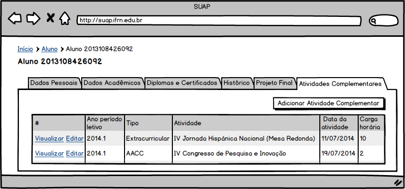
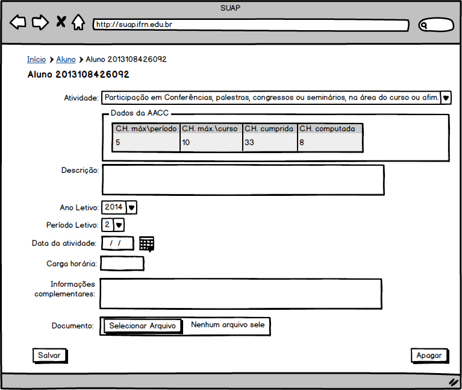
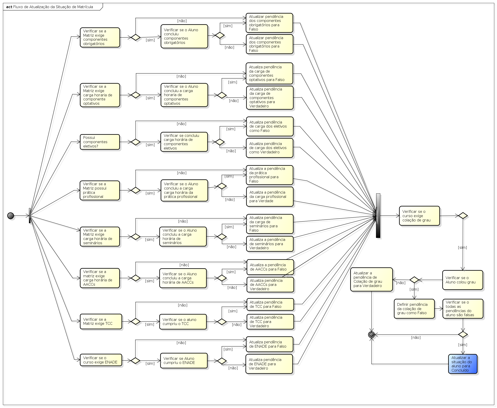

.. |logo| image:: ../../../../_static/images/logo_ifrn.png

.. |titulo| replace:: **Ensino** 

.. include:: ../../../header.rst
   :start-after: uc-start
   :end-before: uc-end

.. _suap-artefatos-edu-ensino-alunos_professores-uc216:

UC 216 - Gerir atividades complementares <v0.1>
===============================================

.. contents:: Conteúdo
    :local:
    :depth: 4

Histórico da Revisão
--------------------

.. list-table:: **Histórico da Revisão**
   :widths: 10 5 30 15
   :header-rows: 1
   :stub-columns: 0

   * - Data
     - Versão
     - Descrição
     - Autor
   * - 19/07/2014
     - 0.1
     - Início do Documento
     - Jailton Carlos

Objetivo
--------

Permite o usuário gerenciar (cadastrar, alterar, remove ou listar) uma atividade complementar 
à prática profissional do aluno.

Atores
------

Principais
^^^^^^^^^^

Secretário, diretores acadêmicos, coordenadores ou administradores do sistema.

Interessado
^^^^^^^^^^^

Não se aplica.

Pré-condições
-------------

Aluno matriculado no período.

Pós-condições
-------------

   Atualizar matricula do aluno conforme fluxo.
   
   A carga horária acumulada será contabilizada dentro do cumprimento da prática profissional.

Casos de Uso Impactados
-----------------------

Não há.

Fluxo de Eventos
----------------

Fluxo Normal
^^^^^^^^^^^^

.. _FN:

    #. O caso de uso é iniciado a partir do passo FA5.2 do caso de uso :ref:`suap-artefatos-edu-ensino-alunos_professores-uc202`, ao 
       acionar a  opção ``ENSINO`` > ``Alunos e Professores`` > ``Alunos``,  em seguida, selecionando a opção ``Ver`` 
       do aluno dentre um dos alunos disponíveis na listagem
    #. O secretário aciona a opção ``Atividades Complementares``   
    #. O sistema exibe a lista de atividades complementares (RIN1_)
    #. O secretário aciona a opção ``Adicionar Atividade Complementar`` 
    #. O secretário informa os dados (RIN2_)
    #. O secretário finaliza o caso de uso selecionando a opção ``Salvar``
    #. O sistema exibe a mensagem M1_
    #. O sistema apresenta a listagem do passo FN_.3 

Fluxo Alternativo
^^^^^^^^^^^^^^^^^

.. _FA1:

FA1 - Editar (FN_.2 )
"""""""""""""""""""""

	#. O secretário aciona a opção ``Editar`` de uma das atividades complementares disponíveis na listagem
	#. O sistema exibe a atividade complementar com os dados (RIN2_) preenchidos
	#. O secretário informa novos valores para os dados (RIN2_) 
	#. O secretário finaliza o caso de uso selecionando a opção ``Salvar``
	#. O sistema exibe a mensagem M2_.
	#. O sistema apresenta a listagem do passo FN_.3
	

FA2 - Visualizar (FN_.2)
""""""""""""""""""""""""

	#. O secretário aciona a opção ``Visualizar`` de uma das linhas da atividade complementar disponíveis na listagem
	#. O sistema exibe informações da registro de projeto final (RI1_)

.. _FA3:
	
FA3 - Remover (FA1_.2)
""""""""""""""""""""""

    #. O secretário aciona a opção ``Apagar`` 
    #. O sistema exibe a mensagem M3_
    #. O secretário confirma a exclusão.
    #. O sistema apresenta a listagem do passo FN_.3 
    	
    	
Fluxo de Exceção
^^^^^^^^^^^^^^^^

Não há.
    

Especificação suplementares
---------------------------

Não há.

Requisitos de Interface
^^^^^^^^^^^^^^^^^^^^^^^

Não há

Requisitos de Informação
^^^^^^^^^^^^^^^^^^^^^^^^

.. _RIN1:
     
RIN1 – Campos para listagem
"""""""""""""""""""""""""""
 
     
.. list-table:: 
   :header-rows: 1
   :stub-columns: 1

   * - 
     - Ações
     - Ano/período letivo
     - Tipo
     - Atividade
     - Data da atividade
     - Carga horária
   * - Ordenação
     - Não
     - Não
     - Não
     - Não
     - Não
     - Não
   * - Filtro
     - Não
     - Não
     - Não
     - Não
     - Não
     - Não
   * - Busca
     - Não
     - Não
     - Não
     - Não
     - Não
     - Não
   * - Observações
     - 
       .. csv-table::
          :header: "Rótulo"
          :widths: 100

          Ver
          Editar
     - 
     - 
     -
     -
     -

          
A `Figura 1`_ exibe um esboço da listagem de registros de projetos finais.     

.. _RIN2:

RIN2 – Campos para Cadastros
""""""""""""""""""""""""""""

.. list-table:: 
   :widths: 10 20 5 5 5 5
   :header-rows: 1
   :stub-columns: 0

   * - Informação
     - Tipo
     - Tamanho
     - Valor Inicial
     - Domínio/Máscara
     - Observação
   * - Descrição*
     - Texto longo
     - 
     - 
     - 
     - 
   * - Tipo*
     - Seleção mutualmente exclusiva
     - 
     - 
     - AACC, Extracurricular
     - 
   * - Atividade*
     - Seleção 
     - 
     - 
     - 
     - 
   * - Ano Letivo*
     - Seleção
     - 
     - 
     - 
     - 
   * - Período Letivo*
     - Seleção
     - 
     - 
     - 
     -   
   * - Data da atividade*
     - Texto Calendário
     - 
     - 
     - 
     -   
   * - Carga horária*
     - Texto
     - 
     - 
     - 
     -      
   * - Informações complementáres 
     - Texto longo
     - 
     - 
     - 
     - 
   * - Documento*
     - Anexar arquivo
     - 
     - 
     - Formato PDF
     -             

A `Figura 2`_ exibe um esboço do formulário de cadastro.

     
Regras de Negócio
^^^^^^^^^^^^^^^^^

.. list-table:: 
   :widths: 10 80
   :header-rows: 1
   :stub-columns: 0

   * - Regra
     - Descrição / Mensagem
   * - RN1
     - | Um tipo de atividade é considerada como AACC, se o tipo estiver presente em uma configuração AACC e está estiver
         relacionada a matriz do curso cujo aluno está matriculado. 
       | mensagem: não há         
   * - RN2
     - | A caixa `Dados da AACC` presente na `Figura 2`_ só será exibida se a regra RN1_ for cumprida.
       | mensagem: não há         
   * - RN3
     - | Após qualquer alteração (Inclusão, edição, exclusão) o sistema deverá verificar se o aluno concluiu o curso, para isso, 
         deverá ser executado o fluxograma de atualização de situação de matrícula.
       | Ver fluxo na `Figura 3`_.   
   * - RN4
     - | Critério para cálculo da carga horária no período:
     
         - máx. no período: é cálculada com base na "Pontuação máxima no período" multiplicado pelo "Fator de conversão (peso)", ambos definidos 
           na configuração de AACC da matriz do curso.
         - máx no curso: é cálculada com base na "Pontuação máxima no curso" multiplicado pelo "Fator de conversão (peso)", ambos definidos 
           na configuração de AACC da matriz do curso.           
         - cumprida: é o somatório de todas as cargas horárias das atividades registradas do aluno cujo tipo de atividade enquadra na regra RN1_
         - considerada: aplica-se o mesmo somatório da cumprida, mas considerar o limite máximo no período ao somatório.                   
       | mensagem: não há. 

      
        
.. _RN1: `Regras de Negócio`_  
.. _RN2: `Regras de Negócio`_
.. _RN3: `Regras de Negócio`_
.. _RN4: `Regras de Negócio`_
.. _RN5: `Regras de Negócio`_
   
Mensagens
^^^^^^^^^

.. _M:

.. list-table:: 
   :widths: 10 90
   :header-rows: 1
   :stub-columns: 0

   * - Código
     - Descrição
   * - M1    
     - Cadastro realizado com sucesso.
   * - M2
     - Atualização realizada com sucesso.
   * - M3
     - Tem certeza que deseja continuar?       

.. _M1: `Mensagens`_     
.. _M2: `Mensagens`_
.. _M3: `Mensagens`_    
    
.. _PE:

Ponto de Extensão
-----------------

Não há.

Questões em Aberto
------------------

Não há.

Esboço de Protótipo
-------------------

.. _`Figura 1`:

   
   Figura 1: Protótipo de tela para listagem de projetos finais cadastrados.
	   
	   
.. _`Figura 2`:
	   

   
   Figura 2: Protótipo de tela para cadastro de projeto final.	   
  

Diagrama de Fluxo de Operação
-----------------------------

O diagrama abaixo representa o fluxo de atividades necessárias para verificar se o aluno concluiu ou não o curso.

.. _`Figura 3`:
      

   
   Figura 3: fluxograma de atualização de status do aluno .   
   

Diagrama de Fluxo de Operação
-----------------------------

Não há.

Cenário de Testes
-----------------

Não há.