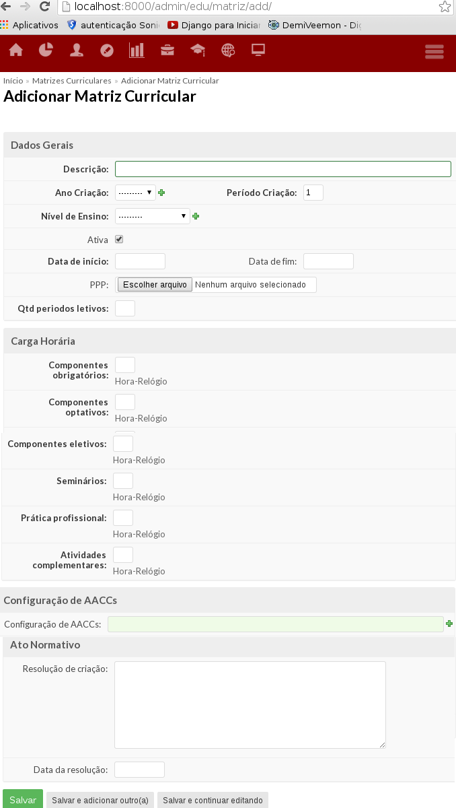

.. |titulo| replace:: **Ensino** 

.. include:: ../../../header.rst
   :start-after: uc-start
   :end-before: uc-end

.. _suap-artefatos-edu-ensino-cursos_matr_comp-uc302: 

UC 302 - Gerir Matrizes Curriculares <v0.1>
===========================================

.. contents:: Conteúdo
    :local:
    :depth: 4

Histórico da Revisão
--------------------

.. list-table:: **Histórico da Revisão**
   :widths: 10 5 30 15
   :header-rows: 1
   :stub-columns: 0

   * - Data
     - Versão
     - Descrição
     - Autor
   * - 28/04/2014
     - 0.1
     - Início do Documento
     - 

Objetivo
--------

Cadastrar, alterar, remove ou listar matrizes curriculares.

Atores
------

Principais
^^^^^^^^^^

Administrador: permite gerir o cadastro de matrizes curriculares. 

Interessado
^^^^^^^^^^^

Não se aplica.

Pré-condições
-------------

Pós-condições
-------------

Fluxo de Eventos
----------------

Fluxo Normal
^^^^^^^^^^^^

.. _FN:

    #. O caso de uso é iniciado acionando a opção  ``ENSINO`` > ``Cursos, Matrizes e Componentes`` > ``Matrizes Curriculares``
    #. O sistema exibe a lista de matrizes curriculares (RIN1_)
    #. O administrador seleciona a opção ``Adicionar Matriz Curricular``
    #. O administrador informa os dados (RIN2_)
    #. O administrador finaliza o caso de uso selecionando a opção ``Salvar``
    #. O sistema exibe a mensagem M1_
    #. O sistema apresenta a listagem do passo FN_.2 

Fluxo Alternativo
^^^^^^^^^^^^^^^^^

.. _FA1:

FA1 – Editar (FN_.2 )
"""""""""""""""""""""

	#. O administrador aciona a opção ``Editar`` dentre uma das matrizes curriculares disponíveis na listagem
	#. O sistema exibe a matriz curricular com os dados (RIN2_) preenchidos
	#. O administrador informa novos valores para os dados (RIN2_) 
	#. O administrador finaliza o caso de uso selecionando a opção ``Salvar``
	#. O sistema exibe a mensagem M2_.
	#. O sistema apresenta a listagem do passo FN_.2 
	
FA2 - Salvar e adicionar outro(a) (FN_.4)
"""""""""""""""""""""""""""""""""""""""""

	#. O administrador aciona a opção ``Salvar e adicionar outro(a)``
	#. O sistema exibe a mensagem M3_.
	#. O caso de uso volta para o passo FN_.4

.. _FA3:

FA3 - Salvar e continuar editando (FA1_.3)
""""""""""""""""""""""""""""""""""""""""""

	#. O administrador aciona a opção ``Salvar e continuar editando``
	#. O sistema exibe a mensagem M4_.
	#. O caso de uso volta para o passo FA1_.3
	

FA4 – Listar (FN_.2)
""""""""""""""""""""

	#. O administrador restringe a lista usando o filtro e/ou busca (RIN1_)
	#. O sistema exibe uma lista que satisfaça aos critérios informados no passo anterior

.. _FA5:   

FA5 - Remover (FA1_.2) 
""""""""""""""""""""""

    #. O administrador aciona a opção ``Apagar`` 
    #. O sistema exibe a mensagem M5_
    #. O administrador aciona a opção "Sim, tenho certeza"
    #. O sistema exibe a mensagem M6_
    #. O administrador confirma a exclusão.
    #. O caso de uso volta para o passo FN_.2

.. _FA6:

FA6 – Visualizar (FN_.2)
""""""""""""""""""""""""

	#. O administrador aciona a opção ``Ver`` da matriz curricular que se deseja visualizar dentre uma das 
	   matriz curricular disponíveis na listagem
	#. O sistema exibe informações da matriz curricular (RI1_)

       #. O sistema exibe informações dos componentes curriculares na aba ``Componentes Curriculares`` (PE_.1)	
       #. O sistema exibe informações dos componentes e seus respectivos pré-requisitos ``Pré-requisitos``	

FA7 - Exportar para XLS (FN_.2)
"""""""""""""""""""""""""""""""

	#. O administrador aciona a opção ``Exportar para XLS`` 
	#. O sistema faz o download do arquivo com extensão .xls com as seguintes colunas (RIN1_) de acordo com a ordem existente na listagem
	

FA8 - Replicar Matriz (FA6_.2)
""""""""""""""""""""""""""""""

	#. O administrador aciona a opção ``Replicar Matriz``
	#. O sistema exibe preenchido a descrição <campo descrição - [REPLICADO]> 
	#. O administrador informa a nova descrição
	#. O caso de uso retorna para o passo FA6_.2

FA9 - Editar Vínculo (FA6_.2.1)
"""""""""""""""""""""""""""""

	#. O administrador aciona a opção ``Editar Vínculo``
	#. O caso de uso é redirecionado para o fluxo FA2.1 do caso de uso PE_.1

FA10 - Desvincular (FA6_.2.1)
"""""""""""""""""""""""""""""

	#. O administrador aciona a opção ``Desvincular``
	#. O sistema exibe a mensagem M6_
	#. O administrador confirma a desvinculação
	#. O caso de uso retorna para o passo FA6_.2

Fluxo de Exceção
^^^^^^^^^^^^^^^^

FE1 – Exclusão fere Regra RN1 (FA5_-1)
""""""""""""""""""""""""""""""""""""""

Especificação suplementares
---------------------------

Requisitos Não-Funcionais
^^^^^^^^^^^^^^^^^^^^^^^^^ 

Não há.

Requisitos de Interface
^^^^^^^^^^^^^^^^^^^^^^^

.. _RI1:

RI1 – Exibição de uma matriz curricular 
"""""""""""""""""""""""""""""""""""""""""""

Requisitos de Informação
^^^^^^^^^^^^^^^^^^^^^^^^

.. _RIN1:
     
RIN1 – Campos para listagem de matriz curricular
""""""""""""""""""""""""""""""""""""""""""""""""

.. _RIN2:

RIN2 – Campos para Cadastros
""""""""""""""""""""""""""""

.. list-table:: 
   :widths: 10 5 5 5 5 10
   :header-rows: 1
   :stub-columns: 0

   * - Informação
     - Tipo
     - Tamanho
     - Valor Inicial
     - Domínio/Máscara
     - Observação
   * - Dados Gerais
     - 
     - 
     - 
     - 
     -
   * - **Descrição**
     - Texto
     - 
     - 
     - 
     - 
   * - **Ano Criação**
     - Ano
     - 
     - 
     - 
     - 
   * - **Período Criação**
     - Número
     - 
     - 
     - 
     - 
   * - **Nível de Ensino**
     - Opção
     - 
     - 
     - 
     - 
   * - Ativa
     - Boleano
     - 
     - 
     - 
     - 
   * - **Data de Início**
     - Data
     - 
     - 
     - 
     - 
   * - Data de Fim
     - Data
     - 
     - 
     - 
     - 
   * - PPP
     - Arquivo
     - 
     - 
     - 
     - 
   * - Qtd periodos letivos
     - Número
     - 
     - 
     - 
     - 
   * - Carga Horária
     - 
     - 
     - 
     - 
     - 
   * - **Componentes obrigatórios**
     - Número
     - 
     - 
     - 
     - 
   * - **Componentes optativos**
     - Número
     - 
     - 
     - 
     - 
   * - **Componentes eletivos**
     - Número
     - 
     - 
     - 
     - 
   * - **Seminários**
     - Número
     - 
     - 
     - 
     - 
   * - **Prática profissional**
     - Número
     - 
     - 
     - 
     - 
   * - **Atividades complementares**
     - Número
     - 
     - 
     - 
     - 
   * - Configuração de AACCs
     - 
     - 
     - 
     - 
     - 
   * - Configuração de AACCs
     - Configuração de AACCs
     - 
     - 
     - 
     - É obrigatório se a carga de Atividades complementares é maior que zero.
   * - Ato Normativo
     - 
     - 
     - 
     - 
     - 
   * - Resolução de criação
     - Texto
     - 
     - 
     - 
     - 
   * - Data da resolução
     - Data
     - 
     - 
     - 
     - 

Regras de Negócio
^^^^^^^^^^^^^^^^^

.. list-table:: 
   :widths: 10 90
   :header-rows: 1
   :stub-columns: 0

   * - Regra
     - Descrição / Mensagem
   * - RN1
     - | Exclusão fere integridade relacional.
       | A remoção de Componente "<campo código - campo descrição>" pode resultar na remoção de objetos relacionados, mas sua conta não tem a permissão para remoção dos seguintes tipos de objetos: 
   * - RN2
     - | Caso as Atividades complementares tenham carga horária maior que zero, a escolha de uma Configuração de AACCs é obrigatória.

.. _RN1: `Regras de Negócio`_
.. _RN2: `Regras de Negócio`_      
  
   
Mensagens
^^^^^^^^^

.. _M:

.. list-table:: 
   :widths: 10 90
   :header-rows: 1
   :stub-columns: 0

   * - Código
     - Descrição
   * - M1    
     - Cadastro realizado com sucesso.
   * - M2
     - Atualização realizada com sucesso.
   * - M3
     - Componente "<campo código - campo descrição>" alterado com sucesso. Você pode adicionar um outro Componente Curricular abaixo.
   * - M4
     - Componente "<campo código - campo descrição>" modificado com sucesso. Você pode editá-lo novamente abaixo. 
   * - M5
     - Você tem certeza que quer remover Componente "<campo código - campo descrição>"? Todos os seguintes itens relacionados serão removidos:
   * - M6
     - Tem certeza que deseja continuar?    

.. _M1: `Mensagens`_     
.. _M2: `Mensagens`_
.. _M3: `Mensagens`_    
.. _M4: `Mensagens`_   
.. _M5: `Mensagens`_    
.. _M6: `Mensagens`_    

.. _PE:

Ponto de Extensão
-----------------

	#. :ref:`suap-artefatos-edu-ensino-cursos_matr_comp-uc303` 

Questões em Aberto
------------------

- Por que quando clico na aba "Componentes Curriculares" sobre a matriz de código 41 nada acontence? Já a matriz de código 38 aparece os componentes vinculados.
- Depois que vinculei um componente a matriz, o exibiu os dados da matriz de código 38 e não possibilitou visualizar a aba "Componentes Curriculares".

Esboço de Protótipo 
-------------------

.. _`Figura 1`:

   
   Figura 1: Protótipo do cadastro da Matriz.

Diagrama de domínio do caso de uso
----------------------------------

Não há.

Diagrama de Fluxo de Operação
-----------------------------

Não há.

Cenário de Testes
-----------------

Não há.