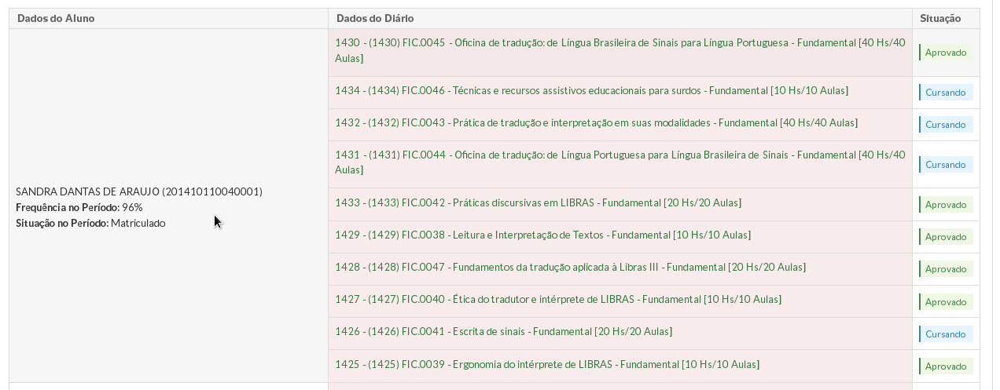
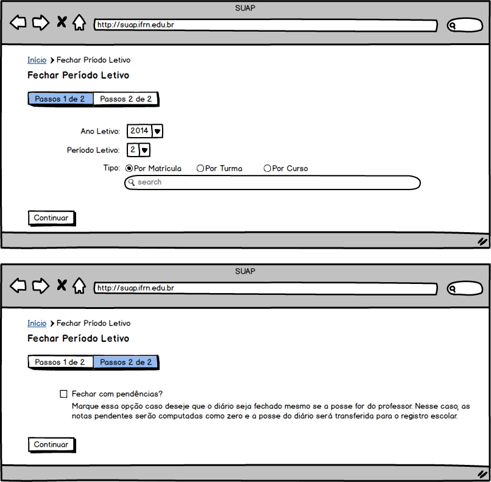
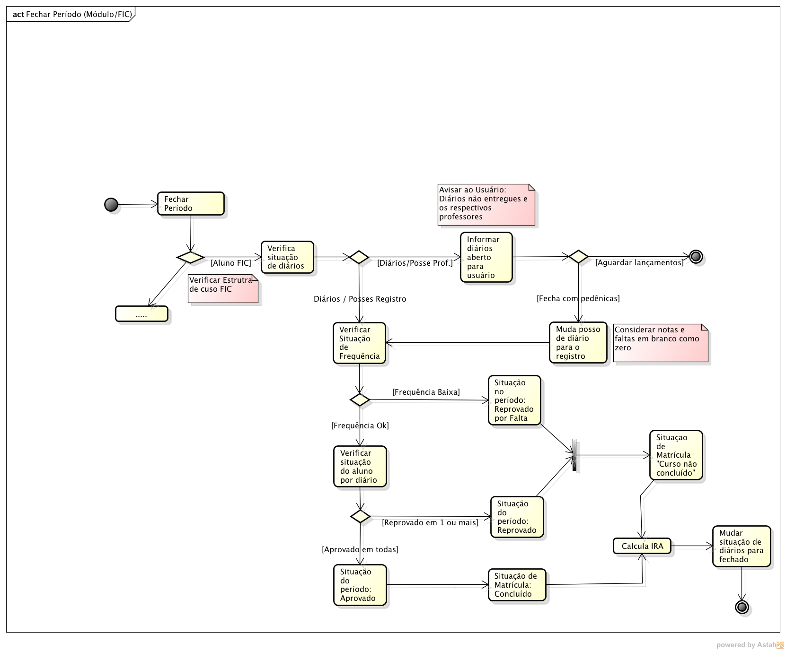
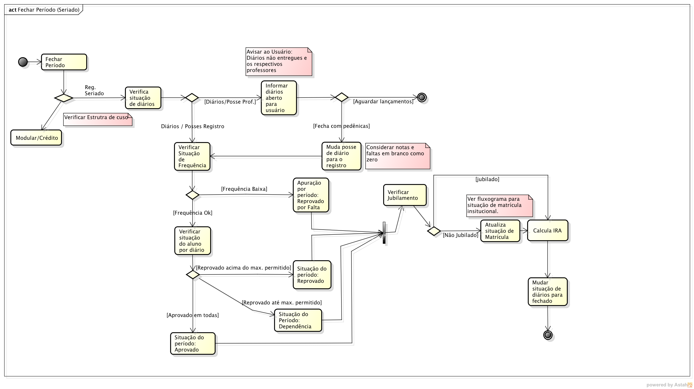
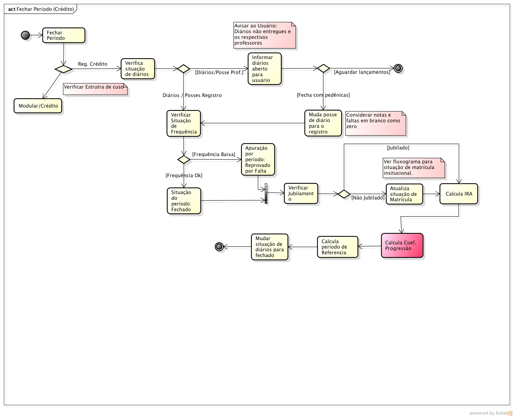
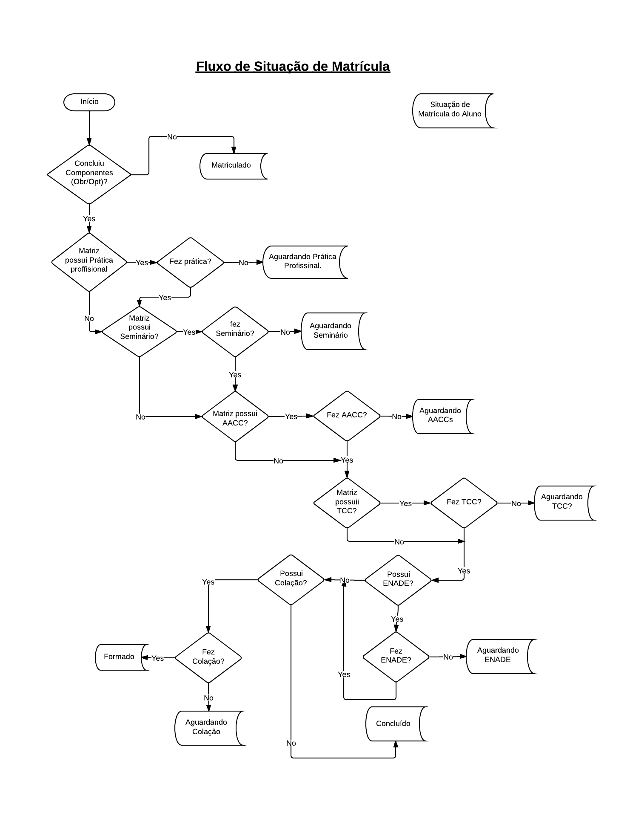

.. |logo| image:: ../../../../_static/images/logo_ifrn.png

.. |titulo| replace:: **Ensino** 

.. include:: ../../../header.rst
   :start-after: uc-start
   :end-before: uc-end

.. _suap-artefatos-edu-ensino-proc_apoio-uc502: 

UC 502 - Fechar Período Letivo <v0.1>
=====================================

.. contents:: Conteúdo
    :local:
    :depth: 4

Histórico da Revisão
--------------------

.. list-table:: **Histórico da Revisão**
   :widths: 10 5 30 15
   :header-rows: 1
   :stub-columns: 0

   * - Data
     - Versão
     - Descrição
     - Autor
   * - 06/05/2014
     - 0.1
     - Início do Documento
     - Jailton Carlos
   * - 19/07/2014
     - 0.2
     - Inclusão do fluxograma regime seriado e regime de crédido
     - Jailton Carlos

Objetivo
--------

Está funcionalidade permitira ao usuário realizar o fechamento de um período letivo.

Atores
------

Principais
^^^^^^^^^^

Administradores do sistema, Diretores Acadêmicos e Secretários.

Interessado
^^^^^^^^^^^

Não se aplica.

Pré-condições
-------------

- Turmas e diários criados;
- Alunos inseridos nos diários.

Pós-condições
-------------

- Coeficiente de rendimento do aluno atualizado (art. 248 OD/2012);
- Situalização do aluno no período atualizada.

Casos de Uso Impactados
-----------------------

	#. :ref:`suap-artefatos-edu-ensino-cursos_matr_comp-uc300`: criar os campos abaixo:
   
       - Caixa `Representação Conceitual`
      
         - Representar faixas de notas para conceitos, informar o conceito e a faixa inicial e final, exemplo.: Conceito A (8-10), B (7-8).

       - Caixa `Apuração por frequência`
      
         - Acrescentar o percentual de freq. mínima p não reprovar na disciplina. hoje é 75 %.

       - Caixa `Critério para jubiliamento`
      
         - quant. máxima de períodos. Ex. o curso possui 4 período, mas o aluno tem direito a 8.
         - quant. reprov. no mesmo período. Ex. reprovar duas vezes o período 1.
         - quant. reprov. na mesma disciplina. Ex. reprovado 3 vezes na disciplina matetemática.

Fluxo de Eventos
----------------

Fluxo Normal
^^^^^^^^^^^^

.. _FN:

    #. O caso de uso é iniciado acionando a opção  ``ENSINO`` > ``Procedimentos de Apoio`` > ``Fechar Período``
    #. O secretário informa os dados (RIN1_)
    #. O secretário aciona a opção "Continuar"
    #. O sistema exibe a relação de alunos (RI1_)
    #. O secretário informa os dados (RIN2_)
    #. O secretário finaliza o caso de uso selecionando a opção ``Finalizar``
    #. O sistema exibe a mensagem M3_ 
    #. O secretário confirma o processamento para fechamento do período
    #. O sistema exibe a mensagem M1_ 

Fluxo Alternativo
^^^^^^^^^^^^^^^^^

Não há.
    	
    	
Fluxo de Exceção
^^^^^^^^^^^^^^^^

Não há.

Especificação suplementares
---------------------------
 

Não há.

Requisitos de Interface
^^^^^^^^^^^^^^^^^^^^^^^

.. _RI1:

RI1 – Exibição da Relação de alunos
"""""""""""""""""""""""""""""""""""

É exibido os diários e a situação de cada um, conforme representado na `Figura 1`_.

Requisitos de Informação
^^^^^^^^^^^^^^^^^^^^^^^^

.. _RIN1:
     
RIN1 – Campos para cadastros do passo 1 de 2
""""""""""""""""""""""""""""""""""""""""""""

.. list-table:: 
   :widths: 10 20 5 5 5 5
   :header-rows: 1
   :stub-columns: 0

   * - Informação
     - Tipo
     - Tamanho
     - Valor Inicial
     - Domínio/Máscara
     - Observação
   * - Ano Letivo*
     - Seleção
     - 
     - 
     - 
     - 
   * - Período Letivo*
     - Seleção
     - 
     - 
     - 
     -   
   * - Tipo*
     - Seleção mutualmente exclusiva
     - 
     - 
     - Por Matricula, Por Turma, Por Curso
     -  
   * - *
     - Texto autocompletar simples
     - 
     - 
     - RN1_
     -    

A `Figura 2`_ exibe um esboço do formulário de cadastro.

.. _RIN2:

RIN2 – Campos para Cadastros do passo 2 de 2
""""""""""""""""""""""""""""""""""""""""""""

.. list-table:: 
   :widths: 10 20 5 5 5 5
   :header-rows: 1
   :stub-columns: 0

   * - Informação
     - Tipo
     - Tamanho
     - Valor Inicial
     - Domínio/Máscara
     - Observação
   * - Fechar com pendência*
     - Caixa de checagem
     - 
     - 
     - 
     - 

A `Figura 2`_ exibe um esboço do formulário de cadastro.

     
Regras de Negócio
^^^^^^^^^^^^^^^^^

.. list-table:: Regras gerais
   :widths: 10 90
   :header-rows: 1
   :stub-columns: 0

   * - Regra
     - Descrição / Mensagem
   * - RN1
     - | Critério para busca do campo do tipo texto autocompletar simples: a busca depende do tipo selecionado:
     
         - `Por Matricuala`:
         - `Por Turma`:
         - `Por Curso`:
       | mensagem: não há. 
   * - RN2
     - | Calcular coeficiente de rendimento escolar de cada aluno conforme equação definida no art. 278 da Organização Didática do IFRN.
       | mensagem: não há.  
   * - RN3
     - | O sistema deve fechar os diários conforme fluxograma de operação definido abaixo:
         
         - Regime FIC: ver diagrama de atividade exibida na `Figura 3`_
         - Regime Seriado: ver diagrama de atividade exibida na `Figura 4`_
         - Regime de Crédito: ver diagrama de atividade exibida na `Figura 5`_
       | mensagem: não há.        
   * - RN4
     - | O sistema deve registrar em log a operação de fechamento de período. 
       | mensagem: não há.            
   * - RN5
     - | O sistema deve exibir o percentual de execução da rotina de fechamento de período. 
       | mensagem: não há.           
       
   
.. list-table:: Regras para o curso do regime seriado
   :widths: 10 90
   :header-rows: 1
   :stub-columns: 0

   * - Regra
     - Descrição / Mensagem
   * - RN6
     - | O processo de reabertura deve desfazer todo o procedimento.
       | mensagem: não há. 
   * - RN7
     - | Para o aluno reprovado o sistema deve criar um novo período (em aberto) com o último período cursado.
       | mensagem: não há. 
   * - RN8
     - | Para o aluno Aprovado e em dependecia, o sistema deve criar um novo período letivo (em aberto) com o próxiom período a cursar
       | mensagem: não há.    
   * - RN9
     - | O aluno que for reprovado por falta deverá ter as disciplinas com situação de aprovadas trocadas para `Aprovado/Reprovado no Módulo`.
       | mensagem: não há.      
   * - RN10
     - | Na ação de atualizar situação de matrícula (ver fluxo na `Figura 6`_), o sistema deve aplicar as regras de jubilamento existentes na estrutura de curso. 
         Criar um novo período letivo (jubilado) com o próximo período a cursar.
       | mensagem: não há. 
       

.. list-table:: Regras para o curso do regime de crédito
   :widths: 10 90
   :header-rows: 1
   :stub-columns: 0

   * - Regra
     - Descrição / Mensagem
   * - RN11
     - | O processo de reabertura deve desfazer todo o procedimento.
       | mensagem: não há. 
   * - RN12
     - | Para o aluno reprovado por falta, o sistema deve criar um novo período letivo (em aberto) apenas incrementando a quantidade de períodos do aluno.
       | mensagem: não há. 
   * - RN13
     - | Período de referência é caracterizado pelo menor período do curso no qual o estudante estiver com disciplina(s) não integralizada(s).
       | mensagem: não há.    
   * - RN14
     - | Na ação de atualizar situação de matrícula (ver fluxo na `Figura 6`_), o sistema deve aplicar as regras de jubilamento existentes na estrutura de curso. 
         Criar um novo período letivo (jubilado) com o próximo período a cursar.
       | mensagem: não há.           
   * - RN15
     - | O coeficiente de progressão é o índice que mede a quantidade de disciplinas cumpridas pelo aluno em relação ao total de disciplinas exigidas. 
         O índice varia de 0 a 10.
         
         .. note::
            NÃO EXISTE ISSO NA ORGANIZAÇÃO DIDÁTICA.
       | mensagem: não há. 
   * - RN16
     - | No sistema de crédito não existe situação aprovado/reprovado no período, mas sim período fechado
       | mensagem: não há.      
             
       
.. _RN1: `Regras de Negócio`_  
.. _RN2: `Regras de Negócio`_  
.. _RN3: `Regras de Negócio`_  
.. _RN4: `Regras de Negócio`_  
.. _RN5: `Regras de Negócio`_ 
.. _RN6: `Regras de Negócio`_ 
.. _RN7: `Regras de Negócio`_ 
.. _RN8: `Regras de Negócio`_ 
.. _RN9: `Regras de Negócio`_ 
.. _RN10: `Regras de Negócio`_ 
.. _RN11: `Regras de Negócio`_ 
.. _RN12: `Regras de Negócio`_ 
.. _RN13: `Regras de Negócio`_ 
.. _RN14: `Regras de Negócio`_ 
.. _RN15: `Regras de Negócio`_
.. _RN16: `Regras de Negócio`_  
   
   
Mensagens
^^^^^^^^^

.. _M:

.. list-table:: 
   :widths: 10 90
   :header-rows: 1
   :stub-columns: 0

   * - Código
     - Descrição
   * - M1    
     - Cadastro realizado com sucesso.
   * - M2
     - Nenhuma matricula a ser processada.
   * - M3
     - Confirmar o processamento do peŕiodo para os diários listados?

.. _M1: `Mensagens`_     
.. _M2: `Mensagens`_
.. _M3: `Mensagens`_
    
.. _PE:

Ponto de Extensão
-----------------

Não há.

Questões em Aberto
------------------

Não há.

Esboço de Protótipo
-------------------

.. _`Figura 1`:

   
   Figura 1: Protótipo de tela para exibição dos dados do aluno.

	   
	   
.. _`Figura 2`:

   
   Figura 2: Protótipo de tela para cadastro de Fechar Período.	   

      
      
.. _`Figura 3`:

   
   Figura 3: Fluxo de atividade para fechamento de período regime FIC.      

      
      
.. _`Figura 4`:

   
   Figura 4: Fluxo de atividade para fechamento de período regime seriado.      

      
      
.. _`Figura 5`:

   
   Figura 5: Fluxo de atividade para fechamento de período regime de crédito.      

.. _`Figura 6`:

   
   Figura 6: Fluxo para atualização da matricula do aluno. 
   

Diagrama de domínio do caso de uso
----------------------------------

Não há.

Diagrama de Fluxo de Operação
-----------------------------

Não há.

Cenário de Testes
-----------------

Não há.