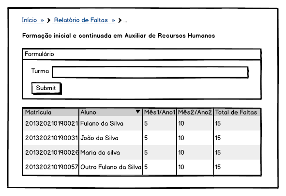

.. |logo| image:: ../../../../_static/images/logo_ifrn.png

.. |titulo| replace:: **Ensino** 

.. include:: ../../../header.rst
   :start-after: uc-start
   :end-before: uc-end

.. _suap-artefatos-edu-ensino-relatorio_estatistica-uc600: 

UC 600 - Visualizar Relatório de Faltas <v0.1>
==============================================

.. contents:: Conteúdo
    :local:
    :depth: 4

Histórico da Revisão
--------------------

.. list-table:: **Histórico da Revisão**
   :widths: 10 5 30 15
   :header-rows: 1
   :stub-columns: 0

   * - Data
     - Versão
     - Descrição
     - Autor
   * - 13/05/2014
     - 0.1
     - Início do Documento
     - Fernando Lopes

Objetivo
--------

Visualizar relatório de faltas

Atores
------

Principais
^^^^^^^^^^

Interessado
^^^^^^^^^^^

Não se aplica.

Pré-condições
-------------

Não há.

Pós-condições
-------------

Não há.

Fluxo de Eventos
----------------

Fluxo Normal
^^^^^^^^^^^^

.. _FN:

    #. O caso de uso é iniciado acionando a opção  ``ENSINO`` > ``Relatórios e Estatísticas`` > ``Relatório de Faltas``
    #. O sistema exibe o campo autocomplete para pequisa de turma
    #. Ao submeter o formulário com uma turma selecionada, será renderizada a listagem dos alunos e suas faltas

Fluxo Alternativo
^^^^^^^^^^^^^^^^^

Não há.

Fluxo de Exceção
^^^^^^^^^^^^^^^^

Não há.

Especificação suplementares
---------------------------

Requisitos Não-Funcionais
^^^^^^^^^^^^^^^^^^^^^^^^^ 

Não há.

Requisitos de Interface
^^^^^^^^^^^^^^^^^^^^^^^

Não há.

Requisitos de Informação
^^^^^^^^^^^^^^^^^^^^^^^^

.. _RIN1:
     
RIN1 – Campos para listagem do relatório
""""""""""""""""""""""""""""""""""""""""
 
A tela do relatório será dividida conforme imagem ( ver `Figura 1`_ ) :
     
.. list-table:: 
   :header-rows: 1
   :stub-columns: 1

   * - 
     - #
     - Matricula
     - Nome
     - Mês 1 / Ano 1
     - Mês 2 / Ano 2
     - Mês n... / Ano n...
     - Total de Faltas
   * - Ordenação
     - Não
     - Não
     - Não, padrão ascendente
     - Não
     - Não
     - Não
     - Não
   * - Filtro
     - Não
     - Não
     - Não
     - Não
     - Não
     - Não
     - Não
   * - Busca
     - Não
     - Não
     - Não
     - Não
     - Não
     - Não
     - Não
	     
.. _RIN2:

RIN2 – Campos para Filtro
"""""""""""""""""""""""""

.. list-table:: 
   :widths: 10 20 5 5 5 5
   :header-rows: 1
   :stub-columns: 0

   * - Informação
     - Tipo
     - Tamanho
     - Valor Inicial
     - Domínio/Máscara
     - Observação
   * - Turma*
     - Texto autocompletar simples
     - 
     - Turma selecionada previamente
     - 
     - 
     
     
A `Figura 1`_ exibe um esboço de como esses campos poderiam está dispostos no formulário.
     
Regras de Negócio
^^^^^^^^^^^^^^^^^

Não há.

Mensagens
^^^^^^^^^

Não há.

Ponto de Extensão
-----------------
	
Não há.

Questões em Aberto
------------------

Não há.

Esboço de Protótipo
-------------------

.. _`Figura 1`:

   
   Figura 1: Protótipo de tela para visualizar relatório de faltas.

Diagrama de domínio do caso de uso
----------------------------------

Não há.

Diagrama de Fluxo de Operação
-----------------------------

Não há.

Cenário de Testes
-----------------

Não há.