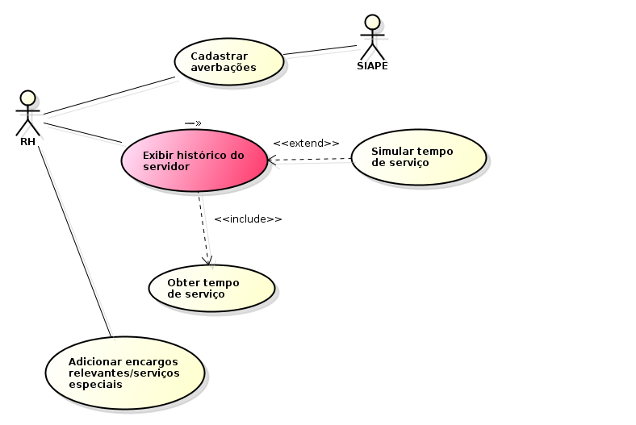
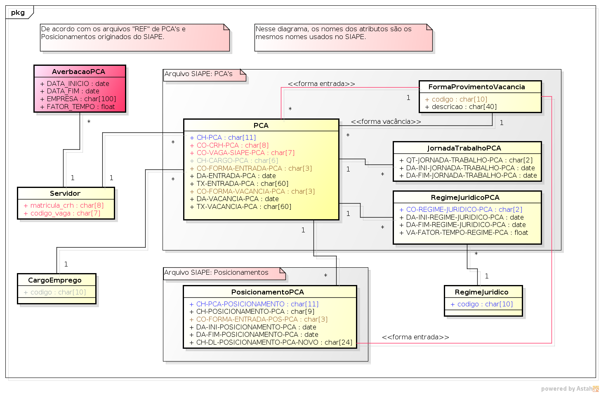

.. |logo| image:: ../../../_static/images/logo_ifrn.png

.. |titulo| replace:: **Mapa de Tempo de Serviço** 

.. include:: ../../header.rst
   :start-after: docvisao-start
   :end-before: docvisao-end

.. _suap-artefatos-rh-mapa_tempo_servico-visao:

Documento de Visão do Subsistema |titulo| <v0.1>
================================================

.. contents:: Conteúdo
    :local:
    :depth: 4    

Histórico da revisão
--------------------

.. list-table:: **Histórico da Revisão**
   :widths: 10 5 30 15
   :header-rows: 1
   :stub-columns: 0

   * - Data
     - Versão
     - Descrição
     - Autor
   * - 23/04/2014
     - 0.1
     - Início do Documento
     - Todos
   * - 05/05/2014
     - 0.2
     - Inclusão do diagrama de domínio;
       Adequação às mudanças ocorridas nos templates da documentação técnica (documento de visão e especificação de caso de uso); 
       Inclusão de novos artefatos referentes aos casos de uso :ref:`03, 04 e 05 <UC>`;
     - Esdras Valentim e George Carvalho 
    

Introdução
----------

Finalidade do documento
^^^^^^^^^^^^^^^^^^^^^^^

A finalidade deste documento é especificar os requisitos relevantes do usuários, assim como os limites e restrições evidentes que 
dão uma visão geral. Essa visão viabiliza a identificação e a produção de documentos e requisitos mais técnicos, assim como do 
próprio sistema. A visão serve como forma de permitir a compreensão, pelos participantes do projeto, do "o quê e por quê" o projeto 
existe e provê uma estratégia a partir da qual todas as futuras decisões podem ser validadas. 

Finalidade do sistema
^^^^^^^^^^^^^^^^^^^^^
.. finalidade_start

Este modulo/aplicação tem como finalidade descrever o histórico funcional dos servidores durante toda sua vida pública e privada. Essa funcionalidade
irá exibir o tempo de serviço do servidor que servirá de base para novos processos e revisões de aposentadoria e para progressões funcionais por 
tempo de serviço. Também tem como finalidade substituir o sistema GDRH, simular tempo de serviço do servidor para fins de aposentadoria 
e progressões funcionais por tempo de serviço. 

.. finalidade_end

Análise de contexto
-------------------

Cenário
^^^^^^^

.. note:: 
   Seção utilizada para documentar novos produtos.
   
   Forneça uma descrição do cenário atual, apresentando o contexto e os macroprocessos como são hoje, que possam motivar o 
   desenvolvimento de uma solução.
    
   .. warning::
      Caso esteja documentando um produto já existente incluir o texto "Não se aplica."

Motivações, necessidades e problemas
^^^^^^^^^^^^^^^^^^^^^^^^^^^^^^^^^^^^

A motivação para o desenvolvimento do módulo é melhorar o processo de análise e elaboraração do mapa de tempo de serviço e do histórico funcional, 
uma vez que o sistema existente (GDRH) se mostrou, em algumas situações, insuficiente para atender as necessidades e com informações incompletas e ou 
incorretas. Além disso a construção do novo modulo se dará de forma integrada ao SIAPE que poderá disponibilizar todas ou a maioria das informações 
necessárias para a elaboração do mapa de tempo de serviço. 

.. comentário
   .. note::  
       A partir do cenário descrito acima, identifique e descreva as possíveis motivações, necessidades e problemas.
       
       Dicas para descrever as necessidades:
       
       - Descrição da necessidade;
       - Qual a solução utilizada atualmente para o atendimento desta necessidade;
       - Qual seria uma solução proposta para o atendimetno desta necessidade.
       
       Dicas para descrever o problema:
       
       - Descrição do problema levantado;
       - Quais são os interessados afetados pelo problema;
       - Qual o impacto do problema;
       - Qual seria uma solução proposta para o problema apresentado.
   
      .. warning::
         Caso esteja documentando um produto já existente, pode-se incluir o texto "Não se aplica." nesta seção.

Escopo do produto
-----------------

Declaração do escopo do produto
^^^^^^^^^^^^^^^^^^^^^^^^^^^^^^^

.. note:: 
   Seção utilizada para documentar novos produtos.  
   
   Forneça a declaração do escopo do produto, descrevendo as características do produto, serviço ou resultado que se
   deseja obter com a execução do projeto.

   .. warning::
      Caso esteja documentando um produto já existente incluir o texto "Não se aplica."
   
Não faz parte do escopo
^^^^^^^^^^^^^^^^^^^^^^^

.. note:: 
   Seção utilizada para documentar novos produtos.
   
   Descreva de forma explícita as características que não fazem parte do produto. Em muitos casos, é mais fácil declarar que
   certos comportamentos nunca poderão ocorrer. Exemplo:
   
   - O sistema não fará controle financeiro;
   - O sistema não fará estatísticas mensais.

   .. warning::
      Caso esteja documentando um produto já existente incluir o texto "Não se aplica."

Descrição dos papéis
--------------------

Papel das partes interessadas
^^^^^^^^^^^^^^^^^^^^^^^^^^^^^
..
   .. note::
      Esta seção fornece as desrições de todas as partes interessadas no desenvolvimento da solução, considerando-se os papéis
      e responsabilidades. Entende-se como partes interessadas, os envolvidos que podem contribuir de várias maneiras para o 
      desenvolvimento da solução, bem como os que influenciam ou são influenciados pela solução.
   
   
.. list-table:: 
   :widths: 10 90
   :header-rows: 1
   :stub-columns: 0

   * - Representante
     - Responsabilidades
   * - Raul Alexandre (DIGPE) 
     - Fornecer requisitos; Validar documentação; Testar/Homologar o software.
   * - Fernando Henrique da Silva (CTI/CM)
     - Fornecer requisitos; Validar documentação; Testar/Homologar o software.
   * - Maria das Gracas de Araujo Varela (COAPEQ)
     - Fornecer requisitos; Validar documentação; Testar/Homologar o software.
   * - Ediberto Barreto da Silva (COAPEQ)
     - Fornecer requisitos; Validar documentação; Testar/Homologar o software.
   * - Equipe de Desenvolvimento (COSINF/COAGP) 
     - Detalhar, Analisar e Implementar requisitos; Criar Testes Automatizados, Criar Manual do Usuário.

Papel dos atores
^^^^^^^^^^^^^^^^

.. list-table:: 
   :widths: 10, 20, 70
   :header-rows: 1
   :stub-columns: 0
   
   * - Ator
     - Sinônimo
     - Descrição
   * - RH
     - `-`      
     - ?????      
   * - SIAPE
     - `-`      
     - ?????      

Visão geral do produto
----------------------

Modelagem de processos de negócio
^^^^^^^^^^^^^^^^^^^^^^^^^^^^^^^^^

.. note::
   Cole aqui um diagrama de atividade para representar os processos de negócio (conjunto de atividades que ocorrem em algum negócio 
   com o objetivo de gerar um produto ou serviço, alcançando determinado objetivo). Esse diagrama fornece o entendimento de como são
   realizadas as diversas atividades contidas em cada processo.

Projeto da solução
^^^^^^^^^^^^^^^^^^

.. note::
   Descreva aqui os elementos do modelo de projeto, que são importantes para a arquitetura, a estrutura de camadas e componentes do
   projeto.

Perspectiva do produto
^^^^^^^^^^^^^^^^^^^^^^
   
Integração com outros sistemas
""""""""""""""""""""""""""""""

.. note::
   Descreva aqui as interfaces de software com outros componentes do sistema de software. Poderão se componentes comparados, 
   componentes reutilizados de outro aplicativo ou componentes que estão sendo desenvolvidos para subsistemas fora do escopo desta,
   mas com os quais esse aplicativo de software deve interagir
   Identificam-se aqui as interfaces com outros produtos de software, tais como aplicativos que recebem dados do produto ou 
   enviam dados para ele, seja on-line, através de arquivos ou através de banco de dados. Não incluir componentes normais 
   do ambiente operacional, como bibliotecas e plataformas.
   Ao descrever as interfaces de software, informe o nome do componente/sistema, a descrição, a forma de entrada de dados 
   e/ou a forma de saída de dados.

Relacionamentos com outros subsistemas
""""""""""""""""""""""""""""""""""""""

.. note::
   Nesta subseção apresente a relação que o produto tem com outros produtos e o ambiente do usuário. Informe se o
   produto é independente e autossuficiente. Se o produto for um componente de um sistema maior, descreva como
   esses sistemas interagem e quais as interfaces relevantes entre os sistemas. Se o produto possuir vários módulos, 
   estes deverão ser listados nesta subseção.

Requisitos
^^^^^^^^^^
..
   .. note::
      Descreva os requisitos funcionais e não funcionais do produto. 
      Foi decidido que não haverá divisão entre requisitos funcionais e não funcionais.
      
      Para requisitos funcionais, pode-se categorizar como "Especificação"

.. list-table:: 
   :widths: 10 60 30
   :header-rows: 1
   :stub-columns: 0

   * - Cód
     - Descrição
     - Categoria
   * - R01
     - O sistema disponibilizará a opção para cadastrar averbações. 
     - Especificação  	
   * - R02
     - O sistema deverá calcular o tempo de serviço atual do servidor.
     - Especificação 
   * - R03
     - O sistema disponibilizará a opção para adicionar os encargos relevantes ou servicos especiais.
     - Especificação 
   * - R04
     - O sistema disponibilizará a opção para exibir o histórico do servidor (averbações e serviços especiais serão mostrados em formato resumido).
     - Especificação
   * - R05
     - Com base no histórico do servidor, será disponibilizada a simulação do tempo de serviço para estimar a data provável da aposentadoria.
     - Especificação
         
     
.. _UC:

Casos de uso
^^^^^^^^^^^^

.. note::
   Listar e descrever resumidamente as funcionalidades que se espera encontrar no produto. Funcionalidades são capacidades que o 
   produto deve ter para atender a uma necessidade de usuário (ator). Cada funcionalidades descreve um serviço percebido pelo usuário 
   e que tipicamente requer entradas para alcançar o resultado desejado. À medida que o modelo de casos de uso for desenvolvido, 
   atualize a descrição para fazer referência aos casos de uso. Cada funcionalidade será descrita mais detalhadamente no modelo de 
   casos de uso. É recomendado ordernar os casos de uso por ordem de decrescente de prioridade.     

.. list-table:: 
   :widths: 30 40 10 10
   :header-rows: 1
   :stub-columns: 0

   * - Cód, Nome, Versão
     - Descrição
     - Complexidade
     - Requisitos relacionados 
   * - :ref:`suap-artefatos-rh-mapa_tempo_servico-uc01`  
     - 
       .. include:: mapa_tempo_servico_uc01.rst
         :start-after: Objetivo
         :end-before: Atores
     - Baixa
     - R01  
   * - :ref:`suap-artefatos-rh-mapa_tempo_servico-uc02`
     - 
       .. include:: mapa_tempo_servico_uc02.rst
         :start-after: Objetivo
         :end-before: Atores
     - Média
     - R02
   * - :ref:`suap-artefatos-rh-mapa_tempo_servico-uc03`
     - 
       .. include:: mapa_tempo_servico_uc03.rst
         :start-after: Objetivo
         :end-before: Atores
     - Baixa
     - R03
   * - :ref:`suap-artefatos-rh-mapa_tempo_servico-uc04`
     - 
       .. include:: mapa_tempo_servico_uc04.rst
         :start-after: Objetivo
         :end-before: Atores
     - Baixa
     - R04
   * - :ref:`suap-artefatos-rh-mapa_tempo_servico-uc05`
     - 
       .. include:: mapa_tempo_servico_uc05.rst
         :start-after: Objetivo
         :end-before: Atores
     - Média
     - R05

Diagrama de caso de uso
^^^^^^^^^^^^^^^^^^^^^^^
.. _diagramaUC:

     
Diagrama de modelagem de domínio
^^^^^^^^^^^^^^^^^^^^^^^^^^^^^^^^
.. _diagramaDominio:

Metas gerenciais
----------------

.. note::
   Exemplo: O projeto deverá ser executado até o mês de Agosto de 2014.
   
   .. warning::
      Caso esteja documentando um produto já existente incluir o texto "Não se aplica."

Questões em aberto
------------------

.. note::
   Descrever as anotações técnicas para informações adicionais a serem trabalhadas no futuro ou lembretes, e questões pendentes 
   que devam ser esclarecidas durante a especificação de requisitos.
   
Encerramento de Projetos
------------------------

.. note::
   Esta seção visa além de formalizar o término do projeto discutir como foi o mesmo e coletar lições aprendidas. No processo de 
   gerenciamento de projetos ele é o documento final. Durante o encerramento é interessante tratar assuntos como:
   
   - Os produtos previstos no projeto foram concluídos
   - O objetivo final do projeto foi alcançado
   - O resultado alcançado está coerente com a justificativa apresentada
   - Quais os principais problemas do projeto
   - Discutir sobre as lições aprendidas
   - Registrar na base de conhecimento da organização   
   
   .. warning::
      Caso esteja documentando um produto já existente incluir o texto "Não se aplica."   