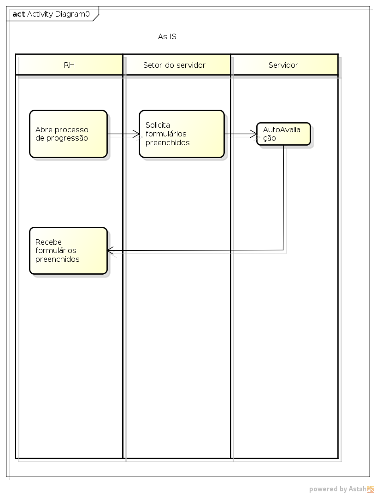
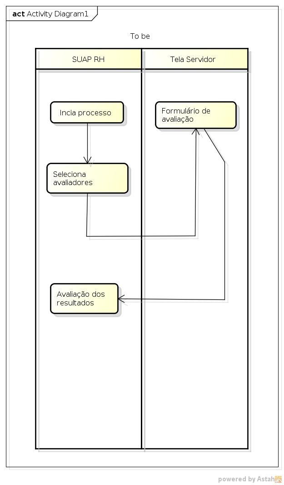
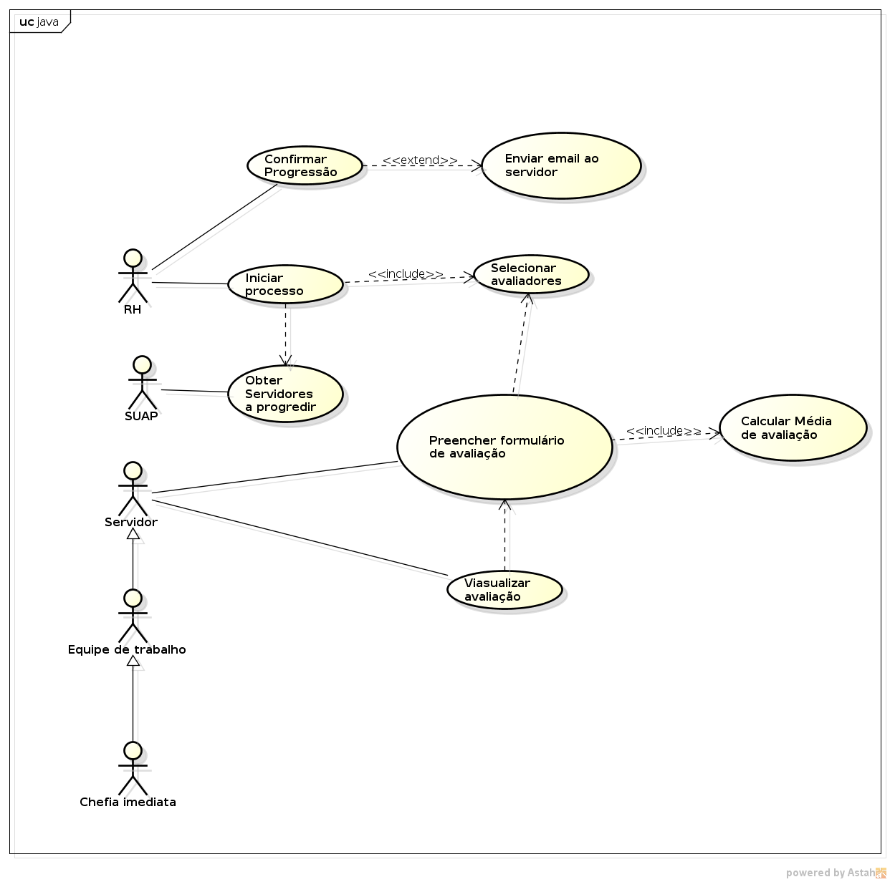
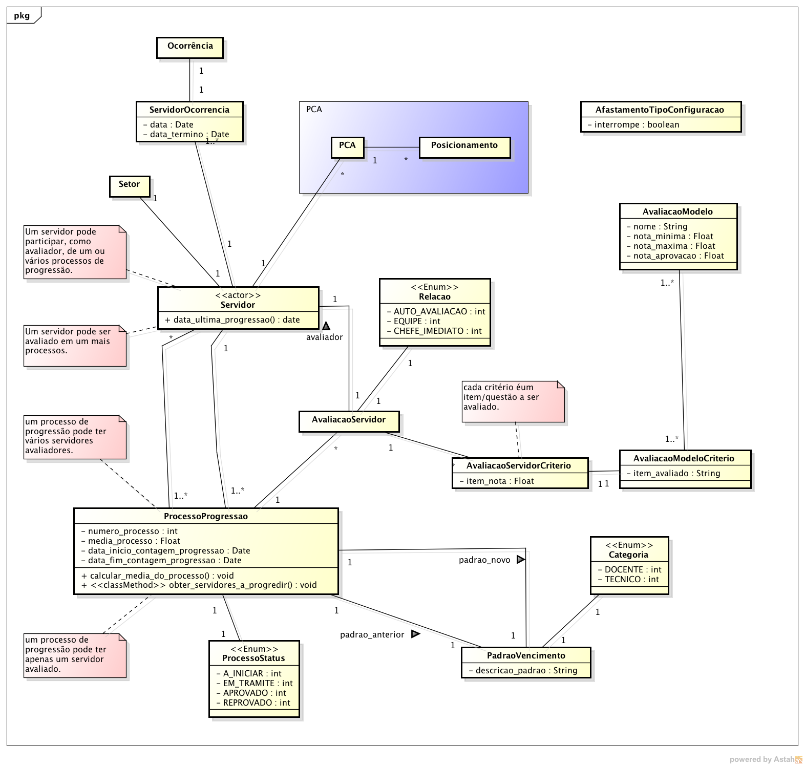

.. |logo| image:: ../../../_static/images/logo_ifrn.png

.. |titulo| replace:: **Progressões** 

.. include:: ../../header.rst
   :start-after: docvisao-start
   :end-before: docvisao-end

.. _suap-artefatos-rh-progressoes-visao:

Documento de Visão do Subsistema |titulo| <v0.1>
================================================

.. contents:: Conteúdo
    :local:
    :depth: 4    

Histórico da revisão
--------------------

.. list-table:: **Histórico da Revisão**
   :widths: 10 5 30 15
   :header-rows: 1
   :stub-columns: 0

   * - Data
     - Versão
     - Descrição
     - Autor
   * - 07/07/2014
     - 0.1
     - Início do Documento
     - Esdras Valentim
   * - 09/07/2014
     - 0.2
     - Inclusão dos casos de uso
     - Esdras Valentim      
    

Introdução
----------

Finalidade do documento
^^^^^^^^^^^^^^^^^^^^^^^

A finalidade deste documento é especificar os requisitos relevantes dos usuários, assim como os limites e restrições evidentes que 
dão uma visão geral. Essa visão viabiliza a identificação e a produção de documentos e requisitos mais técnicos, assim como do 
próprio sistema. A visão serve como forma de permitir a compreensão, pelos participantes do projeto, do "o quê e por quê" o projeto 
existe e provê uma estratégia a partir da qual todas as futuras decisões podem ser validadas. 

Finalidade do sistema
^^^^^^^^^^^^^^^^^^^^^
.. finalidade_start

Este módulo/aplicação tem como finalidade automatizar as progressões por mérito profissional dos servidores, utilizando um sistema
integrado de avaliações composto de auto-avaliação, avaliação dos pares (de mesma função administrativa), avaliação dos subordinados
e avaliação dos superiores.

.. finalidade_end

Análise de contexto
-------------------

Cenário
^^^^^^^

``Não se aplica.``

Motivações, necessidades e problemas
^^^^^^^^^^^^^^^^^^^^^^^^^^^^^^^^^^^^

A motivação para o desenvolvimento do módulo é melhorar o processo de análise e automatizar as progressões por mérito profissional dos servidores.
Uma progressão ocorre a cada interstício de 18 meses de efetivo exercício. Serão utilizados formulários on-line de avaliação e uma média será gerada 
de forma automática, servindo de base para o servidor progredir (aprovação) ou não (reprovação).

.. comentário
   .. note::  
       A partir do cenário descrito acima, identifique e descreva as possíveis motivações, necessidades e problemas.
       
       Dicas para descrever as necessidades:
       
       - Descrição da necessidade;
       - Qual a solução utilizada atualmente para o atendimento desta necessidade;
       - Qual seria uma solução proposta para o atendimetno desta necessidade.
       
       Dicas para descrever o problema:
       
       - Descrição do problema levantado;
       - Quais são os interessados afetados pelo problema;
       - Qual o impacto do problema;
       - Qual seria uma solução proposta para o problema apresentado.
   
      .. warning::
         Caso esteja documentando um produto já existente, pode-se incluir o texto "Não se aplica." nesta seção.

Escopo do produto
-----------------

Declaração do escopo do produto
^^^^^^^^^^^^^^^^^^^^^^^^^^^^^^^

.. note:: 
   Seção utilizada para documentar novos produtos.  
   
   Forneça a declaração do escopo do produto, descrevendo as características do produto, serviço ou resultado que se
   deseja obter com a execução do projeto.

   .. warning::
      Caso esteja documentando um produto já existente incluir o texto "Não se aplica."
   
Não faz parte do escopo
^^^^^^^^^^^^^^^^^^^^^^^
   - O sistema não fará controle das progressões por capacitação profissional (I, II, III, IV);   

Descrição dos papéis
--------------------

Papel das partes interessadas
^^^^^^^^^^^^^^^^^^^^^^^^^^^^^
..
   .. note::
      Esta seção fornece as desrições de todas as partes interessadas no desenvolvimento da solução, considerando-se os papéis
      e responsabilidades. Entende-se como partes interessadas, os envolvidos que podem contribuir de várias maneiras para o 
      desenvolvimento da solução, bem como os que influenciam ou são influenciados pela solução.
   
   
.. list-table:: 
   :widths: 10 90
   :header-rows: 1
   :stub-columns: 0

   * - Representante
     - Responsabilidades
   * - Raul Alexandre (DIGPE) 
     - Fornecer requisitos; Validar documentação; Testar/Homologar o software. 
   

Papel dos atores
^^^^^^^^^^^^^^^^

.. list-table:: 
   :widths: 10, 20, 70
   :header-rows: 1
   :stub-columns: 0
   
   * - Ator
     - Sinônimo
     - Descrição
   * - RH
     - `-`      
     - ?????      
   * - SIAPE
     - `-`      
     - ?????      

Visão geral do produto
----------------------

Modelagem de processos de negócio
^^^^^^^^^^^^^^^^^^^^^^^^^^^^^^^^^

Projeto da solução
^^^^^^^^^^^^^^^^^^

.. note::
   Descreva aqui os elementos do modelo de projeto, que são importantes para a arquitetura, a estrutura de camadas e componentes do
   projeto.

Perspectiva do produto
^^^^^^^^^^^^^^^^^^^^^^
   
Integração com outros sistemas
""""""""""""""""""""""""""""""

"Não se aplica."

Relacionamentos com outros subsistemas
""""""""""""""""""""""""""""""""""""""

"Não se aplica."

Requisitos
^^^^^^^^^^

.. list-table:: 
   :widths: 10 60 30
   :header-rows: 1
   :stub-columns: 0

   * - Cód
     - Descrição
     - Categoria
   * - R01
     - O sistema disponibilizará a opção para selecionar os avaliadores do servidor, independentemente do setor que ele está alocado. 
     - Especificação    
   * - R02
     - O sistema deverá calcular a média das avaliações de acordo com o perfil do servidor.
     - Especificação 
   * - R03
     - O sistema disponibilizará os formulários de avaliação dos servidores para cada setor.
     - Especificação
   * - R04
     - O Servidor deve ser aprovado se a média do período avaliado for igual ou superior a 60 pontos.
     - Especificação
   * - R05
     - O Servidor removido ou redistribuído no período de avaliação deve ser avaliado na lotação anterior.
     - Especificação
   * - R06
     - O servidor cedido à outra instituição num prazo igual ou superior a 06 meses deve ser avaliado no setor em que estiver.
     - Especificação
   * - R07  
     - O resultado da avaliação será obtido por uma média ponderada com pesos diferentes para cada grupo de avaliação, sendo peso 1 para auto-avaliação e avaliação da chefia imediata e peso 2 para avaliação da equipe de trabalho do servidor (a média de avaliação da equipe é a média aritmética da avalição feita pela equipe).
     - Especificação
   * - R08  
     - O servidor deve ser avaliado por: ele mesmo, equipe de trabalho e chefia imediata.
     - Especificação            
         
     
.. _UC:

Casos de uso
^^^^^^^^^^^^

.. list-table:: 
   :widths: 30 40 10 10
   :header-rows: 1
   :stub-columns: 0

   * - Cód, Nome, Versão
     - Descrição
     - Complexidade
     - Requisitos relacionados 
   * - :ref:`suap-artefatos-rh-progressoes-uc01`  
     - 
       .. include:: progressoes_uc01.rst
         :start-after: Objetivo
         :end-before: Atores
     - Média
     - R01
   * - :ref:`suap-artefatos-rh-progressoes-uc02`  
     - 
       .. include:: progressoes_uc02.rst
         :start-after: Objetivo
         :end-before: Atores
     - Baixa
     - R01 
   * - :ref:`suap-artefatos-rh-progressoes-uc03`  
     - 
       .. include:: progressoes_uc03.rst
         :start-after: Objetivo
         :end-before: Atores
     - Média
     - R03, R05, R06, R08
   * - :ref:`suap-artefatos-rh-progressoes-uc04`  
     - 
       .. include:: progressoes_uc04.rst
         :start-after: Objetivo
         :end-before: Atores
     - Média
     - R02, R04, R07
     
   * - :ref:`suap-artefatos-rh-progressoes-uc05`  
     - 
       .. include:: progressoes_uc05.rst
         :start-after: Objetivo
         :end-before: Atores
     - Baixa
     - R01
   * - :ref:`suap-artefatos-rh-progressoes-uc06`  
     - 
       .. include:: progressoes_uc06.rst
         :start-after: Objetivo
         :end-before: Atores
     - Baixa
     - R01  
   * - :ref:`suap-artefatos-rh-progressoes-uc07`  
     - 
       .. include:: progressoes_uc07.rst
         :start-after: Objetivo
         :end-before: Atores
     - Baixa
     - R01                  
             

Diagrama de caso de uso
^^^^^^^^^^^^^^^^^^^^^^^
.. _diagramaUC:   

     
Diagrama de modelagem de domínio
^^^^^^^^^^^^^^^^^^^^^^^^^^^^^^^^
.. _diagramaDominio:

Metas gerenciais
----------------

.. note::
   Exemplo: O projeto deverá ser executado até o mês de Agosto de 2014.
   
   .. warning::
      Caso esteja documentando um produto já existente incluir o texto "Não se aplica."

Questões em aberto
------------------

- Em caso de afastamento a data de progressão muda?
- Se o servidor se afastar da função pouco antes da progressão, como ele será avaliado?
- O tempo da progressão (18 meses) é fícto ou real?
- Qual o tempo de antecedência que o suap deve informar que há servidores aptos a progredir?
   
Encerramento de Projetos
------------------------

.. note::
   Esta seção visa além de formalizar o término do projeto discutir como foi o mesmo e coletar lições aprendidas. No processo de 
   gerenciamento de projetos ele é o documento final. Durante o encerramento é interessante tratar assuntos como:
   
   - Os produtos previstos no projeto foram concluídos
   - O objetivo final do projeto foi alcançado
   - O resultado alcançado está coerente com a justificativa apresentada
   - Quais os principais problemas do projeto
   - Discutir sobre as lições aprendidas
   - Registrar na base de conhecimento da organização   
   
   .. warning::
      Caso esteja documentando um produto já existente incluir o texto "Não se aplica."   