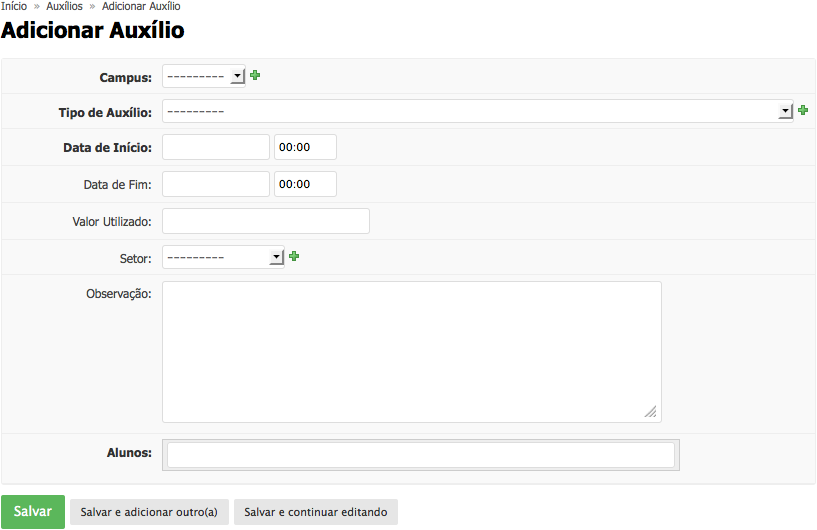
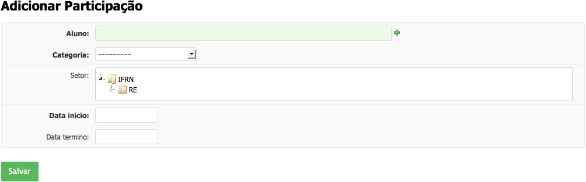
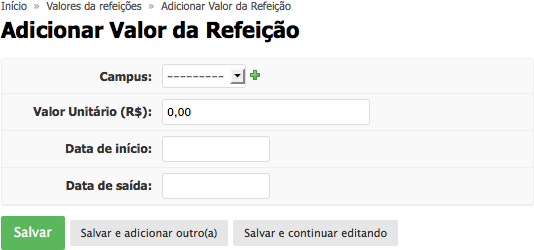
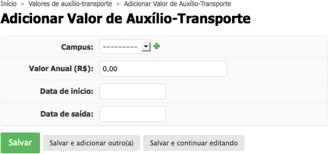
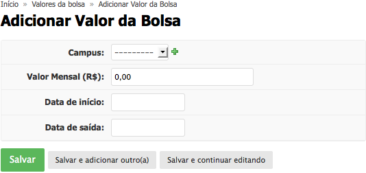

.. _suap-ae-coordenacao-perfil-coordenador_ae:

Coordenação - Coordenador de Atividades Estudantis
==================================================

.. contents:: Conteúdo
    :local:
    :depth: 4

Introdução
----------

Finalidade
^^^^^^^^^^

Permite o controle financeiro das atividades do setor.

..
   Fluxograma de Operação
   ----------------------

   .. note::
      Cole aqui um diagrama de atividade para representar o fluxo de operação por perfil.

Módulo Auxílios
---------------

.. _suap-ae-coordenacao-funcionalidade-adicionar_auxilio:

Adicionar Auxílio
^^^^^^^^^^^^^^^^^

#. Acesse Atividades Estudantis > Coordenação > Auxílios
#. Clique em "Adicionar Auxílio"
#. O sistema exibirá a seguinte tela para que o usuário informe os dados necessários: 
   |adicionar-auxilio|
#. Clique em "Salvar"

Módulo Bolsas
-------------

.. _suap-ae-coordenacao-funcionalidade-adicionar_participacao_bolsa:

Adicionar Participação em Bolsa
^^^^^^^^^^^^^^^^^^^^^^^^^^^^^^^

#. Acesse Atividades Estudantis > Coordenação > Bolsas
#. Clique em "Adicionar Participação"
#. O sistema exibirá a seguinte tela para que o usuário informe os dados necessários: 
   |adicionar-participacao-bolsa|
#. Clique em "Salvar"

Módulo Financeiro
---------------

.. _suap-ae-coordenacao-funcionalidade-valor_refeicao:

Adicionar Valor de Refeição
^^^^^^^^^^^^^^^^^^^^^^^^^^^

#. Acesse Atividades Estudantis > Coordenação > Financeiro > Valor de Refeição
#. Clique em "Adicionar Valor de Refeição"
#. O sistema exibirá a seguinte tela para que o usuário informe os dados necessários: 
   |valor-refeicao|
#. Clique em "Salvar"

.. _suap-ae-coordenacao-funcionalidade-valor_transporte:

Adicionar Valor de Auxílio Transporte
^^^^^^^^^^^^^^^^^^^^^^^^^^^^^^^^^^^^^

#. Acesse Atividades Estudantis > Coordenação > Financeiro > Valor de Auxílio Transporte
#. Clique em "Adicionar Valor de Auxílio Transporte"
#. O sistema exibirá a seguinte tela para que o usuário informe os dados necessários: 
   |valor-transporte|
#. Clique em "Salvar"

.. _suap-ae-coordenacao-funcionalidade-valor_bolsa:

Adicionar Valor de Bolsa de Iniciação Profissional
^^^^^^^^^^^^^^^^^^^^^^^^^^^^^^^^^^^^^^^^^^^^^^^^^^

#. Acesse Atividades Estudantis > Coordenação > Financeiro > Valor de Bolsa
#. Clique em "Adicionar Valor de Bolsa de Iniciação Profissional"
#. O sistema exibirá a seguinte tela para que o usuário informe os dados necessários: 
   |valor-bolsa|
#. Clique em "Salvar"

Manuais Relacionados
--------------------

.. list-table::
   :widths: 40 60
   :header-rows: 1
   :stub-columns: 0

   * - Perfil
     - Subsistema
   * - :ref:`Coordenador de Atividades Estudantis <suap-ae-servico_social-perfil-coordenador_ae>`
     - :ref:`Serviço Social <suap-ae-servico_social-index>`
   