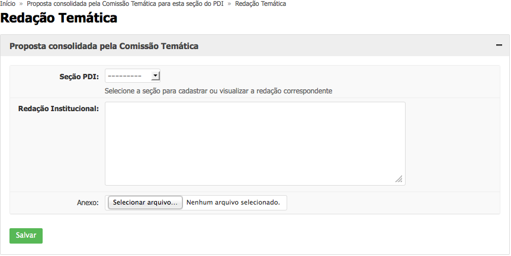

.. _suap-des_institucional-pdi-perfil-comissao_tematica:

PDI - Membro de Comissão Temática
=================================

.. contents:: Conteúdo
    :local:
    :depth: 4

Introdução
----------

Finalidade
^^^^^^^^^^

Servidor previamente cadastrado com o perfil de acesso a uma Comissão Temática de um PDI.

..
   Glossário
   ^^^^^^^^^

   .. include:: glossario.rst

   Fluxograma de Operação
   ----------------------

   .. note::
      Cole aqui um diagrama de atividade para representar o fluxo de operação por perfil.

Módulo Redação Temática
-----------------------

.. _suap-des_institucional-pdi-funcionalidade-redacao_tematica:

Redigir Texto
^^^^^^^^^^^^^

As Comissões Temáticas produzirão a redação definitiva de cada temática através da opção “Redação Temática" pelo menu do SUAP, em Desenvolvimento Institucional > PDI, disponível a todos os membros da respectiva Comissão.

#. Esse texto deverá ser redigido na caixa de texto “Redação Institucional”, cuja capacidade de caracteres não é limitada.
   |redacao-tematica|

..
   Regras relacionadas
   """""""""""""""""""

   - Regra 1
   - Regra 2
   - Regra 3

   Manuais Relacionados
   ---------------------
   