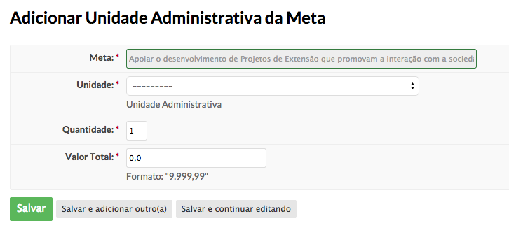
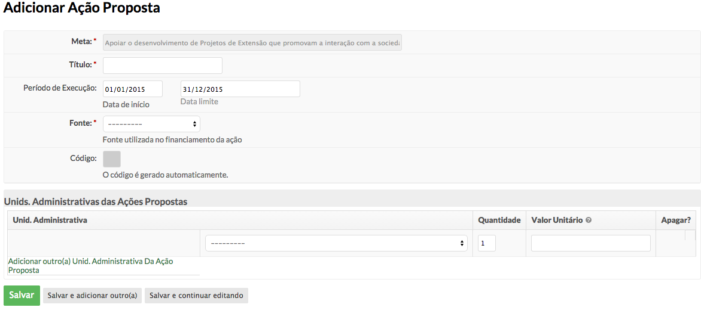

.. _suap-des_institucional-planejamento-perfil-sistemico:

Planejamento - Coordenador de planejamento Sistêmico
====================================================

.. contents:: Conteúdo
    :local:
    :depth: 4

Introdução
----------

Finalidade
^^^^^^^^^^

O usuário com este perfil é responsável por cadastrar objetivos estratégicos, metas e ações propostas da dimensão associada ao setor do usuário. Com este perfil o usuário poderá também realizar as operações de um gerente de campus. Neste caso a unidade administrativa associada ao usuário assumirá o papel de Câmpus.
   Glossário
   ^^^^^^^^^

   .. include:: glossario.rst

.. _suap-planejamento-administrador-funcionalidade-adicionar_macro_projeto:
  
Adicionar Macro Projeto Institucional
^^^^^^^^^^^^^^^^^^^^^^^^^^^^^^^^^^^^^

- O macro projeto institucional é o objetivo geral da instituição definida pela organização para cumprir a função institucional.
 
#. Acesse Des. Institucional > Planejamento > Macro Projeto Institucional.

 .. image:: images/tela_macroprojeto.png

.. _suap-planejamento-administrador-funcionalidade-adicionar_meta:

Adicionar Meta
^^^^^^^^^^^^^^

#. O usuário pode adicionar a meta clicando no macro projeto institucional ou acessando no menu Des. Institucional > Planejamento > Meta.

 .. image:: images/tela_meta.png
 

.. _suap-planejamento-administrador-funcionalidade-adicionar_unid_adm_meta:

Associar Unid. Administrativa à Meta
^^^^^^^^^^^^^^^^^^^^^^^^^^^^^^^^^^^^

#. Após o cadastro o usuário associa a unidade administrativa que participará da meta. 

#. Para isso, clica-se nos detalhes da meta. 

.. _suap-planejamento-administrador-funcionalidade-adicionar_acao_proposta:

Adicionar Ação Proposta
^^^^^^^^^^^^^^^^^^^^^^^

#. Na mesma tela de detalhes da Meta, o usuário pode adicionar a ação proposta e associar a alguma unidade administrativa. 

