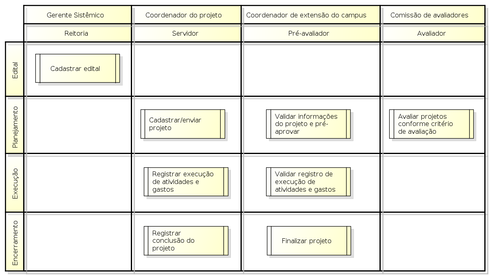

.. _suap-extensao-projetos-index:

Pró-reitoria de Extensão
========================

.. contents:: Conteúdo
    :local:
    :depth: 4

Introdução
----------

Finalidade
^^^^^^^^^^

O subsistema Projetos de Extensão tem o objetivo de gerenciar as ações da Pró-Reitoria de Extensão, permitindo gerenciar todas as etapas dos projetos de extensão, desde a publicação do edital, 
cadastro e submissão dos projetos, gerencia e monitoramento da execução até a finalização dos projetos.

.. 
   Convenções
   ^^^^^^^^^^
   Para melhor apreensão deste manual, serão adotadas algumas convenções de conceitos e exibição de informações.

   Conceitos, termos e abreviações
   """""""""""""""""""""""""""""""

   .. include:: glossario.rst

Conceito
^^^^^^^^

O subsistema é dividido em quatro fases conforme figura a seguir:

.. _`Figura 1`:

   
   Figura 1: Fluxograma visão geral do subsistema de Projetos de Extensão.	

* A Fase de Edital é o ponto de partida do subsistema de gerencia de projetos de extensão, é nessa fase que é registrada todas as informações pertinentes ao edital de extensão, tais como o período de inscrição, pré-seleção, seleção, divulgação da seleção, etc.   

* A Fase de Planejamento ocorre em quatro etapas dividas por período: inicia no período de inscrição, nesse, o Coordenador do Projeto cadastra as informações do projeto, tais como as metas/atividades, plano de desembolso, memória de cálculo, etc; No período de pré-seleção, o Coordenador de Extensão do campus valida as informações  e pré-aprova o projeto; Já no período de seleção, os membros da Comissão de Avaliadores avalia a qualidade dos projetos conforme os critérios de avaliação; Por fim, o período de divulgação da seleção, divulga os projetos aprovados.

* A Fase de Execução inicia após o período de divulgação, nessa fase o Coordenador do Projeto gerencia as execuções das atividades e os gastos dos projetos enquanto que o Coordenador de extensão do campus valida a execução dessas atividades e gastos.

* A Fase de Encerramento ocorre quando o Coordenador do Projeto registra a conclusão do projeto e solicita sua finalização.

.. 
   A figura `Figura 1`_

Perfis envolvidos
-----------------

.. list-table::
   :widths: 40 60
   :header-rows: 1
   :stub-columns: 0

   * - Perfil
     - Finalidade
   * - :ref:`Coordenador de Projeto <suap-extensao-projetos-perfil-coordenador-projeto>`
     - Papel desepenhado por um servidor que submete projetos para editais de extensão. 
       Permite cadastrar projetos bem como gerenciar a execução de seus projetos.
   * - :ref:`Pré-avaliador <suap-extensao-projetos-perfil-coordenador-extensao>`
     - Papel desempenhado pelo Coordenador de extensão do campus. 
       Permite aprovar ou desaprovar projetos na fase de pré-seleção bem como validar os gastos, as execuções das atividades e a conclusão do projeto de seu campus.
   * - :ref:`Avaliador <suap-extensao-projetos-perfil-coordenador>`
     - Papel desempenhado por membros da comissão de avaliadores. 
       Permite avaliar os projetos pré-aprovados de acordo com os critérios de avaliação.
   * - :ref:`Gerente Sistêmico <suap-extensao-projetos-perfil-coordenador>`
     - Papel desempenhado por membros da Pró-Reitoria de Extensão. 
       Permite cadastrar novos editais e acompanhar todas as atividades relacionadas aos projetos de extensão, desde sua submissão, planejamento, execução e finalização.     

.. comentário

	Módulo Cadastro de Projetos
	^^^^^^^^^^^^^^^^^^^^^^^^^^^
	
	.. list-table::
	   :widths: 20 30 50 
	   :header-rows: 1
	   :stub-columns: 0
	
	   * - Operação
	     - Finalidade
	     - Regras relacionadas
	   * - :ref:`suap-extensao-projetos-funcionalidade-cadastro_projeto`
	     - Adiciona um novo projeto para um determinado edital de extensão.
	     -
	   * - :ref:`suap-extensao-projetos-funcionalidade-definir_equipe`
	     - Define a equipe do projeto.
	     -
	   * - :ref:`suap-extensao-projetos-funcionalidade-inativar_participante`
	     - Inativa participante da equipe.
	     -
	   * - :ref:`suap-extensao-projetos-funcionalidade-adicionar_meta`
	     - Adiciona uma meta para o projeto.
	     -
	   * - :ref:`suap-extensao-projetos-funcionalidade-adicionar_atividade`
	     - Adiciona uma atividade para uma meta do projeto.
	     -
	   * - :ref:`suap-extensao-projetos-funcionalidade-memoria_calculo`
	     - Cadastra a memória de cálculo do projeto.
	     -
	   * - :ref:`suap-extensao-projetos-funcionalidade-adicionar_desembolso`
	     - Adiciona um desembolso ao Plano de Aplicação do projeto.
	     -
	   * - :ref:`suap-extensao-projetos-funcionalidade-adicionar_anexo`
	     - Adiciona um anexo ao projeto.
	     -
