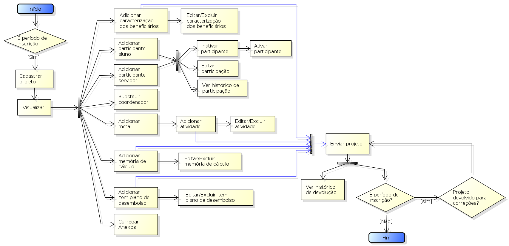
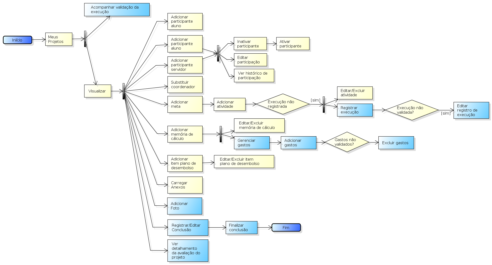

.. _suap-extensao-projetos-perfil-coordenador-projeto:

Coordenador de Projetos de Extensão
===================================

.. contents:: Conteúdo
    :local:
    :depth: 4

Introdução
----------

Finalidade
^^^^^^^^^^

Permite ao servidor (coordenador do projeto) realizar as seguinte tarefeas:

- Durante o período de inscrição, cadastrar e enviar projetos para editais de extensão 
- Durante o período de execução, registrar a execução das atividades, os gastos do projeto e registrar a conclusão do projeto.

..
   Fluxograma de Operação
   ----------------------

   .. note::
      Cole aqui um diagrama de atividade para representar o fluxo de operação por perfil.

Fase de Planejamento
--------------------

A fase de planejamento ocorre durante o período de inscrição do edital. Se ao final desse período, o projeto não tiver sido enviado, 
ele não estará disponível para a próxima fase (pré-seleção). 

A Figura 1 abaixo apresenta o fluxograma de operação dessa fase.

.. _`Figura 1`:

   
   Figura 1: Fluxograma de operação para a fase de planejamento
   
   
Fase de Execução
----------------

A fase de execução ocorre após a data de divulgação dos resultados. Nessa fase, os trabalhos são realizados conforme definidos no planejamento,
são registrados a execução das atividades e os gastos. 

Essa fase contínua até que seja registrada conclusão do projeto e sua finalização seja solicitada. 

A Figura 2 abaixo apresenta o fluxograma de operação para essa fase. As funcionalidades destacadas de azul são atividades novas decorrente dessa fase. 

.. _`Figura 2`:

   
   Figura 2: Fluxograma de operação para a fase de execução

