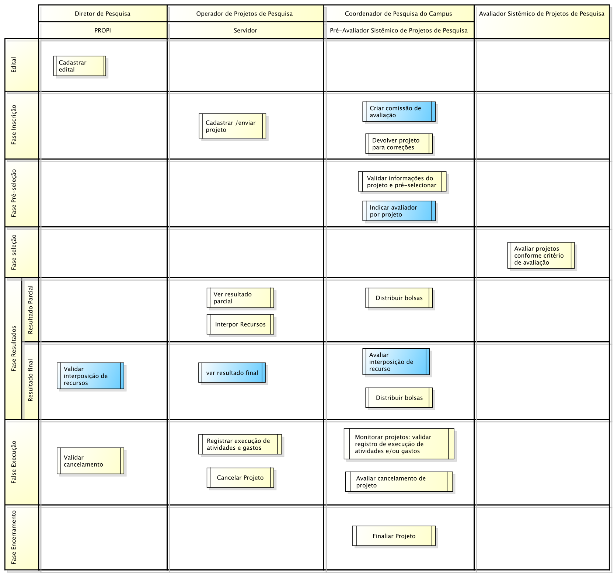

.. _suap-pesquisa-projetos-index:

Projetos de Pesquisa
====================

.. contents:: Conteúdo
    :local:
    :depth: 4

Introdução
----------

Finalidade
^^^^^^^^^^

O módulo Projetos de Pesquisa tem o objetivo de gerenciar as ações da PROPI - Pró-Reitoria de Pesquisa e Inovação, permitindo gerenciar todas as etapas dos projetos de pesquisa, desde a publicação do edital,
cadastro e submissão dos projetos, gerência e monitoramento da execução até a finalização dos projetos.

.. 
   Convenções
   ^^^^^^^^^^
   Para melhor apreensão deste manual, serão adotadas algumas convenções de conceitos e exibição de informações.

   Conceitos, termos e abreviações
   """""""""""""""""""""""""""""""

   .. include:: glossario.rst

Integração com outros sistemas
------------------------------

.. list-table::
   :widths: 40 60
   :header-rows: 1
   :stub-columns: 0

   * - Sistema/Módulo
     - Finalidade
   * - Módulo CNPQ / Currículo Lattes
     - Acessa as informações dos currículos lattes dos pesquisadores para calcular de forma automática o "Critérios de Avaliação da Qualificação do Coordenador".
   * - Módulo AE - Atividade Estudantil
     - Cadastra no AE as bolsas dos alunos bolsistas dos projetos aprovados. Também faz o controle de bolsas, pois não é permitido o acúmulo des bolsas.
   * - Plataforma Sucupira (Periódicos Qualis)
     - Processa planilha excel com todos os períodicos e suas respectivas classificação de suas áreas de avaliação. Essa informação é utilizada para calcular a pontuação dos periódicos de acordo com os critérios definidos para avaliação da qualificação do coordenador.
   * - Diretório de Grupos de Pesquisa no Brasil - Lattes
     - Extrai através da técnica de "web scraping" informações dos grupos de pesquisa dos pesquisadores.

Visão Geral
^^^^^^^^^^^

.. |fluxo-visao-geral| image:: ../images/fluxo-visao-geral.png

O módulo é dividido em sete fases conforme figura a seguir:

.. _`Figura 1`:

   
   Figura 1: Fluxograma visão geral do módulo de Projetos de Pesquisa.	

* A **fase de edital** é o ponto de partida do módulo de gerência de Projetos de Pesquisa, é nessa fase que são registradas todas as informações pertinentes ao edital de pesquisa, tais como o período de inscrição, pré-seleção, seleção, divulgação da seleção, etc;

* A **fase de inscrição** ocorre no período entre as datas "Início de Inscrições" e  "Fim das Inscrições" definidas no cadastro do edital. Nessa fase :

    * O Coordenador do Projeto cadastra as informações do projeto, tais como as metas/atividades, plano de desembolso, memória de cálculo, etc e submete (envia) o projeto para o referido edital;
    * O "Coordenador de pesquisa do campus " já pode criar a comissão de avaliadores e, se necessário, pode devolver o projeto para que o coordenador do projeto faça mudanças conforme sugestão.

* A **fase de pré-seleção** ocorre no período entre as datas "Início da Pré-seleção" e "Início de Seleção" definidas no cadastro do edital. Nessa fase, o coordenador de pesquisa do campus valida as informações do projeto aprovando ou não a sua continuidade no processo seletivo. Também nessa fase, o coordenador de pesquisa já pode indicar quem são os avaliadores de determinado projeto;

* A **fase de seleção** ocorre no período entre as datas "Início da Seleção" e "Fim da Seleção" definidas no cadastro do edital. Nessa fase, os avaliadores indicados avaliam a qualidade dos projetos sobre sua responsabilidade conforme os critérios de avaliação;

* A **fase de resultados** divide-se em dois períodos:

    * **Período de resultado parcial** ocorre entre as datas "Fim de Seleção" e "Data Limite para Recursos" definidas no cadastro do edital. Nesse Período:

      * O coordenador de pesquisa realiza a distribuição de bolsas, isto é, pode fazer o remanejamento de bolsas dos pesquisadores e dos alunos de um projeto para outro, além de poder aprovar um projeto que não havia sido aprovado na fase de seleção;
      * O coordenador do projeto pode não concordar com o resultado e pode interpor recurso questionando os resultados.

    * **Período de resultado** final ocorre entre as datas "Data Limite para Recursos" e "Divulgação da Seleção" definidas no cadastro do edital. Nesse período:

      * O coordenador de pesquisa pode aceitar a interporsição de recurso e caso tenha sido aceito pela PROPI pode refazer a distribuição de bolsas.

* A **fase de execução** inicia após a data "Divulgação da Seleção". Nessa fase:

  * O coordenador do projeto gerencia as execuções das atividades e os gastos dos projetos enquanto que o Coordenador de pesquisa do campus valida a execução dessas atividades e gastos. Essa fase continua até que o coordenador do projeto registre a sua conclusão.
  * O coordenador do projeto poderá solicitar dentro do prazo o cancelamento do projeto, cabendo ao coordenador de pesquisa aceitar ou não a solicitação de cancelamento.

* A **fase de encerramento** ocorre quando o Coordenador do Projeto registra a conclusão do projeto e solicita sua finalização. Cabe ao coordenador de pesquisa aceitar o encerramento do projeto.

.. 
   A figura `Figura 1`_

Perfis envolvidos
-----------------

.. list-table::
   :widths: 40 60
   :header-rows: 1
   :stub-columns: 0

   * - Perfil
     - Finalidade
   * - :ref:`Diretor de Pesquisa <suap-pesquisa-projetos-perfil-diretor-pesquisa>`
     - Papel desepenhado pelos gestores da PROPI (Pró-reitoria de Pesquisa e Inovação)
       Permite cadastrar novos editais e acompanhar todas as atividades relacionadas aos Projetos de Pesquisa, desde sua submissão, planejamento, execução e finalização.
   * - :ref:`Coordenador de Pesquisa <suap-pesquisa-projetos-perfil-coordenador-pesquisa>`
     - Papel desempenhado pelo Coordenador de pesquisa do campus.
       Permite aprovar ou desaprovar projetos na fase de pré-seleção bem como validar os gastos, as execuções das atividades e a conclusão do projeto de seu campus.
   * - :ref:`Pré-Avaliador Sistêmico de Projetos de Pesquisa <suap-pesquisa-projetos-perfil-coordenador-pesquisad>`
     - Papel desempenhado por um servidor ou um prestador de serviço.
       Realiza as mesmas atividades do coordenador de pesquisa do campus, mas somente para editais cuja forma de seleção é do tipo geral.
   * - :ref:`Coordenador de Projeto <suap-pesquisa-projetos-perfil-coordenador-projeto>`
     - Papel desepenhado por um "Operador de Projetos de Pesquisa" cujo projeto foi submetido para um edital de pesquisa.
       Permite cadastrar projetos bem como gerenciar a execução de seus projetos.
   * - :ref:`Avaliador Sistêmico de Projetos de Pesquisa <suap-pesquisa-projetos-perfil-avaliador-pesquisa>`
     - Papel desempenhado por um servidor que demonstrou interesse em ser avaliador e foi selecionado para avaliar algum projeto.
       Permite avaliar os projetos pré-aprovados de acordo com os critérios de avaliação.
   * - :ref:`Visualizador de Projetos <suap-pesquisa-projetos-perfil-coordenador-projeto>`
     - Papel desempenhado por um servidor auditor.
       Tem acesso somente leitura em todas as funcionalidades do módulo

.. comentário

	Módulo Cadastro de Projetos
	^^^^^^^^^^^^^^^^^^^^^^^^^^^
	
	.. list-table::
	   :widths: 20 30 50 
	   :header-rows: 1
	   :stub-columns: 0
	
	   * - Operação
	     - Finalidade
	     - Regras relacionadas
	   * - :ref:`suap-pesquisa-projetos-funcionalidade-cadastro_projeto`
	     - Adiciona um novo projeto para um determinado edital de pesquisa.
	     -
	   * - :ref:`suap-pesquisa-projetos-funcionalidade-definir_equipe`
	     - Define a equipe do projeto.
	     -
	   * - :ref:`suap-pesquisa-projetos-funcionalidade-inativar_participante`
	     - Inativa participante da equipe.
	     -
	   * - :ref:`suap-pesquisa-projetos-funcionalidade-adicionar_meta`
	     - Adiciona uma meta para o projeto.
	     -
	   * - :ref:`suap-pesquisa-projetos-funcionalidade-adicionar_atividade`
	     - Adiciona uma atividade para uma meta do projeto.
	     -
	   * - :ref:`suap-pesquisa-projetos-funcionalidade-memoria_calculo`
	     - Cadastra a memória de cálculo do projeto.
	     -
	   * - :ref:`suap-pesquisa-projetos-funcionalidade-adicionar_desembolso`
	     - Adiciona um desembolso ao Plano de Aplicação do projeto.
	     -
	   * - :ref:`suap-pesquisa-projetos-funcionalidade-adicionar_anexo`
	     - Adiciona um anexo ao projeto.
	     -
