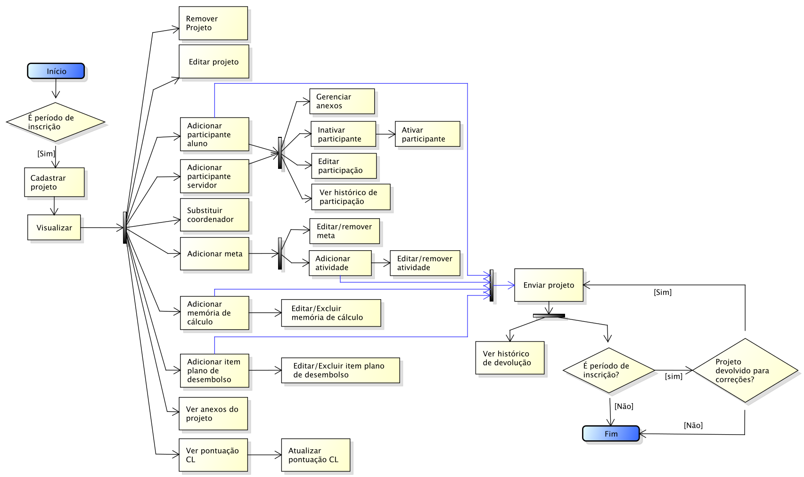
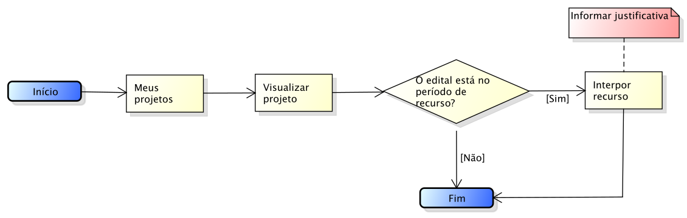
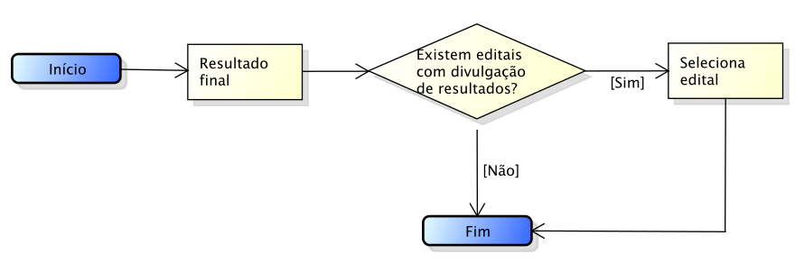
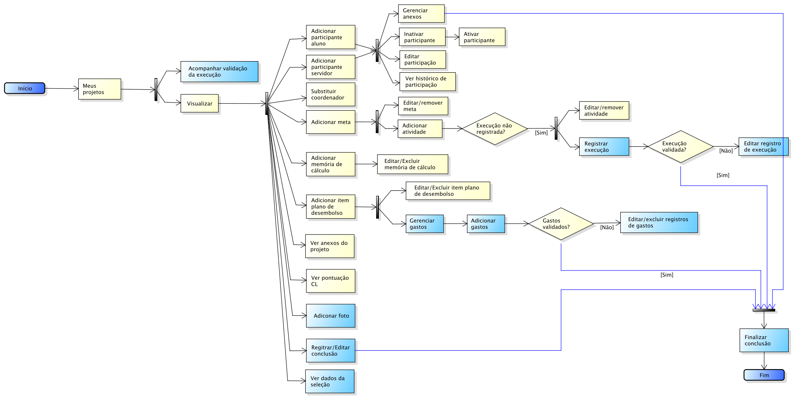
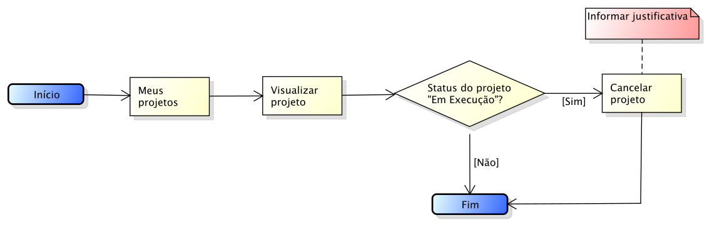

.. _suap-pesquisa-projetos-perfil-coordenador-projeto:

Coordenador do Projetos de Pesquisa
===================================

.. contents:: Conteúdo
    :local:
    :depth: 4

Introdução
----------

Finalidade
^^^^^^^^^^

Permite ao servidor (coordenador do projeto) realizar as seguinte tarefeas:

- Durante a **fase de inscrição**, cadastrar e enviar projetos para editais de pesquisa;
- Durante a **fase de resultados**, ver resultados parcial e interpor recursos contra os resultados;
- Durante a **fase de execução**, registrar a execução das atividades, os gastos do projeto e registrar a conclusão do projeto.

..
   Fluxograma de Operação
   ----------------------

   .. note::
      Cole aqui um diagrama de atividade para representar o fluxo de operação por perfil.

Fase de Insrição
----------------

A fase de planejamento ocorre durante o período de inscrição do edital. Se ao final desse período, o projeto não tiver sido enviado, ele não estará disponível para a próxima fase (pré-seleção).

Funcionalidade Submeter Projeto para Edital
^^^^^^^^^^^^^^^^^^^^^^^^^^^^^^^^^^^^^^^^^^^

Permite ao servidor cadastrar um novo projeto para um determinado edital. Após preencher as informações de equipes, plano de trabalho, planejamentos de gastos, poderá submter (enviar) o projeto para o edital.

A Figura 1 abaixo apresenta o fluxograma de operação dessa fase.

.. _`Figura 1`:

   
   Figura 1: Fluxograma de operação para submissão de projeto
   

Fase Resultado
----------------------

Nessa fase, o coordenador de pesquisa poderá ver o resultado parcial e caso discorde do resultado poderá entrar com interposição de recurso.

Funcionalidade Interpor Recurso
^^^^^^^^^^^^^^^^^^^^^^^^^^^^^^^

Permite ao coordenador de pesquisa interpor recurso contra o resultado parcial

A Figura 2 abaixo apresenta o fluxograma de operação dessa fase.

.. _`Figura 2`:

   Figura 2: Fluxograma de operação para interposição de recurso

Funcionalidade Ver Resultado Final
^^^^^^^^^^^^^^^^^^^^^^^^^^^^^^^^^^

Permite ao coordenador de ver quais projetos foram aprovados ou não no processo seletivo.

A Figura 3 abaixo apresenta o fluxograma de operação dessa fase.

.. _`Figura 3`:

   Figura 3: Fluxograma de operação para a fase de execução

Fase de Execução
----------------

A fase de execução ocorre após a data de divulgação dos resultados. Nessa fase, os trabalhos são realizados conforme definidos no planejamento, são registrados a execução das atividades e os gastos.

Essa fase contínua até que seja registrada conclusão do projeto e sua finalização seja solicitada. 

Funcionalidade Registrar execução de atividade e gastos
^^^^^^^^^^^^^^^^^^^^^^^^^^^^^^^^^^^^^^^^^^^^^^^^^^^^^^^

As operações realizadas na fase de execução são além das já realizadas na fase de inscrição, as destacadas de azul no fluxograma de operação representado pela Figura 4

.. _`Figura 4`:

   
   Figura 5: Fluxograma de operação para a fase de execução

Funcionalidade Cancelar Projeto
^^^^^^^^^^^^^^^^^^^^^^^^^^^^^^^

Poderá ocorrer algum motivo que impessa o coordenador de continuar a execução do seu projeto, nessa caso, ele deverá pedir o seu cancelamento.

A Figura 5 abaixo apresenta o fluxograma de operação dessa fase.

.. _`Figura 5`:

   Figura 5: Fluxograma de operação para solicitação de cancelamento de projeto