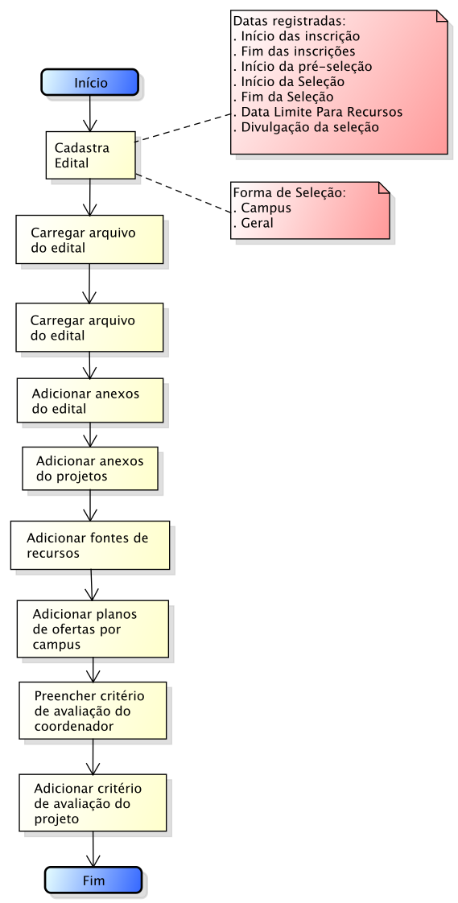
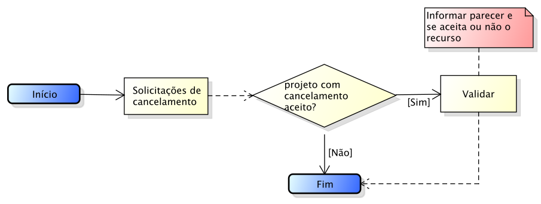

.. _suap-pesquisa-projetos-perfil-diretor-pesquisa:

Diretor de Pesquisa e Inovação
==============================

.. contents:: Conteúdo
    :local:
    :depth: 4

Introdução
----------

Finalidade
^^^^^^^^^^

Permite ao gestor da PROPI - Pró-reitoria de Pesquisa e Inovação realizar as seguinte tarefas:

- Durante a **fase de edital**, registrar todas as informações pertinentes ao edital de pesquisa, tais como o período de inscrição, pré-seleção, seleção, divulgação da seleção, etc;
- Durante a **fase de resultados**, validar aceite de interposição de recursos
- Durante a **fase de execução**, validar aceite de solicitação de cancelamento

..
   Fluxograma de Operação
   ----------------------

   .. note::
      Cole aqui um diagrama de atividade para representar o fluxo de operação por perfil.

Fase de Edital
--------------

Funcionalidade Cadastrar Edital
^^^^^^^^^^^^^^^^^^^^^^^^^^^^^^^

Permite cadastar e/ou editar um edital.

A Figura 1 abaixo apresenta o fluxograma de operação dessa fase.

.. _`Figura 1`:

   
   Figura 1: Fluxograma de operação para cadastro de edital
   

Fase Resultado
--------------

Nessa fase, o diretor de pesquisa poderá, se desejar, distribuir bolsas e validar os aceites de interposição de recursos.

Funcionalidade Validar Interpor Recurso
^^^^^^^^^^^^^^^^^^^^^^^^^^^^^^^^^^^^^^^

Permite ao diretor de pesquisa validar os aceites de interposição de recursos oriundos dos coordenadores de pesquisa.

A Figura 2 abaixo apresenta o fluxograma de operação dessa fase.

.. _`Figura 2`:

   Figura 2: Fluxograma de operação para validação de interposição de recurso

Fase Execução
-------------

Funcionalidade Validar Solicitação de Cancelamento de Projeto
^^^^^^^^^^^^^^^^^^^^^^^^^^^^^^^^^^^^^^^^^^^^^^^^^^^^^^^^^^^^^

Permite ao diretor de pesquisa validar os aceites de solicitação de cancelamento de projeto oriundos dos coordenadores de pesquisa.

A Figura 3 abaixo apresenta o fluxograma de operação dessa fase.

.. _`Figura 3`:

   Figura 3: Fluxograma de operação para validação de aceite de solicitação de cancelamento

