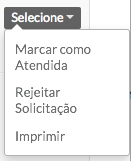
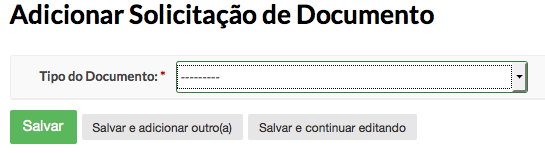
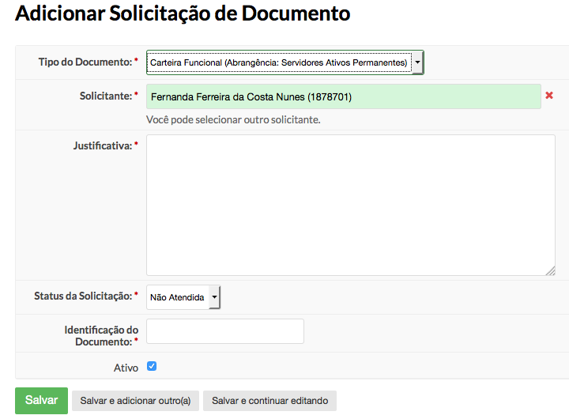
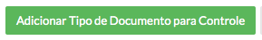
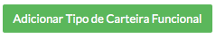
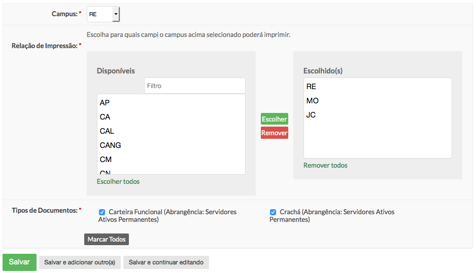

.. _suap-rh-solicitacao_documento-index:

Solicitação de Documento
========================

.. contents:: Conteúdo
    :local:
    :depth: 4

Introdução
----------

O módulo de solicitação de documentos foi desenvolvido para substituir o controle de documento, que era usado apenas para registrar as impressões dos documentos.
Este novos módulo contempla também a solicitação, dando um maior controle nos registros de emissão dos documentos.

Acesso e Funcionamento
----------------------

**Acesse Gestão de Pessoas > Solicitação de Documento**
A lista de solicitações é diferente para cada tipo de perfil de usuário:

#. Usuário comum pode visualizar apenas a sua solicitação, tendo disponível o histórico do andamento de sua solicitação.
#. Usuários com o perfil de RH, a principio, visualiza todas as solicitações de seu campus ou Reitoria. Caso a configuração de impressão seja alterada, poderá visualizar mais campi.
#. Super usuário consegue ver todas as solicitações.

Ações: Perfil RH
~~~~~~~~~~~~~~~~

Usuários com o perfil RH terão disponíveis as seguintes ações:
|acoes-perfil-rh|

#. Ao selecionar a ação "Marcar como Atendida", a situação da solicitação ficará como "atendida". O sistema entenderá que o documento já foi impresso.
#. Ao selecionar a ação "Rejeitar Solicitação", irá abrir uma janela para que o usuário justifique a rejeição. Esta informação ficará disponível para o usuário solicitante.
#. Ao selecionar a ação "Imprimir", será gerado um layout do tipo do documento solicitado para impressão.

.. warning::
    Lembrando que carteira funcional pode ter mais de um tipo cadastrado. Será impresso o layout da versão ativa no sistema.

Cadastro: Solicitação de Documento
~~~~~~~~~~~~~~~~~~~~~~~~~~~~~~~~~~

* Clique no botão "Adicionar Solicitação de Documento" para acessar o formulário de solicitação.
|btn-add-solicitacao-documento|

* Será acessado um formulário para escolha de qual o tipo de documento será solicitado.
|form-tipo-documento-solicitacao|

* Ao selecionar o tipo de documento, será redirecionado para o formulário específico do documento escolhido. Ex.: Carteira Funcional
|form-solicitacao-carteira-funcional|

.. note::
    O perfil de RH pode solicitar um documento para uma pessoa, bastando alterar o campo "Solicitante".
    Perfis de usuário comuns não terá acesso a determinados campos do formulário, como, no exemplo, os campos: Situação da Solicitação, Identificação do Documento e Ativo.

Pré Requisitos
--------------

    Para o bom funcionamento deste módulo, é necessário o pré-cadastro de algumas informações: Tipo de Documento, Tipo de Carteira Funcional (quando necessário) e Configuração de Impressão de Documentos.

Tipos de Documentos
^^^^^^^^^^^^^^^^^^^

    Tipo de Documento é um módulo de suporte ao módulo de Solicitação de Documentos. Sua função é basicamente cadastrar quais os tipos de documentos poderão ser solicitados.

Cadastro: Tipo de Documento
~~~~~~~~~~~~~~~~~~~~~~~~~~~

#. Acesse Gestão de Pessoas > Cadastros > Tipos de Documentos
#. Clique no botão "Adicionar Tipo de Documento para Controle" localizado no canto superior direito
   |btn-add-tipo-documento|
#. Preencha os campos obrigatórios do formulário e clique em "Salvar"

.. warning::
    Lembrando que toda a lógica da solicitação ainda precisará ser implementada pela equipe de desenvolvimento.

Tipos de Carteira Funcional
^^^^^^^^^^^^^^^^^^^^^^^^^^^

Tipo de carteira funcional é um módulo auxiliar ao módulo de Solicitação de Documento. Este módulo é responsável por cadastrar e manter todos os tipos já usados de carteira funcional,
deixando também disponível o modelo atual para impressão.

Cadastro: Tipo de Carteira Funcional
~~~~~~~~~~~~~~~~~~~~~~~~~~~~~~~~~~~~

#. Acesse Gestão de Pessoas > Cadastros > Tipos de Carteira Funcional
#. Clique no botão "Adicionar Tipo de Carteira Funcional" localizado no canto superior direito
   |btn-add-tipo-carteira-funcional|
#. Preencha os campos obrigatórios do formulário e clique em "Salvar"

.. warning::
    O campo **template** é usando dentro do código do suap para identificar qual template de impressão será usado. Logo, a cada novo cadastro será necessário desenvolver a lógica de impressão.

Configuração de Impressão de Documento
^^^^^^^^^^^^^^^^^^^^^^^^^^^^^^^^^^^^^^

    Este módulo é responsável por configurar as responsabilidades de impressão dos documentos para o instituto. Ele é importante para a correta visualização das solicitações pelos campi responsáveis.

Cadastro: Configuração de Impressão de Documentos
~~~~~~~~~~~~~~~~~~~~~~~~~~~~~~~~~~~~~~~~~~~~~~~~~

#. Acesse Gestão de Pessoas > Cadastros > Configuração de Impressão de Documento
#. Clique no botão "Adicionar Configuração de Impressão de Documentos" localizado no canto superior direito
   |btn-add-configuracao-impressao-documento|
#. Ao acessar o formulário de cadastro, será necessário tomar alguns cuidados ao preenchê-lo:
    * O campo "Campus" é o local responsável pelas impressões, ou seja, é importante selecionar apenas os campi que tem impressora para imprimir os documentos;
    * O campo "Relação de Impressão" é onde será definido quais os campi serão abarcados pelo campus responsável;
    * O campo "Tipos de Documentos" mostra todos os Tipos de Documentos cadastrados que o sistema tem suporte.
   |form-configuracao-impressao-documento|
      Neste exemplo, a Reitoria (RE) é responsável pelas impressões das campi Mossoró (MO) e João Câmara (JC) e responsável pelas suas próprias impressões.
      Também é possível perceber que a Reitoria poderá imprimir carteiras funcionais e crachás.

